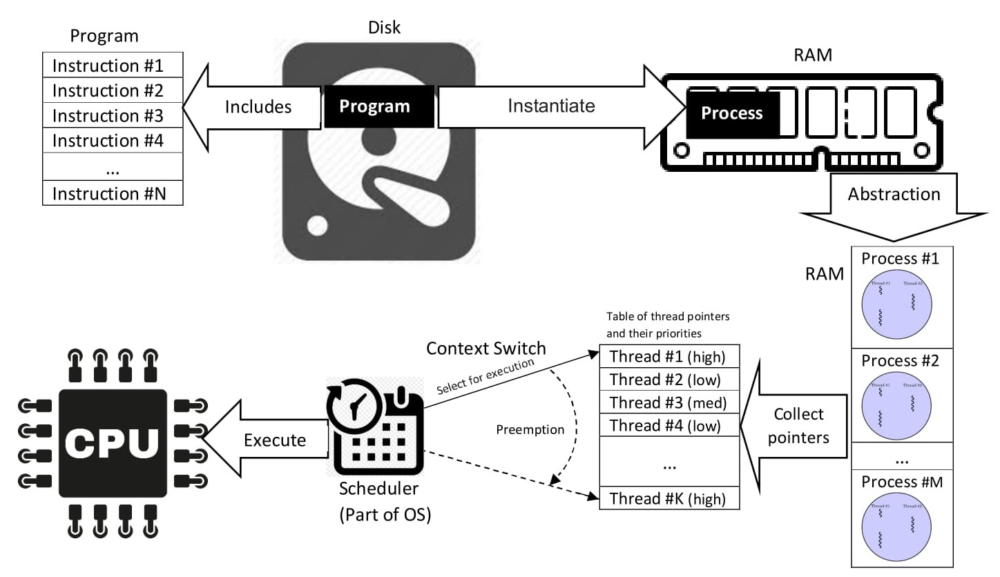
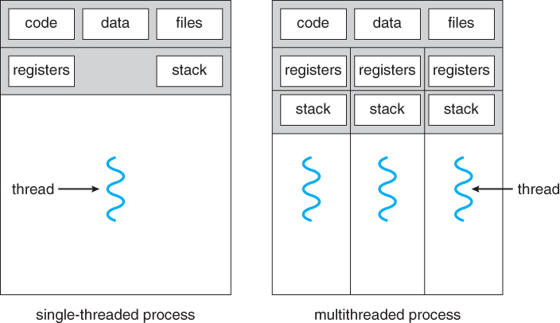
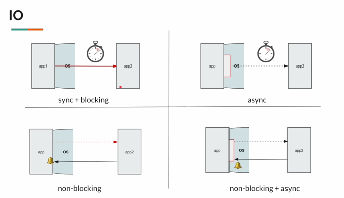
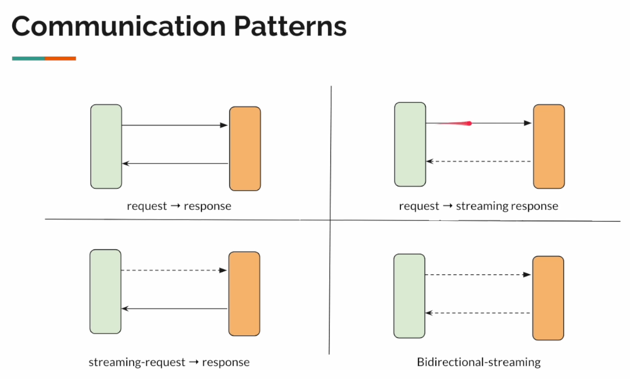
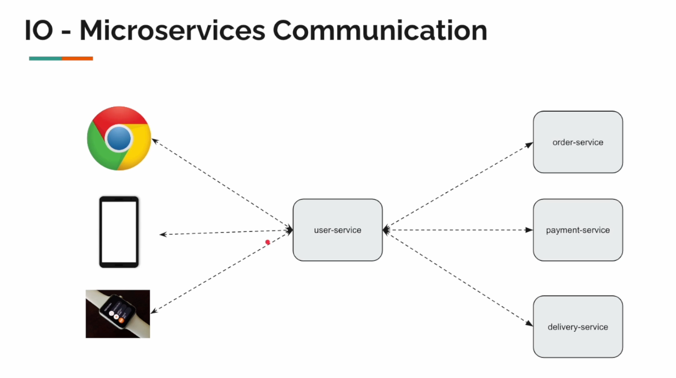
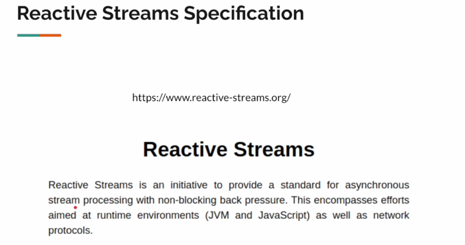

# День 1. Blocking vs Non-Blocking

## Process / Thread / CPU / RAM / Scheduler



Предположим, мы разработали простое Java-приложение и упаковали его в Jar-файл.
Этот Jar, соответственно, будет храниться где-то на диске и наша программа - не что иное, как
набор инструкций, которые необходимо выполнить

Когда мы пишем команду

````
java -jar MyApp.jar
````

То MyApp будет загружен в RAM, как Process. Фактически, создается процесс.

И сейчас будет несколько не слишком понятных определений, которые я объясню:

**Процесс** - это абстракция, существующая на программном уровне - уровне операционной системы.
Создание процесса - тяжеловесная процедура на основе системных вызовов.

**Поток** - это единица выполнения внутри процесса. То есть, поток - часть процесса.

Итак, процесс — это экземпляр компьютерной программы. Он включает в себя наш код, другие ресурсы, выделенные ОС: сокеты, память и тп

У потока есть:

- **instruction pointer(счетчик команд)** (специальный регистр процессора, который содержит адрес следующей машинной команды, подлежащей
  выполнению):
  чтобы понимать, где сейчас выполняется код;
- **stack**: локальные вызовы и переменные;
- **registers**: текущее состояние CPU для выполнения;

Процесс будет содержать хотя бы один поток. Очевидно, их может быть гораздо больше.



Операционная система выделяет память под процесс и эта память совместно используется потоками, а значит:

**Процесс - единица ресурсов, а поток - единица выполнения.**

**Состояния потоков:**

- **Выполняемый (Executing)** - поток, который выполняется в текущий момент на процессоре
- **Готовый (Runnable или Ready)** - поток ждет получения кванта времени и готов выполнять назначенные ему инструкции. Планировщик выбирает
  следующий поток для выполнения только из готовых потоков.
- **Заблокированный (Waiting)** - работа потока заблокирована в ожидании блокирующей операции

Процесс распределения ресурсов происходит в несколько этапов:

В ОС есть нечто, называемое **Планировщиком(Scheduler)** - он назначает поток на процессор, управляя очередями задач и переключая контекст
выполнения, в то время как исполнение конкретных инструкций контролируется самим процессором на аппаратном уровне.
А если проще, то он анализирует список потоков в состоянии «Готов» (Ready) и
выбирает один из потоков для выполнения на основе определенных правил.

**1) Выбор потока (Алгоритмы планирования)**

- **Приоритетность**: Потоки с более высоким приоритетом получают доступ к процессору раньше остальных.
- **Квантование времени**: Каждому потоку выделяется фиксированный отрезок времени (квант). Когда он истекает, ОС принудительно прерывает
  поток, чтобы дать поработать другим.
- **Affinity (Сродство)**: ОС старается закрепить поток за конкретным ядром процессора, чтобы эффективнее использовать кэш-память этого
  ядра.

**2) Переключение контекста (Context Switch)**
Чтобы запустить выбранный поток, планировщик выполняет следующие действия:

- **Сохранение**: Состояние текущего потока (значения регистров, указатель команд) записывается в специальную структуру памяти в ОС
- **Загрузка**: Состояние нового потока восстанавливается в регистры процессора.
- **Переход**: Указатель команд(IP, EIP, RIP) - устанавливается на следующую инструкцию нового потока, и процессор начинает выполнение

**Если непонятно про Переход**:
Представьте, что процессор — это читатель, а поток — это книга.

Когда планировщик переключает потоки, он делает ровно то же самое, что и мы, когда переключаемся между чтением двух разных романов:

- **Закладка (Указатель команд)**: Чтобы не забыть, на каком месте мы остановились в первой книге, мы кладем туда закладку. В компьютере эта
  «закладка» — специальный регистр (IP/EIP), который хранит адрес следующей строчки кода.
- **Переход**: То есть, я закрываю первую книгу и беру в руки вторую.
- **Поиск места**: То есть, я открываю вторую книгу там, где лежит закладка.
- **Чтение**: Как только твой взгляд упал на нужную строчку на основе закладки, я продолжаю читать с того места, где остановился.

Оригинальный поток Java был представлен около 25 лет назад. И Java поток — это оболочка вокруг потока ОС, поэтому один поток Java — это один
поток ОС.

**Так в чем проблема подобного подхода?**

- CPU дорогой, причем речь тут о финансовой составляющей. И попытка развернуть что-либо на каких-то серверах это подтвердит,
  учитывая цену на аренду машин. И нам следует использовать этот процессор как можно рациональнее и больше, дабы он впустую не
  простаивал и не тратил деньги.
- Часто в архитектуре микросервисов у нас слишком много сетевых вызовов, и сетевые вызовы медленны. В рамках такого вызова, поток,
  отправивший запрос во внешний сервис, будет заблокирован до тех пор, пока не придет ответ, а значит, что процессор впустую простаивает.
  И бывает такое, что если сервис работает в рамках блокирующего подхода, и сетевых вызовов ожидается много, то и потоков нужно очень
  много, а каждый поток - занимает память.
- А значит, сам поток - тяжеловесный ресурс, так как потребляет порядка 1 МБ памяти при создании.
- Поэтому нам нужен механизм, который сделает эти сетевые вызовы более эффективными, не тратя впустую системные ресурсы.

## IO Models: Inbound / Outbound

Поговорим о различных типах вызовов внешних сервисов:



1) **sync + blocking** — Очень простой и понятный синхронный блокирующий обмен данными, с которым мы часто сталкивались.

- **ПРИМЕР**: Я звоню в парикмахерскую по предоставленному номеру. Я могу ждать ответа сколь угодно долгое время и не факт, что
  получу его. До тех пор, пока не придет ответ, все это время мне пришлось ждать и сидеть без дела. Я не могу сделать ничего другого, потому
  что не знаю, когда кто-нибудь будет доступен на другом конце провода.

2) **async** - На этот раз вместо того, чтобы позвонить в страховую компанию, я спросил друга: «Эй, приятель, помоги кое с чем, позвони,
   пожалуйста, в парикмахерскую, и запиши меня на завтра». В этом случае я делегировал задачу второму потоку, который будет ждать, пока
   парикмахерская не ответит. Как видно, я не заблокирован, поскольку делегировал задачу, однако, мой друг в этом сценарии будет
   заблокирован в рамках своего вызова, а значит, мы наблюдаем аналогичный сценарий, что какой-то поток простаивает.

3) **non-blocking**: Предположим, что я опять звоню в парикмахерскую. Автоматизированная система голосовых сообщений на стороне
   парикмахерской сообщает, что все мастера в данный момент заняты, оставьте свой номер телефона и мы вам перезвоним, когда кто-то
   освободится. Я даю им свой номер телефона и могу заниматься своими делами и дальше, но через некоторое время мой телефон зазвонит и
   мне сообщат о том, какой мастер освободился. В этом случае я, как поток, отправил запрос и не заблокировался. В этом случае ОС
   уведомит поток о том, что ответ от внешнего сервиса был получен. Этот сценарий мы еще обсудим подробнее

4) **non-blocking + async**: это комбинация **async и non-blocking** подхода одновременно. Предположим, я опять звоню в парикмахерскую,
   мне ответят "Оставьте ваши контакты для связи, мы вам перезвоним". В этом случае, вместо того, чтобы давать свой номер, я даю номер
   друга, чтобы перезвонили именно ему, а значит, я не заблокирован, и мой друг не заблокирован. Аналогично, поток в этом случае шлет
   запрос во внешнюю систему, занимается своими делами дальше, и уже ОС УВЕДОМИТ другой поток(моего друга) для обработки ответа

И если рассматривать сложность разработки по шкале от 1 до 4, то в таком же порядке она и будет:

1) **sync + blocking**
2) **async**
3) **non-blocking**
4) **non-blocking + async**

Реактивное программирование - это модель программирования, упрощающая неблокирующую асинхронную связь.

## Типы коммуникаций

Мы писали код так, что отправляли запрос, и ждали ответ, и так писали много-много лет. Это простое требование, в котором можно обойтись и
без реактивности, подумав над архитектурой общения.
Можно ли использовать Virtual Threads в таком сценарии? - можно использовать, более того, нужно использовать, если позволяет система.

Однако, мы пытаемся решить другую проблему и сейчас я объясню, какую.
Реактивное программирование открывает двери для трех дополнительных моделей общения на выбор:



1) **request -> response**: Все понятно
2) **request -> streaming response**: Мы отправляем запрос и получаем множественный ответ. Предположим, мы хотим заказать пиццу,
   отправляя запрос и в ответ нам могут слать не просто некий http-ответ, а потоковый multiple-response ответ, например получаем
   потоковый, динамически заполняющийся в режиме реального времени ответ. Например, смотрим в смартфон и видим, что заказ перешел с одного
   статуса в другой и тп., видим движущегося курьера на карте и тп. То есть, получаем Streaming-response
3) **streaming request -> response**: В некоторых случаях мы и сами можем слать streaming-request в удаленный сервер. Например, у нас
   есть условные Apple-watch, который периодически может слать данные о частоте пульса на удаленный сервер и тп, и это можно реализовать,
   используя возможности реактивного программирования. Либо, к примеру, мы работаем с Google документом на удаленном сервере, изменяя
   его время от времени, и изменения сохраняются на сервере. В этом случае надо еще понимать, что мы не шлем несколько http-запросов в
   цикле, а открываем одно соединение, через которое отправляем несколько потоковых сообщений на удаленный сервер.
4) **Bidirectional-streaming**: это комбинация 2 и 3 подхода(двунаправленный стриминг данных). Приложения могут продолжать обмениваться
   данными динамически(аналог диалога между людьми)

Все типы указанных коммуникаций возможны в реактивном программировании

## Микросервисное взаимодействие



Технологические гиганты, такие как Twitter, Netflix и тп, например, понимают, что приложения сейчас становятся все более сложными. Сейчас
люди используют смартфоны, умные часы и т. д. И почти все они подключены к Интернету, а значит, клиентам нужны механизмы обновления
приложения, механизмы получения различных уведомлений и тп.

Так что типичное общение в стиле запроса и ответа не очень помогает, потому что мы не можем продолжать отправлять запросы к удаленному
серверу по типу: «Эй, сервер, у вас есть обновления?». Не очень разумным будет подход, когда мы таким образом будем периодически
продолжать отправлять запрос каждую секунду, так как это неэффективно. Незачем просить ресурс тогда, когда его нет, либо он не готов.
Вместо этого, сервер должен уведомлять клиента в случае обновлений, например, в виде потокового ответа(streaming response). Аналогично,
например, если пользователь смотрит прямо сейчас какой-то фильм, какие твиты мы смотрим и тп, таким образом клиенту необходимо
отправлять поток запросов на сервер. Поэтому, если модель общения между приложениями сложная, то типичный request-response стиль не
помогут и нам нужна иная программная модель.



И вот, примерно в 2014 году, была создана новая спецификация, называемая **Reactive Streams**. Он определяет стандарт асинхронной обработки
потоков с неблокирующим противодавлением. Например, беря в аналогию объектно-ориентированное программирование с его абстракциями,
инкапсуляцией, наследованиями и полиморфизмами, то, аналогично, для реактивного программирования ключевыми концептуальными определениями
будут выступать: **asynchronous**, **non-blocking**, **backpressure**, **stream processing**, где "stream processing" - это не одно
сообщение, как мы говорили сегодня ранее, это поток сообщений.

Путем обсуждения проблем и решений, это создало необходимость в другой модели программирования - реактивном программировании

## Что такое реактивное программирование?

Как мы поняли по определению, это новая парадигма программирования, предназначенная для обработки потока сообщений неблокирующим
асинхронным способом управления с обратным давлением и она обещает упростить неблокирующее асинхронное взаимодействие

Также важно отметить, что парадигма основана на шаблоне проектирования Наблюдатель(Observer)

Реактивное программирование лучше всего себя показывает при множественных IO вызовах и дополняет объектно-ориентированное
программирование, предоставляющее мощные инструменты для обработки этого асинхронного неблокирующего процесса