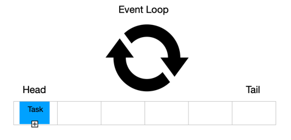
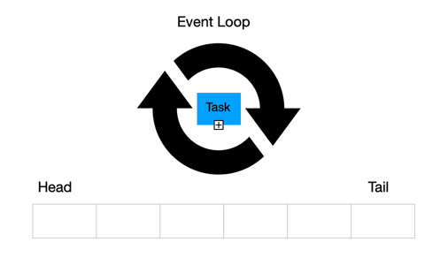
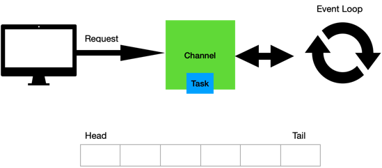
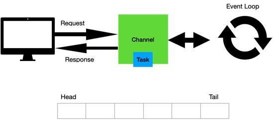

# День 1. Blocking vs Non-Blocking

## 0. Что человек должен понять после урока

- что происходит, когда мы запускаем Java-приложение;
- чем процесс отличается от потока;
- почему поток - это не бесплатный ресурс;
- что делает scheduler операционной системы;
- почему blocking I/O занимает поток ожиданием;
- почему async и non-blocking - это разные вещи;
- что event loop на уровне идеи и понимания работы;
- почему в WebFlux нельзя писать как обычный blocking MVC-код, просто завернув результат в `Mono`;
- какую проблему решает реактивное программирование;

## 1. Backend-сценарий

```text
GET /clients/123/profile
```

Чтобы вернуть ответ, сервису нужно:

1. сходить в БД за клиентом;
2. сходить в `account-service` за счетами;
3. сходить в `limit-service` за лимитами;
4. сходить в `transaction-service` за последними операциями;
5. собрать JSON-ответ.

В blocking-модели это часто выглядит так:

```text
HTTP request
   ↓
worker thread
   ↓
Controller
   ↓
Service
   ↓
DB call             ← поток ждет
   ↓
HTTP account call   ← поток ждет
   ↓
HTTP limits call    ← поток ждет
   ↓
Response
```

Главный вопрос текущего пункта:

```text
Что значит "поток ждет" с точки зрения операционной системы?
```

## 2. Process / Thread / CPU / RAM / Scheduler


````
java -jar MyApp.jar
````

Концептуально:

```text
shell
  ↓
exec java
  ↓
OS создает JVM process
  ↓
JVM читает MyApp.jar
  ↓
JVM загружает classes
  ↓
JVM запускает main Java thread
  ↓
public static void main(...)
```

**Процесс** - это абстракция, существующая на программном уровне - уровне операционной системы.

**Поток** - это единица выполнения внутри процесса. То есть, поток - часть процесса.

**Характеристики потока:**

У потока есть:

- **instruction pointer** - «навигатор или закладка», которая указывает процессору, какую строчку кода выполнять следующей, если поток будет
  запущен.

- **stack**: локальные вызовы и переменные;

- **registers**: (Регистры общего назначения) — Это «руки» процессора, в которых он держит данные во время вычислений.

**Процесс будет содержать хотя бы один поток. Очевидно, их может быть гораздо больше.**


---

### Про выделение памяти при запуске процесса

1) Code Segment: Машинный код (инструкции процессора). Это физический объем всех методов и логики программы в байтах.
2) Data Segment: Статические переменные (те самые static). ОС выделяет под них место заранее, так как они должны существовать в течение
   всего цикла работы приложения.
3) ReadOnly Segment: Константы и строковые литералы. Память для данных, которые никогда не изменятся.

```text
JVM Process
┌─────────────────────────────────────────────────────────────┐
│ Virtual Address Space                                       │
│                                                             │
│  Java Heap                  — объекты Java                  │
│  Thread Stacks              — стек каждого platform thread  │
│  Metaspace                  — metadata классов              │
│  Code Cache                 — JIT-скомпилированный код      │
│  Native Memory              — память JVM/native-библиотек   │
│  Loaded Libraries           — libc, JVM libs и т.п.         │
│  File Descriptors/Sockets   — открытые файлы и соединения   │
│                                                             │
└─────────────────────────────────────────────────────────────┘
```

Самая главная мысль:

```text
Процесс владеет ресурсами.
Потоки исполняют код внутри процесса.
Каждый platform thread имеет свою стоимость.
```

---

Операционная система выделяет память под процесс и эта память совместно используется потоками, а значит:

#### Процесс - единица ресурсов, а поток - единица выполнения.

**Состояния потоков:** Для нашего урока достаточно трех

- **Выполняемый (Executing)** - поток, который выполняется в текущий момент на процессоре
- **Заблокированный (Waiting)** - работа потока заблокирована в ожидании блокирующей операции
- **Готовый (Runnable или Ready)** - поток ждет получения кванта времени и готов выполнять назначенные ему инструкции. Планировщик выбирает
  следующий поток для выполнения только из готовых потоков.

---
**Процесс распределения ресурсов происходит в несколько этапов:**

В ОС есть нечто, называемое **Планировщиком(Scheduler)** - он назначает поток на процессор, управляя очередями задач и переключая контекст
выполнения, в то время как исполнение конкретных инструкций контролируется самим процессором на аппаратном уровне.

**1) Выбор потока (Алгоритмы планирования)**

- **Приоритетность**: Потоки с более высоким приоритетом получают доступ к процессору раньше остальных.
- **Квантование времени**: Каждому потоку выделяется фиксированный отрезок времени (квант). Когда он истекает, ОС принудительно прерывает
  поток, чтобы дать поработать другим.
- **Affinity (Сродство)**: ОС старается закрепить поток за конкретным ядром процессора, чтобы эффективнее использовать кэш-память этого
  ядра.

**2) Переключение контекста (Context Switch)**
Чтобы запустить выбранный поток, планировщик выполняет следующие действия:

- **Сохранение**: Состояние текущего потока (значения регистров, указатель команд) записывается в специальную структуру памяти в ОС - в RAM
- **Загрузка**: Состояние нового потока восстанавливается в регистры процессора.
- **Переход**: Указатель команд - устанавливается на следующую инструкцию нового потока, и процессор начинает выполнение

**Так в чем проблема подобного подхода? Мы дошли до самого интересного**

- CPU дорогой
- Много сетевых вызовов
- Поток - тяжеловесный ресурс
- Нагрузка из-за большого количества потоков
- Необходим новый механизм

## 3. IO Models: Inbound / Outbound

Поговорим о различных моделях ввода/вывода:


1) **sync + blocking**

2) **async**

3) **non-blocking**

4) **non-blocking + async**

Сложность разработки

1) **sync + blocking**
2) **async**
3) **non-blocking**
4) **non-blocking + async**

Реактивное программирование - это модель программирования, упрощающая неблокирующую асинхронную связь.

## 4. Типы коммуникаций


1) **request -> response**
2) **request -> streaming response**
3) **streaming request -> response**

Все типы указанных коммуникаций возможны в реализации в реактивной системе

## 5. Почему thread-per-request имеет предел

В классической servlet-модели, например в Spring MVC, удобно думать так:

```text
request -> worker thread -> controller -> service -> repository/client -> response
```

Проблема начинается там, где внутри обработки запроса много ожидания:

- запрос в базу данных;
- HTTP-вызов в другой микросервис;
- обращение к брокеру;
- чтение файла;

Еще раз аккуратная формулировка:

```text
CPU не обязан простаивать целиком. Но request-thread занят ожиданием и не может взять другой запрос.
```

Если таких запросов 1000, то в blocking thread-per-request модели нам может понадобиться очень много потоков, которые значительную часть
времени будут просто ждать I/O.

---


Приложения становятся гораздо сложнее

## 6. Reactive-streams


Новая спецификация Reactive Streams

## 7. Что такое реактивное программирование?

Реактивное программирование лучше всего себя показывает при множественных I/O вызовах и дополняет объектно-ориентированное программирование,
предоставляющее инструменты для обработки этого асинхронного неблокирующего процесса

## 8. CPU-bound и I/O-bound работа

Чтобы понять, где реактивность полезна, нужно различать два типа работы.

#### CPU-bound работа:

Примеры:

- посчитать хэш;
- выполнить тяжелую криптографию;
- обработать большой JSON;
- сжать изображение;
- выполнить сложный алгоритм;
- сделать тяжелый mapping миллионов объектов;

#### I/O-bound работа:

Примеры:

- сходить в БД;
- отправить HTTP-запрос;
- получить данные из Redis;
- дождаться Kafka;
- прочитать файл;
- дождаться ответа от внешнего сервиса;

Интуитивно можно прийти к вопросу

```text
Если мы все равно ждем внешний мир, можно ли не удерживать поток во время ожидания?
```

Именно здесь non-blocking модель становится особенно интересной

## 9. Фундамент реактивного программирования: Netty, EventLoop

До этого момента мы обсуждали проблему блокирующего подхода:

```text
много concurrent I/O-операций
    ↓
много ожидания
    ↓
много занятых platform threads
    ↓
много памяти под стеки
    ↓
нагрузка на scheduler
    ↓
context switches
```

Теперь нужно понять, на чем физически держится WebFlux-приложение.

Для сравнения посмотрим на две модели рядом.

```text
Spring MVC / blocking:

HTTP request
   ↓
Servlet container
   ↓
worker thread из пула
   ↓
DispatcherServlet
   ↓
Controller
   ↓
blocking service/db/http call
   ↓
worker thread ждет
   ↓
response
```

```text
Spring WebFlux / reactive:

HTTP request
   ↓
Reactor Netty
   ↓
Netty Channel
   ↓
EventLoop
   ↓
Spring WebFlux handler
   ↓
Controller returns Mono/Flux
   ↓
non-blocking db/http operation registered
   ↓
EventLoop thread освобождается
   ↓
Данные придут позже, так как поток не заблокирован
   ↓
pipeline continues
   ↓
response
```

Центральный фундамент реактивного WebFlux-приложения — runtime

### 9.1. Как это работает на уровни концепции с иллюстрациями

Netty — это сетевой framework, который позволяет строить высокопроизводительные веб-серверы и клиенты на событийной(event-driven)
non-blocking модели.

---

Концептуально:

```text
предположим, клиент открыл TCP-соединение
    ↓
Netty создал Channel
    ↓
Channel зарегистрирован на одном из EventLoop
```

1) Регистрация Channel в EventLoop

   

2) Запрос преобразуется в задачу(task)

   

3) Эвент отправляется в очередь задач EventLoop

   
4) EventLoop забирает эвент и начинает обработку

   
5) Как только обработка закончена, результат обработки вернется в Channel

   
6) После чего будет получен клиентом

   

Это и есть основная концепция работы Event Loop

---

```text
   HTTP request
        ↓
Netty создает Channel
        ↓
Channel регистрируется на EventLoop, создается некий "мост" между EventLoop и Channel
        ↓
EventLoop начинает обслуживать события этого Channel
        ↓
Запрос попадает в Spring WebFlux
```

```text
EventLoop — это платформенный Java поток вокруг вечного цикла, который обслуживает множество соединений.
```

То есть не так:

```text
Request-1 → Thread-1
Request-2 → Thread-2
Request-3 → Thread-3
Request-4 → Thread-4
```

А так:

```text
Channel-1 ┐
Channel-2 ├── EventLoop-1
Channel-3 ┘

Channel-4 ┐
Channel-5 ├── EventLoop-2
Channel-6 ┘
```

Один EventLoop может обслуживать много Channel-ов.
Но внутри одного EventLoop выполнение последовательное.

### 9.4. Channel

`Channel` — это Netty-абстракция над соединением.

Можно думать так:

```text
TCP connection
    ↓
Netty Channel
```

Когда клиент подключился к серверу, Netty создает для этого соединения Channel.

```text
Client A ───── Channel A
Client B ───── Channel B
Client C ───── Channel C
```

Дальше Channel закрепляется за EventLoop.

```text
EventLoop-1
   ├── Channel A
   ├── Channel B
   └── Channel C
```

Важное следствие:

```text
Если EventLoop заблокирован, страдают все Channel-ы, которые он обслуживает.
```

Именно поэтому в WebFlux нельзя писать blocking-код на event-loop потоке.

### Пример: два запроса в один endpoint и работа EventLoop-очередей

Представим, что у нас есть endpoint:

```kotlin
@GetMapping("/profile/{id}")
fun profile(@PathVariable id: String): Mono<ProfileResponse> {
    return Mono.just(id)
        .map { validate(it) }
        .flatMap { validId ->
            externalClient.getProfile(validId)
        }
        .map { externalResponse ->
            ProfileResponse.from(externalResponse)
        }
}
```

***1) Допустим, почти одновременно пришли два запроса:***

```text
GET /profile/1
GET /profile/2
```

Для простоты считаем, что это два разных клиента и два разных TCP-соединения.

Значит, на входе у нас появились два Channel:

```text
Client-1 → Channel-A → MyApp
Client-2 → Channel-B → MyApp
```

Пусть они попали на один EventLoop:

```text
EventLoop-1
   ├── Channel-A: /profile/1
   └── Channel-B: /profile/2
```

--->

Когда приложение принимает запросы от пользователей, это inbound-соединения.

Когда приложение само идет во внешний сервис через WebClient/Reactor Netty, появляются outbound-соединения.

***2) Теперь EventLoop последовательно обрабатывает эти Channel-ы.***

```text
process Channel-A
process Channel-B
```

***3) После обработки двух входящих запросов состояние такое:***

```text
Inbound:
  Channel-A ждет response для Client-1
  Channel-B ждет response для Client-2

Outbound:
  Channel-X ждет response от external-service для request-1
  Channel-Y ждет response от external-service для request-2
```

***4) внешний сервис отвечает***

Допустим, external-service ответил в таком порядке:

```text
response for request-2
response for request-1
```

***5) продолжение обработки***

```text
Inbound:
  Channel-A ждет response для Client-1
  Channel-B ждет response для Client-2

Outbound:[]
```

Результат вызова внешнего сервиса вернулся, отдаем каждый ответ последовательно, и в конце получаем состояние:

```text
Inbound:[]

Outbound:[]
```

## 10. Сетёвка «под капотом» для разработчика: От Сокета до Event Loop

#### 10.1. Что такое Сокет на самом деле?

**IP-адрес**, **Порт**, **Сокет** - объяснить

На уровне ОС Socket — Это исключительно программное понятие, а не физическая деталь.

Внутри сокета есть два буфера:

1) Inbound (для получения данных)
2) Outbound (для отправления данных во внешний мир).

#### 10.2. Проблема «Ждуна» (Blocking I/O)

Минус: 1000 медленных клиентов = 1000 спящих потоков. А мы помним, что каждый поток — это минимум 1 МБ памяти под стек и затраты на
переключение контекста (Context Switch).

#### 10.3. Революция: Non-blocking и Selector

В Non-blocking модели мы говорим сокету: «Если данных нет — не держи меня, я пойду проверю другие дела».

Но как понять, у какой из 1000 «дверей» (сокетов) появились данные? Не бегать же по кругу, опрашивая каждого (это съест CPU).

Для этого есть Selector. Пока, на уровне разработки, давайте понимать его вот как:

**Selector — это «вахтёр у пульта»**

Для инженера, разбирающегося в сетях, Selector — это мультиплексор ввода-вывода.

Как это работает на уровне железа и ОС:

```text
while (true) {
    selector.select();
    for (readyKey : selector.selectedKeys()) {
        handle(readyKey);
    }
}
```

1) Регистрация события
2) Вызов selector.select()
3) Прерывание
4) Пробуждение

#### 10.4. Event Loop — Сердце реактивности

Event Loop — это бесконечный цикл, который крутит наш поток вокруг этого селектора. Вернее, это обычный поток, который запущен в бесконечном
цикле while(true)

В Netty это выглядит так:

1) Поток вызывает selector.select()
2) Обработка I/O (Сетевые задачи)
3) Не-сетевые задачи
4) Закончив круг, он снова возвращается к пункту 1.

#### 10.5. Реактивный алгоритм обращения во внешний сервис

Допустим, нам нужно в процессе обработки запроса сходить во внешний микросервис.

1) EventLoop инициирует запрос к внешнему сервису (открывает для него новый Channel).
2) Он не ждет! Он вешает на этот новый канал «закладку», говорящую: «Когда придут данные, доделай работу».
3) EventLoop освобождается и тут же идет в selector.select() обслуживать других клиентов.
4) Когда внешний сервис ответит, Селектор снова разбудит поток, и тот по «той самой закладке» поймет, что необходимо дальше сделать в
   процессе обработки запроса и какому клиенту нужно отдать финальный результат.

#### 10.6. Золотое правило: Не блокируй!

Ни в коем случае нельзя блокировать EventLoop

Если внутри кода вызвать Thread.sleep(), тяжелое вычисление или вызовешь блокирующий драйвер БД (JDBC), ты мы остановим один из
важнейших потоков, предназначенных для высокоскоростной работы с соединениями.

#### 10.7. EventLoop при входящих запросах

Представим: у нас один поток Event Loop (одно ядро процессора) и 5 пользователей, которые одновременно нажали «Отправить».

1) Пусть приходит 5 запросов в приложение (Уровень ОС)

- Сетевая карта принимает пакеты от 5 пользователей, ЯДРО ОС ДАЛЕЕ:
- Создает 5 новых сокетов (по одному на каждого клиента).
- Кладет байты запросов в Inbound-буферы этих сокетов.
- «Зажигаются те самые лампочки» готовности в Селекторе для этих 5 сокетов.
- Будит поток Event Loop.

3) Работа Event Loop (Цикл обработки)

- selector.select() возвращает список из 5 «ключей» (идентификаторов сокетов), которые готовы к чтению.
- Event Loop начинает обрабатывать их строго по очереди в одном цикле:
- Клиент №1: Event Loop берет сокет №1, считывает байты → Pipeline превращает их в HTTP-запрос → Находит метод в Контроллере →
  Выполняет логику → Пишет ответ в Outbound-буфер сокета №1.
- Клиент №2: ...
- ... и так далее до Клиента №5.

Главные выводы из этого алгоритма:

1) Очередь: Внутри одного Event Loop всё делается по очереди. Если Клиент №1 заставит поток «вычислять число Пи до миллионного знака»,
   Клиенты №2–5 будут ждать.
2) Экономия: Мы обслужили 5 человек (и потенциально 5000).
3) Непрерывность: Поток никогда не висит в блокировке. 
4) Мало тяжелых переключений Context Switch, благодаря чему CPU работает максимально эффективно

Темы следующего занятия:

- Netty server.
- Channel.
- ChannelPipeline.
- EventLoopGroup.
- Reactor Netty.
- Spring WebFlux поверх Netty.
- HttpHandler, WebHandler, HandlerMapping, HandlerAdapter.
- Controller возвращает Mono/Flux.
- Где HTTP response подписывается на publisher.