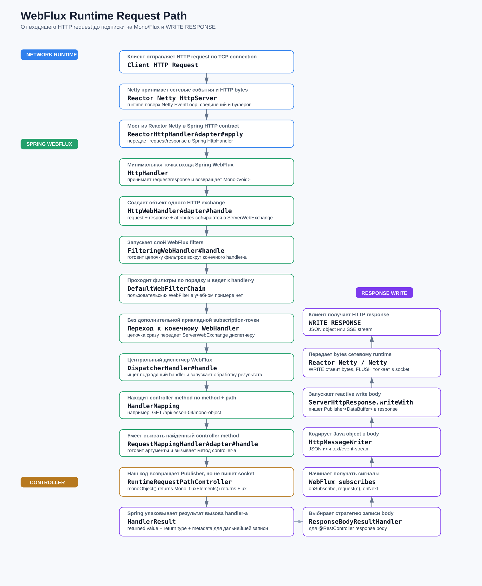
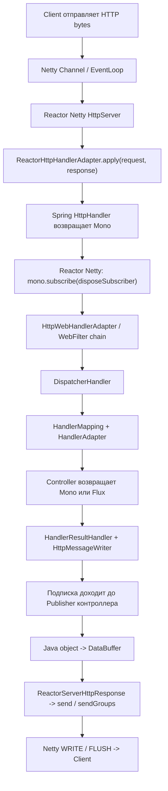
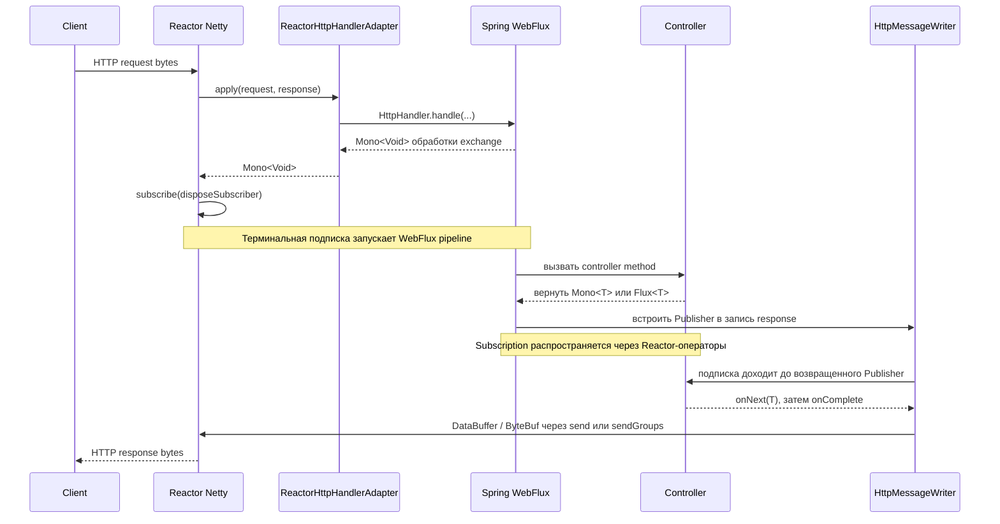
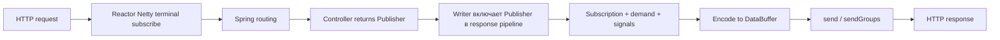

# Лекция 4. Reactor + Spring WebFlux в runtime: от HTTP-запроса до подписки и записи ответа

Этот файл — мой полный сценарий четвертой лекции.

Здесь одновременно находятся:

- текст, который я почти дословно говорю аудитории;
- действия, которые я выполняю в IDE и терминале;
- точки останова;
- объекты и стек вызовов, которые я показываю в debugger;
- ожидаемые логи и HTTP-ответы;
- технические оговорки, которые не дают сформировать неправильную модель;
- тезисы, которые позже можно вынести в отдельный `FULL_4_LECTION_VIEW.md`.

Главная цель занятия — не пройти как можно больше внутренних классов Spring. Главная цель — взять один HTTP-запрос и увидеть несколько
ключевых границ:

```text
HTTP request
  -> Reactor Netty принимает request
  -> Reactor Netty запускает общий Spring Mono<Void> через subscribe(...)
  -> подписка приводит в движение WebFlux pipeline
  -> Spring находит и вызывает controller
  -> controller возвращает Mono или Flux
  -> Spring встраивает этот Publisher в response-writing pipeline
  -> подписка доходит до Publisher контроллера
  -> значение кодируется в DataBuffer / ByteBuf
  -> Reactor Netty записывает bytes клиенту
```

---

## 0. Как пользоваться этим сценарием

В каждом практическом блоке есть одинаковые части:

- **Что говорю аудитории** — мой почти дословный текст;
- **Что открываю и делаю** — конкретное действие в IDE или терминале;
- **Где ставлю breakpoint** — основная точка остановки;
- **Что изучаю в debugger** — на какие переменные, объекты и call stack смотрю;
- **Что должно появиться в логах или `curl`** — наблюдаемый результат;
- **Какой вывод фиксирую** — одна мысль, ради которой был нужен шаг;
- **Тезис для будущего `FULL_4_LECTION_VIEW`** — короткая формулировка для зрительской версии;
- **Запасной вариант** — что делать, если исходники зависимости или breakpoint недоступны.

### Продолжительность

Базовый вариант рассчитан примерно на 75 минут:

```text
00–05 минут  — связь с первыми тремя лекциями
05–12 минут  — обзор кода четвертой лекции
12–20 минут  — точная модель subscription
20–52 минуты — полный Mono request path
52–67 минут  — Flux/SSE и отличие streaming response
67–75 минут  — сравнение, вопросы и итог
```

Если доступно только 60 минут:

- обзор файлов сократить до трех минут;
- `HttpWebHandlerAdapter`, `HandlerMapping` и `HandlerResult` объяснить через call stack без дополнительных остановок;
- для Flux показать только `doOnSubscribe`, первый `doOnNext` и `sendGroups`;
- блок «Дополнительный разбор на 90 минут» пропустить.

Если доступно 90 минут:

- отдельно остановиться в `HttpWebHandlerAdapter#handle`;
- показать `RequestMappingHandlerMapping` и `RequestMappingHandlerAdapter`;
- раскрыть содержимое `HandlerResult`;
- подробнее разобрать demand и различие `writeWith` / `writeAndFlushWith`;
- остановить SSE-клиент после второго события и показать `doFinally signal=cancel` без `onComplete`.

---

## 1. Техническая база, на которой проверен сценарий

Сценарий проверен на текущих зависимостях проекта:

```text
Spring Boot       4.0.6
Spring Framework  7.0.7
Reactor Core      3.8.5
Reactor Netty     1.3.5
Netty             4.2.12.Final
Java              21
```

Это важно, потому что внутренние классы и номера строк Spring/Reactor Netty могут меняться между версиями. Мы изучаем устойчивую
архитектурную модель, но конкретные внутренние точки останова привязаны к перечисленным версиям.

Основные endpoint-ы:

```bash
curl "http://localhost:8080/api/lesson-04/mono-object?name=Omar"
curl -N "http://localhost:8080/api/lesson-04/flux-elements"
```

---

## 2. Вступление и связь с первыми тремя лекциями — около 5 минут

**Что говорю аудитории**

Всем привет, ребята!

Сегодня четвертая лекция цикла по реактивному программированию. Первые три лекции поэтапно построили одну большую модель.

В первой лекции мы разобрали фундамент: чем blocking отличается от non-blocking, почему ожидание I/O не ускоряется от реактивности, почему
поток является ресурсом и зачем нужен EventLoop.

Во второй лекции мы спустились в сетевой runtime. Мы увидели `Channel`, `ChannelPipeline`, `EventLoop` и поняли роль Reactor Netty поверх
Netty.

В третьей лекции мы поднялись от Reactor Netty к Spring WebFlux. Теоретически разобрали `ReactorHttpHandlerAdapter`, `HttpHandler`,
`ServerWebExchange`, фильтры, `DispatcherHandler`, поиск controller-а, `HandlerResult` и запись ответа.

Сегодня мы не будем строить еще одну отдельную теорию. Сегодня мы проверим предыдущую схему в runtime.

Главный вопрос лекции:

```text
Кто запускает WebFlux pipeline через subscribe,
как эта подписка приводит выполнение в controller,
и как Publisher контроллера превращается в HTTP response пользователя?
```

Я хочу, чтобы после лекции вы не просто повторяли фразу «Spring подписывается на Mono», а могли объяснить ее технически корректно.

**Что открываю и делаю**

Открываю общую схему:



Показываю направление сверху вниз до controller-а и обратную колонку response write.

**Где ставлю breakpoint**

На этом этапе breakpoint не нужен.

**Что изучаю в debugger**

Debugger пока не запускаю. Сначала аудитория должна увидеть общую карту, иначе внутренние классы превратятся в бессвязный список.

**Что должно появиться в логах или `curl`**

Ничего. Это вводный блок.

**Какой вывод фиксирую**

```text
V1 дала модель потоков и ожидания.
V2 дала сетевой runtime Netty.
V3 дала архитектурный WebFlux request path.
V4 показывает, как эта схема реально исполняется.
```

**Тезис для будущего `FULL_4_LECTION_VIEW`**

> Сегодня мы проследим один request: Reactor Netty → Spring WebFlux → controller → Publisher → HTTP response.

**Запасной вариант**

Если SVG не открылся в preview, показываю следующую текстовую карту:

```text
Client
  -> Netty / Reactor Netty
  -> ReactorHttpHandlerAdapter
  -> WebFilter chain
  -> DispatcherHandler
  -> Controller
  -> HandlerResult / HttpMessageWriter
  -> ServerHttpResponse
  -> Reactor Netty send
  -> Client
```

---

## 3. Что находится в модуле четвертой лекции — около 7 минут

### 3.1. Карта всех файлов модуля

| Файл                                          | Роль в лекции                                                                                                                             |
|-----------------------------------------------|-------------------------------------------------------------------------------------------------------------------------------------------|
| `lesson04/RuntimeRequestPathController.java`  | Два сценария: обычный `Mono` JSON response и streaming `Flux` SSE response; прямые `[MONO]` и `[FLUX]` логи показывают assembly и сигналы |
| `lesson04/model/Lesson04ProfileResponse.java` | Java-record одного JSON-ответа Mono                                                                                                       |
| `lesson04/model/Lesson04StreamElement.java`   | Java-record одного элемента Flux/SSE                                                                                                      |
| `full-plan.md`                                | Теоретический черновик четвертой лекции                                                                                                   |
| `runtime-debug-script.md`                     | Подробный черновик debugger-прохода                                                                                                       |
| `webflux-request-path-runtime.svg`            | Общая визуальная схема request/response path                                                                                              |
| `FULL_4_LECTION.md`                           | Итоговый самостоятельный сценарий преподавателя                                                                                           |

### 3.2. Контроллер

**Что говорю аудитории**

В контроллере специально оставлены только два endpoint-а. Нам не нужно двадцать примеров WebFlux. Нам нужен один обычный ответ и один
потоковый ответ, чтобы внимательно проследить их жизненный цикл.

Первый метод возвращает:

```java
Mono<Lesson04ProfileResponse>
```

Внутри используется `Mono.fromSupplier(...)`. Поэтому создание `Lesson04ProfileResponse` отложено до подписки и demand.
В mapping явно указан `application/json`, чтобы на лекции однозначно показать выбор JSON writer-а.

Второй метод возвращает:

```java
Flux<Lesson04StreamElement>
```

Он создает пять элементов и задерживает каждый примерно на 300 миллисекунд, чтобы streaming был виден глазами.

**Что открываю и делаю**

Открываю `RuntimeRequestPathController.java` и быстро показываю методы `monoObject` и `fluxElements`.

В `monoObject` выделяю три разные группы строк:

```text
1. Вход в controller method.
2. Assembly: Mono.fromSupplier + doOn... операторы.
3. `[MONO] return`: `responsePublisher` уходит обратно в Spring без subscribe().
```

`doOnError` оставлен как диагностический hook на случай непредвиденной ошибки, но отдельный error endpoint в V4 не добавлен: нормальный
`onError`-сценарий относится к практике Reactive Streams в V5.

В `fluxElements` выделяю:

```text
Flux.range -> delayElements -> map -> doOn... -> return responsePublisher
```

**Где ставлю breakpoint**

Пока только отмечаю будущие точки:

- вход в `monoObject`;
- строку с `[MONO] return` перед `return responsePublisher`;
- supplier внутри `Mono.fromSupplier`;
- `doOnSubscribe` и `doOnRequest`;
- вход в `fluxElements`;
- первый `doOnNext`.

**Что изучаю в debugger**

Пока ничего — только связываю структуру кода с будущей демонстрацией.

**Что должно появиться в логах или `curl`**

Ничего: приложение еще не запущено.

**Какой вывод фиксирую**

Controller не пишет JSON и не вызывает `subscribe()` самостоятельно. Он собирает и возвращает Publisher.

Логи намеренно называют конкретное место в коде, а не абстрактный номер стадии:

| Префикс и hook                            | Что он показывает                                               |
|-------------------------------------------|-----------------------------------------------------------------|
| `[MONO] controller` / `[FLUX] controller` | Spring физически вызвал обычный Java-метод                      |
| `[MONO] return` / `[FLUX] return`         | Метод собрал и возвращает Publisher без `subscribe()`           |
| `doOnSubscribe`                           | Subscription дошла до Publisher контроллера                     |
| `doOnRequest`                             | Downstream передал demand через `request(n)`                    |
| `[MONO] supplier`                         | Началась отложенная работа источника Mono                       |
| `[FLUX] map`                              | После задержки создается очередной элемент Flux                 |
| `doOnNext`                                | Publisher отправил значение                                     |
| `doOnComplete`                            | Flux отправил нормальный terminal signal                        |
| `doFinally`                               | Последовательность завершилась через complete, error или cancel |

**Тезис для будущего `FULL_4_LECTION_VIEW`**

> Controller возвращает описание будущей выдачи данных: `Mono` для 0..1 и `Flux` для 0..N.

**Запасной вариант**

Если времени мало, не разбираю каждый оператор. Показываю только `fromSupplier`, `delayElements`, `return responsePublisher` и перехожу к общей модели
подписки.

### 3.3. Почему пользовательского WebFilter в примере нет

**Что говорю аудитории**

Внутри Spring WebFlux по-прежнему существуют `FilteringWebHandler` и `DefaultWebFilterChain`. Но собственный учебный `WebFilter` мы
намеренно не добавляем.

Причина: его `doOnSubscribe` наблюдал бы подписку на внешний `Mono<Void>` filter chain. Рядом с `doOnSubscribe` Mono контроллера это легко
ошибочно принять за две независимые терминальные подписки. Для текущей цели фильтр добавляет больше шума, чем доказательств.

Вход в Spring мы увидим через `ReactorHttpHandlerAdapter`, `HttpWebHandlerAdapter` и `DispatcherHandler`. Достижение Publisher-а
контроллера увидим через единственный прикладной `doOnSubscribe` в самом контроллере.

**Что открываю и делаю**

Показываю структуру `lesson04`: controller и два record, без пользовательского фильтра и без helper-а логирования.

**Где ставлю breakpoint**

Отдельный breakpoint не ставлю. При расширенном проходе можно открыть framework-классы `HttpWebHandlerAdapter` и
`FilteringWebHandler`, не добавляя собственный фильтр.

**Что изучаю в debugger**

Позже посмотрим `ServerWebExchange` внутри framework-кода и call stack на входе в controller.

**Что должно появиться в логах или `curl`**

До controller-а пользовательских V4-логов не будет. Это ожидаемо: входящую инфраструктурную часть мы доказываем debugger-ом.

**Какой вывод фиксирую**

Отсутствие пользовательского фильтра не удаляет WebFlux filter chain. Мы лишь не добавляем еще один учебный Publisher и еще один
`doOnSubscribe`.

**Тезис для будущего `FULL_4_LECTION_VIEW`**

> Framework filter chain существует, но для демонстрации subscription достаточно Reactor Netty и Publisher-а контроллера.

**Запасной вариант**

Если framework-breakpoint недоступны, начинаю прикладную часть с controller breakpoint и показываю входящий маршрут на SVG-схеме.

### 3.4. Модели и простые логи

**Что говорю аудитории**

`Lesson04ProfileResponse` и `Lesson04StreamElement` — обычные Java-record. В них нет реактивной магии. Они нужны, чтобы ясно показать границу:

```text
Java object -> encoder -> DataBuffer -> Netty ByteBuf -> network bytes
```

В контроллере используются обычные прямые вызовы `log.info(...)`. Никакого helper-а, скрытого форматирования и числовых стадий нет.

Префикс `[MONO]` или `[FLUX]` отвечает на вопрос «какой endpoint наблюдаем», а `controller`, `return`, `supplier`, `map` или настоящее имя
`doOn...` отвечает на вопрос «в какой строке цепочки мы находимся».

В каждом логе оставляем thread name. Он нужен не для идентификации request-а, а для демонстрации перехода с `reactor-http-nio-*` на
`parallel-*` после `delayElements`.

Упрощение имеет осознанное ограничение: во время лекции отправляем один request за раз. При конкурентных запросах эти логи могут
перемешаться, а thread name не является correlation id.

**Что открываю и делаю**

Быстро открываю оба record и несколько прямых `log.info(...)` в контроллере.

**Где ставлю breakpoint**

Breakpoint не нужен.

**Что изучаю в debugger**

Позже record будет виден сначала как Java object, а ниже — уже как закодированный buffer.

**Что должно появиться в логах или `curl`**

Учебные строки будут иметь простую форму:

```text
[MONO] doOnRequest: request(n)=... | thread=...
[FLUX] doOnNext: index=... | thread=...
```

**Какой вывод фиксирую**

Лог называется так же, как точка в коде. Thread name — дополнительное наблюдение, а не сама реактивная модель.

**Тезис для будущего `FULL_4_LECTION_VIEW`**

> Логи помогают увидеть стадии, но доказательство подписки находится в call stack и `subscribe`/`doOnSubscribe`.

**Запасной вариант**

Если аудитории уже понятны record и формат логов, этот блок сокращаю до одной минуты.

---

## 4. Главная архитектурная модель: где на самом деле происходит subscription — около 8 минут

### 4.1. Сначала исправляем опасное упрощение

**Что говорю аудитории**

Сейчас важно остановиться и аккуратно развести два уровня описания.

Часто говорят:

```text
Spring подписался на Mono контроллера.
```

Для прикладного объяснения эта фраза допустима, но она скрывает важную деталь. Не нужно представлять себе две независимые ручные команды:

```text
Reactor сделал subscribe №1.
Spring отдельно сделал subscribe №2.
```

Точнее происходит так:

1. Reactor Netty получает от Spring общий `Mono<Void>`, представляющий весь HTTP exchange.
2. Reactor Netty выполняет терминальный `subscribe(...)` на этом `Mono<Void>`.
3. Эта подписка приводит в движение pipeline Spring WebFlux.
4. Spring находит controller и получает его `Mono` или `Flux`.
5. Response-writing слой Spring встраивает Publisher контроллера в pipeline кодирования и записи ответа.
6. Уже запущенная подписка распространяется через Reactor-операторы до Publisher контроллера.
7. `doOnSubscribe` нашего controller Publisher показывает момент, когда подписка действительно дошла до него.

Spring здесь отвечает за композицию HTTP pipeline: routing, вызов controller-а, выбор writer-а, encoding и `ServerHttpResponse`.

Reactor Core отвечает за исполнение Publisher/Subscriber-цепочки и распространение сигналов.

Reactor Netty находится на терминальной границе сервера: он запускает общий pipeline и связывает его завершение с сетевой операцией.

**Что открываю и делаю**

Показываю следующую схему.



**Где ставлю breakpoint**

В схеме выделяю две будущие точки:

```text
Терминальная граница:
HttpServer.HttpServerHandle#onStateChange
  -> mono.subscribe(ops.disposeSubscriber())

Граница Publisher контроллера:
RuntimeRequestPathController
  -> doOnSubscribe(...)
```

**Что изучаю в debugger**

На первой точке увидим, кто запускает общий `Mono<Void>`.

На второй точке увидим, что эта подписка дошла до `Mono` или `Flux`, который вернул controller.

Между ними Spring WebFlux собирает маршрут и response-writing pipeline.

**Что должно появиться в логах или `curl`**

На терминальной точке наших V4-логов еще не будет. После выполнения `subscribe(...)` Spring дойдет до controller-а, и первой прикладной
строкой станет `[MONO] controller` или `[FLUX] controller`.

**Какой вывод фиксирую**

```text
Одна терминальная подписка запускает общий HTTP pipeline.
Spring встраивает Publisher контроллера внутрь этого pipeline.
Reactor распространяет subscription и signals через всю цепочку.
```

**Тезис для будущего `FULL_4_LECTION_VIEW`**

> Reactor Netty запускает общий `Mono<Void>`, а Spring WebFlux встраивает Publisher контроллера в response pipeline.

**Запасной вариант**

Если исходник `HttpServer.java` не открывается, не говорю, что подписки нет. Показываю терминальную роль Reactor Netty на схеме, а факт
достижения Publisher-а доказываю через `doOnSubscribe` и call stack.

### 4.2. Та же модель как последовательность вызовов



### 4.3. Assembly и execution в этом конкретном request

**Что говорю аудитории**

Нужно различать две вещи.

`Assembly` — создание объектов и связывание операторов:

```text
Mono.fromSupplier(...)
    .doOnSubscribe(...)
    .doOnRequest(...)
    .doOnNext(...)
```

`Execution` — реальное прохождение subscription, demand и сигналов через собранную цепочку.

В нашем request часть инфраструктурного pipeline существует с запуска приложения, часть request-specific pipeline создается при получении
запроса, а выполнение отложенных участков начинается из-за терминальной подписки Reactor Netty.

Controller method тоже должен быть физически вызван, чтобы вернуть свой Publisher. Но supplier внутри `Mono.fromSupplier` выполнится позже,
когда подписка дойдет до него и появится demand.

**Что открываю и делаю**

Показываю короткую временную схему. Корневой `subscribe(...)` уже запустил общий `Mono<Void>` до вызова handler method; после возврата
Publisher-а subscription распространяется во вложенную цепочку ответа:

```mermaid
flowchart LR
    A["Reactor Netty: корневой subscribe на Mono<Void>"] --> B["Spring вызывает controller method"]
    B --> C["Assembly: Mono.fromSupplier и doOn-операторы"]
    C --> D["Controller возвращает Mono<T> без subscribe()"]
    D --> E["Spring response writer встраивает Mono<T>"]
    E --> F["Subscription доходит до controller Publisher"]
    F --> G["doOnSubscribe"]
    G --> H["request(n) / demand"]
    H --> I["Supplier создаёт Java object"]
    I --> J["onNext"]
    J --> K["Encoding -> DataBuffer -> send -> client"]
```



**Где ставлю breakpoint**

Позже сравним breakpoint на входе в controller и breakpoint внутри supplier.

**Что изучаю в debugger**

На входе в controller объекта ответа еще нет. В supplier он появляется после `doOnSubscribe` и `doOnRequest`.

**Что должно появиться в логах или `curl`**

Порядок ключевых Mono-логов будет таким:

```text
[MONO] controller
[MONO] return
[MONO] doOnSubscribe
[MONO] doOnRequest
[MONO] supplier
[MONO] doOnNext
[MONO] doFinally
```

**Какой вывод фиксирую**

Вызов controller method и выполнение Publisher-а контроллера — связанные, но разные стадии.

**Тезис для будущего `FULL_4_LECTION_VIEW`**

> Controller method сначала возвращает pipeline; отложенная работа внутри Publisher выполняется после subscription и demand.

**Запасной вариант**

Если debugger сильно замедляет демонстрацию, порядок доказываю точными lesson-04 логами.

---

## 5. Подготовка к live-demo

### 5.1. Настройка IDE

Перед лекцией проверяю:

- приложение запускается в режиме **Debug**;
- для Gradle-зависимостей загружены sources;
- открывается `reactor.netty.http.server.HttpServer`;
- открывается `org.springframework.http.server.reactive.ReactorHttpHandlerAdapter`;
- открываются `DispatcherHandler`, `AbstractMessageWriterResultHandler`, `EncoderHttpMessageWriter` и `ReactorServerHttpResponse`;
- порт `8080` свободен;
- в терминале доступен `curl`;
- framework-breakpoint настроены как `Suspend: Thread`, если не требуется заморозить все приложение;
- старые breakpoint отключены, чтобы запрос не остановился в неожиданных местах.

Для Flux breakpoint в `doOnNext` делаю условным:

```java
element.index() ==1
```

Иначе debugger остановится пять раз.

### 5.2. Основные точки останова для Mono

```text
1. HttpServer.HttpServerHandle#onStateChange, newState == REQUEST_RECEIVED
2. ReactorHttpHandlerAdapter#apply
3. HttpServer.HttpServerHandle: mono.subscribe(ops.disposeSubscriber())
4. DispatcherHandler#handle
5. RuntimeRequestPathController#monoObject
6. AbstractMessageWriterResultHandler#writeBody
7. EncoderHttpMessageWriter#write
8. doOnSubscribe / doOnRequest / supplier внутри monoObject
9. ReactorServerHttpResponse#writeWithInternal
```

Дополнительные, но не обязательные точки:

```text
HttpWebHandlerAdapter#handle
AbstractHandlerMapping#getHandler
RequestMappingHandlerAdapter#handle
DispatcherHandler#handleResult
ResponseBodyResultHandler#handleResult
AbstractServerHttpResponse#writeWith
```

### 5.3. Запуск

Запускаю приложение в Debug и дожидаюсь:

```text
Netty started on port 8080 (http)
Started ReactiveLearningApplication
```

В отдельном терминале подготавливаю, но пока не выполняю:

```bash
curl "http://localhost:8080/api/lesson-04/mono-object?name=Omar"
```

---

## 6. Полный Mono-проход — около 30–35 минут

Запрос:

```bash
curl "http://localhost:8080/api/lesson-04/mono-object?name=Omar"
```

Ожидаемый ответ после завершения всех остановок:

```json
{
  "lesson": "04",
  "scenario": "mono-object",
  "name": "Omar",
  "message": "Hello, Omar",
  "createdAt": "..."
}
```

### 6.1. Reactor Netty получил HTTP request

**Что говорю аудитории**

Клиент уже установил TCP connection и отправил HTTP request. Netty прочитал входящие bytes, HTTP codec распознал request, а Reactor Netty
создал `HttpServerOperations` для текущего HTTP exchange.

Мы начинаем не с controller-а и даже не со Spring. Мы начинаем в Reactor Netty в момент состояния `REQUEST_RECEIVED`.

В текущей версии это внутренний класс:

```text
reactor.netty.http.server.HttpServer.HttpServerHandle
```

Его метод `onStateChange(...)` получает сетевое соединение и новое состояние. Когда новое состояние равно `REQUEST_RECEIVED`, Reactor Netty
применяет зарегистрированный HTTP handler.

**Что открываю и делаю**

Выполняю подготовленный `curl` и перехожу в IDE, когда debugger остановится в `HttpServerHandle#onStateChange`.

Показываю концептуально важный фрагмент текущей версии Reactor Netty:

```java
if(newState ==HttpServerState.REQUEST_RECEIVED){
HttpServerOperations ops = (HttpServerOperations) connection;
Publisher<Void> publisher = handler.apply(ops, ops);
Mono<Void> mono = Mono.deferContextual(ctx -> Mono.fromDirect(publisher));
// ...
    mono.

subscribe(ops.disposeSubscriber());
        }
```

**Где ставлю breakpoint**

Основная точка:

```text
reactor.netty.http.server.HttpServer.HttpServerHandle#onStateChange
```

Условие:

```java
newState ==HttpServerState.REQUEST_RECEIVED
```

Пока не продолжаю до строки `subscribe`. Сначала нужно увидеть переход в Spring-адаптер.

**Что изучаю в debugger**

Смотрю:

```text
newState        -> REQUEST_RECEIVED
connection      -> HttpServerOperations
ops             -> request и response текущего HTTP exchange
handler         -> зарегистрированный ReactorHttpHandlerAdapter
current thread  -> reactor-http-nio-*
```

Обращаю внимание: один и тот же `HttpServerOperations` реализует нужные Reactor Netty request/response-контракты и передается в
`handler.apply(ops, ops)` как request и response.

**Что должно появиться в логах или `curl`**

`curl` ждет ответ. Наших `[MONO]` или `[FLUX]` логов пока нет: controller еще не вызван.

**Какой вывод фиксирую**

Request path начинается в сетевом runtime. Controller пока не найден и не вызван.

**Тезис для будущего `FULL_4_LECTION_VIEW`**

> `REQUEST_RECEIVED` в Reactor Netty — момент передачи принятого HTTP request зарегистрированному handler-у.

**Запасной вариант**

Если внутренний класс не виден, начинаю с `ReactorHttpHandlerAdapter#apply` и словами объясняю, что его вызывает Reactor Netty после
получения request.

### 6.2. `ReactorHttpHandlerAdapter`: мост из Reactor Netty в Spring

**Что говорю аудитории**

Сейчас Reactor Netty вызывает handler, зарегистрированный Spring Boot. Этим handler-ом является `ReactorHttpHandlerAdapter`.

Адаптер решает конкретную задачу: переводит Reactor Netty request/response в Spring-абстракции и вызывает Spring `HttpHandler`.

Внутри `apply(...)` создаются:

```text
NettyDataBufferFactory
ReactorServerHttpRequest
ReactorServerHttpResponse
```

Затем вызывается:

```java
this.httpHandler.handle(request, response)
```

И возвращается `Mono<Void>`.

Обратите внимание: `ReactorHttpHandlerAdapter#apply` не вызывает `subscribe()` на Publisher контроллера. Он вообще еще не видел наш
controller Publisher. Он получает общий `Mono<Void>` обработки HTTP exchange и возвращает его Reactor Netty.

**Что открываю и делаю**

Продолжаю выполнение из `HttpServerHandle` и останавливаюсь в:

```text
org.springframework.http.server.reactive.ReactorHttpHandlerAdapter#apply
```

Пошагово показываю создание Spring request/response wrappers и вызов `httpHandler.handle(...)`.

**Где ставлю breakpoint**

```text
ReactorHttpHandlerAdapter#apply
```

Дополнительно можно поставить line breakpoint на вызове:

```java
this.httpHandler.handle(request, response)
```

**Что изучаю в debugger**

Смотрю:

```text
reactorRequest   -> Reactor Netty HttpServerRequest
reactorResponse  -> Reactor Netty HttpServerResponse
bufferFactory    -> NettyDataBufferFactory
request          -> ReactorServerHttpRequest
response         -> ReactorServerHttpResponse
httpHandler      -> Spring HttpHandler, обычно HttpWebHandlerAdapter
```

В `request` показываю method, path и headers. В `response` показываю native Reactor Netty response.

**Что должно появиться в логах или `curl`**

Наши controller-логи еще не обязаны появиться. `curl` продолжает ждать.

**Какой вывод фиксирую**

`ReactorHttpHandlerAdapter` — мост, а не место бизнес-логики и не терминальная подписка.

**Тезис для будущего `FULL_4_LECTION_VIEW`**

> `ReactorHttpHandlerAdapter` превращает Reactor Netty request/response в Spring HTTP abstractions и возвращает `Mono<Void>`.

**Запасной вариант**

Если line breakpoint не совпадает из-за другой patch-версии, ставлю method breakpoint на `apply` и показываю параметры метода.

### 6.3. Терминальный `subscribe(...)` на общем `Mono<Void>`

**Что говорю аудитории**

Теперь возвращаемся в `HttpServerHandle#onStateChange`.

`handler.apply(...)` уже вернул Publisher обработки. Reactor Netty обернул его в `Mono<Void>` и дошел до важнейшей строки всей лекции:

```java
mono.subscribe(ops.disposeSubscriber());
```

Именно здесь находится терминальная подписка серверного runtime на общий pipeline обработки request.

`ops.disposeSubscriber()` — внутренний subscriber Reactor Netty, связанный с жизненным циклом текущей сетевой операции. Он наблюдает
завершение или ошибку общего `Mono<Void>`.

`Void` означает, что наружу не передается Java-объект ответа. Значимым результатом этого `Mono` является завершение всей обработки и записи
HTTP response.

Важная оговорка:

```text
Это terminal subscribe общего HTTP pipeline.
Это еще не отдельная ручная подписка непосредственно на Mono<Lesson04ProfileResponse>.
```

После выполнения этой строки подписка начнет распространяться через Reactor-операторы и приведет в движение Spring WebFlux pipeline.

**Что открываю и делаю**

Останавливаюсь непосредственно перед:

```java
mono.subscribe(ops.disposeSubscriber());
```

Показываю аудитории, что `curl` все еще ждет, а controller еще не создал `Lesson04ProfileResponse`.

Делаю Step Over или Resume.

**Где ставлю breakpoint**

```text
HttpServer.HttpServerHandle#onStateChange
строка: mono.subscribe(ops.disposeSubscriber())
```

Для Reactor Netty 1.3.5 это находится примерно в районе строки 1378 `HttpServer.java`, но ориентироваться нужно на код, а не на номер.

**Что изучаю в debugger**

До выполнения строки смотрю:

```text
publisher -> Publisher<Void>, возвращенный Spring adapter-ом
mono      -> общий Mono<Void>
subscriber-> ops.disposeSubscriber()
thread    -> reactor-http-nio-*
```

После Resume смотрю call stack в следующей нашей точке. В нем появятся Reactor `subscribe`-методы и Spring WebFlux pipeline.

**Что должно появиться в логах или `curl`**

После запуска подписки Spring исполнит входящий pipeline. Первой прикладной строкой станет вызов controller method:

```text
[MONO] controller: метод вызван, name=Omar | thread=reactor-http-nio-*
```

**Какой вывод фиксирую**

```text
Reactor Netty не получает готовый response object.
Он получает Mono<Void> всей обработки и терминально подписывается на него.
```

**Тезис для будущего `FULL_4_LECTION_VIEW`**

> Терминальный запуск WebFlux request pipeline: `mono.subscribe(ops.disposeSubscriber())` внутри Reactor Netty.

**Запасной вариант**

Не ставлю глобальный method breakpoint на каждый `Mono.subscribe`, потому что приложение может остановиться на множестве посторонних
подписок. Если точная строка недоступна, показываю декомпилированный `onStateChange` либо схему из раздела 4.

### 6.4. `HttpWebHandlerAdapter`: `ServerWebExchange` без пользовательского фильтра

**Что говорю аудитории**

После терминального `subscribe` исполнение вошло в Spring WebFlux. `HttpWebHandlerAdapter` создает `ServerWebExchange`, содержащий request,
response и attributes текущего HTTP exchange.

Внутри framework по-прежнему есть `FilteringWebHandler` и `DefaultWebFilterChain`. Но пользовательских фильтров в нашем примере нет,
поэтому мы не создаем дополнительный прикладной `Mono<Void>` с еще одним `doOnSubscribe`.

Для модели подписки достаточно двух границ:

```text
Reactor Netty terminal subscribe на общем Mono<Void>
  -> Spring WebFlux infrastructure
  -> doOnSubscribe Publisher-а контроллера
```

**Что открываю и делаю**

Для базового 75-минутного прохода показываю `HttpWebHandlerAdapter` и `FilteringWebHandler` в call stack, после чего продолжаю до
`DispatcherHandler`.

**Где ставлю breakpoint**

Необязательный framework-breakpoint:

```text
org.springframework.web.server.adapter.HttpWebHandlerAdapter#handle
```

**Что изучаю в debugger**

Смотрю:

```text
exchange.getRequest().getMethod() -> GET
exchange.getRequest().getPath()   -> /api/lesson-04/mono-object
exchange.getResponse()            -> ReactorServerHttpResponse
thread                            -> reactor-http-nio-*
```

В call stack отмечаю `HttpWebHandlerAdapter`, `FilteringWebHandler`, `DefaultWebFilterChain` и следующий `DispatcherHandler`.

**Что должно появиться в логах или `curl`**

Пользовательских логов на этом уровне нет. `curl` продолжает ждать. Следующей строкой будет `[MONO] controller`.

**Какой вывод фиксирую**

Терминальная подписка Reactor Netty уже запустила Spring pipeline. Пользовательский WebFilter для доказательства этого факта не нужен.

**Тезис для будущего `FULL_4_LECTION_VIEW`**

> После terminal subscribe Spring создает `ServerWebExchange` и проводит request через framework chain к `DispatcherHandler`.

**Запасной вариант**

Если framework sources недоступны, пропускаю этот breakpoint и показываю переход `ReactorHttpHandlerAdapter → DispatcherHandler` на
SVG-схеме.

### 6.5. `DispatcherHandler`: найти и вызвать handler

**Что говорю аудитории**

Теперь запрос дошел до центрального диспетчера Spring WebFlux — `DispatcherHandler`.

Его задача делится на три шага:

```text
HandlerMapping       -> найти подходящий handler
HandlerAdapter       -> вызвать найденный handler
HandlerResultHandler -> обработать результат и записать response
```

В нашем случае mapping должен найти:

```text
GET /api/lesson-04/mono-object
  -> RuntimeRequestPathController#monoObject
```

Для вызова метода `@RestController` будет использован `RequestMappingHandlerAdapter`.

**Что открываю и делаю**

Останавливаюсь в `DispatcherHandler#handle`.

Не ухожу во все mapping по одному. Раскрываю списки стратегий и показываю, что Dispatcher не захардкожен под один вид controller-а.

После этого делаю Resume до нашего controller-а.

**Где ставлю breakpoint**

Основной:

```text
org.springframework.web.reactive.DispatcherHandler#handle
```

Необязательные для 90-минутного варианта:

```text
AbstractHandlerMapping#getHandler
RequestMappingHandlerAdapter#handle
```

**Что изучаю в debugger**

Смотрю поля:

```text
handlerMappings
handlerAdapters
resultHandlers
exchange
```

Позже на входе в controller через call stack показываю, что метод был вызван инфраструктурой Spring, а не Reactor Netty напрямую.

**Что должно появиться в логах или `curl`**

Следующими станут controller-логи. Пока `curl` продолжает ожидать.

**Какой вывод фиксирую**

Reactor Netty запускает общий pipeline, а маршрутизацией и вызовом controller-а занимается Spring WebFlux.

**Тезис для будущего `FULL_4_LECTION_VIEW`**

> `DispatcherHandler`: mapping находит controller method, adapter вызывает его, result handler готовит response.

**Запасной вариант**

Если `DispatcherHandler#handle` срабатывает слишком часто, оставляю только breakpoint в нашем controller-е и показываю нужные Spring-классы
в call stack.

### 6.6. Controller method: assembly еще не execution

**Что говорю аудитории**

Вот мы дошли до кода, который обычно считает началом request path прикладной разработчик.

Но теперь мы видим: до controller-а уже были Netty, Reactor Netty, терминальный subscribe, Spring adapters, framework chain, dispatcher,
mapping и adapter.

Сейчас controller method физически вызван. Он выполняет обычный Java-код и начинает собирать `Mono`.

Строка:

```java
Mono.fromSupplier(() ->{...})
```

не выполняет supplier немедленно. Она создает Publisher с правилом: выполнить supplier, когда до него дойдут subscription и demand.

Операторы `doOn...` тоже не запускают pipeline. Они добавляют наблюдение за будущими сигналами.

**Что открываю и делаю**

Останавливаюсь на входе в `monoObject`.

Показываю значение `name=Omar`.

Прохожу строки assembly до `return responsePublisher`, но не захожу в supplier.

Перед `return` задаю аудитории вопрос:

```text
Lesson04ProfileResponse уже создан или пока нет?
```

Правильный ответ: пока нет.

**Где ставлю breakpoint**

```text
RuntimeRequestPathController#monoObject
строка перед return responsePublisher
```

Отдельный breakpoint внутри supplier пока оставляю включенным на будущее.

**Что изучаю в debugger**

Смотрю:

```text
name              -> Omar
responsePublisher -> объект Mono с цепочкой операторов
thread            -> reactor-http-nio-*
```

Объясняю, что generic type помогает нам мыслить как `Mono<Lesson04ProfileResponse>`, но внутри runtime это цепочка Reactor Publisher-ов.

**Что должно появиться в логах или `curl`**

Точные сообщения текущего кода:

```text
[MONO] controller: метод вызван, name=Omar | thread=reactor-http-nio-*
[MONO] return: возвращаем Mono без subscribe() | thread=reactor-http-nio-*
```

Не должны появиться до подписки на controller Mono:

```text
[MONO] supplier: создаём Lesson04ProfileResponse...
[MONO] doOnNext: response=...
```

**Какой вывод фиксирую**

```text
Controller method был вызван.
Publisher был собран и возвращен.
Отложенная работа Publisher-а еще не обязана выполниться.
```

**Тезис для будущего `FULL_4_LECTION_VIEW`**

> Вызвать controller method ≠ выполнить возвращенный им Publisher.

**Запасной вариант**

Если debugger при Step Over заходит во внутренности Lombok/логгера, использую Resume между двумя заранее установленными breakpoint: вход
в метод и supplier.

### 6.7. `HandlerResult` и response-writing стратегия Spring

**Что говорю аудитории**

Controller вернул `Mono<Lesson04ProfileResponse>`, но Spring еще не получил JSON или bytes.

`RequestMappingHandlerAdapter` упаковывает результат вызова controller-а в `HandlerResult`.

Упрощенно внутри находятся:

```text
handler
returnValue
returnType
bindingContext
exceptionHandler
```

`HandlerResult` — это metadata и return value на уровне Spring. Это еще не HTTP response body.

Далее `DispatcherHandler` выбирает `HandlerResultHandler`. Для `@RestController` с body нас интересует `ResponseBodyResultHandler`.

Наиболее полезная практическая точка находится ниже, в:

```text
AbstractMessageWriterResultHandler#writeBody
```

Здесь Spring:

1. анализирует declared return type;
2. через `ReactiveAdapterRegistry` распознает `Mono`;
3. получает Publisher;
4. определяет element type;
5. выбирает media type;
6. выбирает подходящий `HttpMessageWriter`;
7. передает Publisher writer-у.

И снова важная точность: здесь Spring организует response pipeline, но в этом методе нет отдельного прикладного вызова
`controllerMono.subscribe(...)`.

**Что открываю и делаю**

Останавливаюсь в `AbstractMessageWriterResultHandler#writeBody`.

Если есть время, перед этим на секунду останавливаюсь в `DispatcherHandler#handleResult` и раскрываю `HandlerResult`.

В `writeBody` дохожу до вызова:

```java
writer.write(publisher, ...)
```

**Где ставлю breakpoint**

Основной:

```text
org.springframework.web.reactive.result.method.annotation.AbstractMessageWriterResultHandler#writeBody
```

Дополнительные:

```text
DispatcherHandler#handleResult
ResponseBodyResultHandler#handleResult
```

**Что изучаю в debugger**

Смотрю:

```text
body               -> Mono, возвращенный controller-ом
bodyType           -> Mono<Lesson04ProfileResponse>
adapter            -> ReactiveAdapter для Reactor Mono
publisher          -> Publisher с controller pipeline
elementType        -> Lesson04ProfileResponse
bestMediaType      -> application/json
messageWriters     -> список доступных writers
writer             -> подходящий EncoderHttpMessageWriter
exchange.response  -> ReactorServerHttpResponse
```

**Что должно появиться в логах или `curl`**

Нового lesson-04 лога в самом `writeBody` нет. `curl` продолжает ждать. Следом инфраструктура подготовит encoding pipeline, а затем
subscription дойдет до controller Mono.

**Какой вывод фиксирую**

Spring не извлекает значение через `block()`. Он передает Publisher в реактивный writer и встраивает его в общий response pipeline.

**Тезис для будущего `FULL_4_LECTION_VIEW`**

> `HandlerResult` хранит return value; `AbstractMessageWriterResultHandler` передает Publisher подходящему `HttpMessageWriter`.

**Запасной вариант**

Если локальные переменные оптимизированы или не отображаются, показываю сигнатуру метода, `body`, `exchange` и выбранный writer через
пошаговое выполнение.

### 6.8. `EncoderHttpMessageWriter`: Java Publisher превращается в Publisher буферов

**Что говорю аудитории**

Spring выбрал `EncoderHttpMessageWriter`. Его задача — связать Publisher Java-объектов с encoder-ом и реактивной записью response.

Внутри writer вызывает encoder и получает:

```text
Flux<DataBuffer>
```

Для нашего Mono-контроллера writer использует ветку 0..1. Он ожидает максимум один закодированный buffer и затем передает его в
`message.writeWith(...)`.

Объект еще не превращается в строку заранее в controller-е. Кодирование является частью reactive pipeline.

**Что открываю и делаю**

Останавливаюсь в:

```text
org.springframework.http.codec.EncoderHttpMessageWriter#write
```

Показываю вызов encoder-а и две концептуальные ветки:

```text
Mono input       -> 0..1 buffer -> writeWith(...)
streaming Flux   -> группы buffers -> writeAndFlushWith(...)
```

**Где ставлю breakpoint**

```text
EncoderHttpMessageWriter#write
```

Для Mono обращаю внимание на ветку:

```java
if(inputStream instanceof Mono){
        // singleOrEmpty -> flatMap -> writeWith
        }
```

**Что изучаю в debugger**

Смотрю:

```text
inputStream -> Publisher, пришедший от controller-а
elementType -> Lesson04ProfileResponse
mediaType   -> application/json
encoder     -> JSON encoder, настроенный Spring Boot
message     -> ReactorServerHttpResponse
body        -> Flux<DataBuffer>, созданный encoder-ом
```

Важно: вызов `encode(...)` строит pipeline кодирования. Фактическое значение controller Mono появится, когда подписка пойдет в этот pipeline.

**Что должно появиться в логах или `curl`**

Сразу после подписки на возвращенный writer-ом pipeline дойдем до `doOnSubscribe` в controller-е.

**Какой вывод фиксирую**

```text
HttpMessageWriter не получает готовые bytes от controller-а.
Он получает Publisher<T> и строит Publisher<DataBuffer>.
```

**Тезис для будущего `FULL_4_LECTION_VIEW`**

> `EncoderHttpMessageWriter`: `Publisher<Java object>` → `Publisher<DataBuffer>`.

**Запасной вариант**

Если Spring выбрал специализированный writer, смотрю его media type и ищу ближайший вызов `writeWith` или `writeAndFlushWith`. Цель —
увидеть Publisher буферов, а не запомнить приватную реализацию одной версии.

### 6.9. Subscription дошла до `Mono` контроллера

**Что говорю аудитории**

Вот второй ключевой наблюдаемый момент лекции.

Ранее Reactor Netty терминально подписался на общий `Mono<Void>`. Spring дошел до controller-а, получил его `Mono`, выбрал response writer
и включил этот `Mono` в pipeline кодирования.

Теперь подписка дошла до Publisher, который вернул controller, поэтому срабатывает:

```java
.doOnSubscribe(...)
```

`doOnSubscribe` не является еще одной нашей терминальной командой. Это оператор-наблюдатель. Он сообщает: downstream подписался на этот
участок цепочки.

Затем приходит `request(n)`: downstream сообщает demand — сколько элементов он готов принять.

В проверенном Mono-запуске значение равно:

```text
9223372036854775807 == Long.MAX_VALUE
```

Но смысл лекции не в конкретном числе. Mono все равно может выдать максимум одно значение.

После subscription и demand выполняется supplier и создается `Lesson04ProfileResponse`.

**Что открываю и делаю**

Последовательно останавливаюсь:

1. в lambda `doOnSubscribe`;
2. в lambda `doOnRequest`;
3. внутри supplier `Mono.fromSupplier`;
4. при желании в `doOnNext`.

На `doOnSubscribe` открываю call stack и показываю Reactor operator chain. Возвращаюсь мысленно к терминальному `subscribe` Reactor Netty.

**Где ставлю breakpoint**

В `RuntimeRequestPathController#monoObject`:

```text
.doOnSubscribe(...)
.doOnRequest(...)
lambda внутри Mono.fromSupplier(...)
.doOnNext(...)
```

**Что изучаю в debugger**

На `doOnSubscribe`:

```text
subscription -> Reactor Subscription implementation
call stack    -> Reactor operators + Spring response-writing pipeline
thread        -> reactor-http-nio-*
```

На `doOnRequest`:

```text
requested -> обычно Long.MAX_VALUE для этого Mono-сценария
```

В supplier:

```text
name       -> Omar
new record -> создается только сейчас
createdAt  -> текущее время исполнения, а не время assembly
thread     -> reactor-http-nio-*
```

**Что должно появиться в логах или `curl`**

Точные сообщения:

```text
[MONO] doOnSubscribe: subscription дошла до Mono | thread=reactor-http-nio-*
[MONO] doOnRequest: request(n)=9223372036854775807 | thread=reactor-http-nio-*
[MONO] supplier: создаём Lesson04ProfileResponse после subscription и demand | thread=reactor-http-nio-*
[MONO] doOnNext: response=Lesson04ProfileResponse[lesson=04, scenario=mono-object, name=Omar, message=Hello, Omar, createdAt=...] | thread=reactor-http-nio-*
```

Во время лекции отправляю только один request, поэтому строки не перемешиваются с другим вызовом. Thread показывает место исполнения, но
не является идентификатором request-а.

`curl` пока может еще ждать, потому что Java object нужно закодировать и записать в network response.

**Какой вывод фиксирую**

```text
Terminal subscribe был в Reactor Netty.
Spring встроил controller Mono в response pipeline.
Теперь subscription дошла до controller Mono, появился demand,
и только после этого supplier создал значение.
```

**Тезис для будущего `FULL_4_LECTION_VIEW`**

> `doOnSubscribe` доказывает, что subscription дошла до Publisher контроллера; supplier выполняется после demand.

**Запасной вариант**

Если breakpoint в lambda ведет себя неудобно, отключаю его и использую точный порядок lesson-04 логов. Не называю `doOnSubscribe`
местом, где мы сами вызвали terminal `subscribe()`.

### 6.10. `ReactorServerHttpResponse`: возврат из Spring к Reactor Netty

**Что говорю аудитории**

Controller Mono выдал Java object. Encoder превратил его в `DataBuffer`. Теперь Spring должен передать buffer серверному runtime.

`AbstractServerHttpResponse#writeWith` управляет commit response и реактивной записью body. Конкретная реализация для Reactor Netty —
`ReactorServerHttpResponse`.

В текущей версии ее ключевой метод выглядит концептуально так:

```java
protected Mono<Void> writeWithInternal(Publisher<? extends DataBuffer> publisher) {
    return this.response.send(toByteBufs(publisher)).then();
}
```

Здесь виден обратный мост:

```text
Spring DataBuffer
  -> native Netty ByteBuf
  -> Reactor Netty HttpServerResponse.send(...)
  -> Netty outbound pipeline
  -> WRITE / FLUSH
  -> socket / client
```

Вызов `send(...)` тоже не означает «синхронно скопировать все bytes в сетевую карту прямо на этой строке». Он является частью Reactor
Netty outbound pipeline. Фактическая запись зависит от подписки, EventLoop, buffers и готовности socket.

**Что открываю и делаю**

Останавливаюсь в:

```text
org.springframework.http.server.reactive.ReactorServerHttpResponse#writeWithInternal
```

Показываю `publisher`, native `response`, вызов `toByteBufs(...)`, `send(...)` и `.then()`.

После этого отключаю основные breakpoint и нажимаю Resume, чтобы ответ дошел до `curl`.

**Где ставлю breakpoint**

Основной:

```text
ReactorServerHttpResponse#writeWithInternal
```

Дополнительный:

```text
AbstractServerHttpResponse#writeWith
```

**Что изучаю в debugger**

Смотрю:

```text
publisher -> Publisher<DataBuffer> body
response  -> native Reactor Netty HttpServerResponse
headers   -> Content-Type: application/json
state     -> response commit lifecycle
thread    -> обычно reactor-http-nio-*
```

Если debugger позволяет, раскрываю `DataBuffer` и показываю, что это уже не `Lesson04ProfileResponse`, а representation закодированных
данных.

**Что должно появиться в логах или `curl`**

В `curl` появляется JSON:

```json
{
  "lesson": "04",
  "scenario": "mono-object",
  "name": "Omar",
  "message": "Hello, Omar",
  "createdAt": "..."
}
```

Финальный учебный лог:

```text
[MONO] doFinally: signal=onComplete | thread=reactor-http-nio-*
```

**Какой вывод фиксирую**

Spring закончил свою часть не на Java object, а передал реактивный Publisher буферов обратно Reactor Netty, который выполняет network
outbound path.

**Тезис для будущего `FULL_4_LECTION_VIEW`**

> `ReactorServerHttpResponse`: `DataBuffer` → `ByteBuf` → Reactor Netty `send(...)` → Netty WRITE/FLUSH.

**Запасной вариант**

Если breakpoint в `writeWithInternal` не сработал, останавливаюсь в `AbstractServerHttpResponse#writeWith` и в call stack нахожу конкретную
Reactor Netty реализацию. Сам факт успешного JSON в `curl` подтверждает завершение response path.

### 6.11. Фактический порядок Mono-логов

В проверенном запуске текущего кода порядок выглядит так:

```text
1. [MONO] controller: метод вызван, name=Omar | thread=reactor-http-nio-*
2. [MONO] return: возвращаем Mono без subscribe() | thread=reactor-http-nio-*
3. [MONO] doOnSubscribe: subscription дошла до Mono | thread=reactor-http-nio-*
4. [MONO] doOnRequest: request(n)=9223372036854775807 | thread=reactor-http-nio-*
5. [MONO] supplier: создаём Lesson04ProfileResponse после subscription и demand | thread=reactor-http-nio-*
6. [MONO] doOnNext: response=Lesson04ProfileResponse[...] | thread=reactor-http-nio-*
7. [MONO] doFinally: signal=onComplete | thread=reactor-http-nio-*
```

Этот порядок привязан к текущему расположению операторов. Главная устойчивая граница: supplier выполняется только после
`doOnSubscribe` и `doOnRequest`.

### 6.12. Итог Mono-прохода — что говорю дословно

```text
Мы только что прошли один запрос от Reactor Netty до controller-а и обратно.

Reactor Netty получил request и вызвал Spring adapter.
Spring вернул общий Mono<Void> обработки HTTP exchange.
Reactor Netty выполнил terminal subscribe на этом Mono<Void>.

Подписка запустила Spring WebFlux framework chain и DispatcherHandler.
Spring нашел и вызвал controller method.
Controller собрал Mono<Lesson04ProfileResponse> и вернул его, не вызывая subscribe.

ResponseBodyResultHandler и HttpMessageWriter встроили этот Mono в pipeline записи ответа.
Subscription дошла до controller Mono.
Появился request(n), supplier создал Java object, encoder превратил его в DataBuffer.

ReactorServerHttpResponse передал buffers в Reactor Netty через send(...),
а Netty записал HTTP bytes клиенту.

То есть controller не является ни началом request path, ни местом terminal subscribe,
ни компонентом, который лично пишет bytes в socket.
```

---

## 7. Flux/SSE: тот же request path, но несколько элементов — около 12–15 минут

Перед новым запросом отключаю framework-breakpoint входящего маршрута, которые уже были показаны:

```text
HttpServerHandle entry
ReactorHttpHandlerAdapter#apply
DispatcherHandler#handle
```

Оставляю точки, важные для различий Flux:

```text
RuntimeRequestPathController#fluxElements
doOnSubscribe
doOnRequest
doOnNext с условием element.index() == 1
ServerSentEventHttpMessageWriter#write
ReactorServerHttpResponse#writeAndFlushWithInternal
doOnComplete
```

Запускаю:

```bash
curl -N "http://localhost:8080/api/lesson-04/flux-elements"
```

`-N` отключает обычную буферизацию вывода `curl`, чтобы SSE-события были видны по мере прихода.

### 7.1. Controller возвращает `Flux`, но не готовый список

**Что говорю аудитории**

Входящий маршрут до controller-а принципиально тот же: Reactor Netty, terminal subscribe, Spring framework chain, Dispatcher, mapping и
adapter.

Отличие начинается с return value:

```java
Flux<Lesson04StreamElement>
```

Наш pipeline:

```java
Flux.range(1,5)
        .

delayElements(Duration.ofMillis(300))
        .

map(index ->new

Lesson04StreamElement(...))
        .

doOnSubscribe(...)
        .

doOnRequest(...)
        .

doOnNext(...)
        .

doOnComplete(...)
        .

doFinally(...);
```

Controller не создает `List` из пяти готовых record. Он возвращает Publisher последовательности.

`delayElements` не вызывает `Thread.sleep(300)` на EventLoop. Оператор планирует отложенное продолжение через Reactor scheduler.

**Что открываю и делаю**

Останавливаюсь на входе в `fluxElements`.

Прохожу assembly до `return responsePublisher`, не ожидая появления пяти элементов.

Показываю, что метод быстро возвращает объект `Flux`.

**Где ставлю breakpoint**

```text
RuntimeRequestPathController#fluxElements
строка перед return responsePublisher
```

**Что изучаю в debugger**

Смотрю:

```text
responsePublisher -> Flux operator chain
thread            -> reactor-http-nio-*
```

Пяти `Lesson04StreamElement` в памяти как готового списка нет.

**Что должно появиться в логах или `curl`**

Точные текущие сообщения:

```text
[FLUX] controller: метод вызван | thread=reactor-http-nio-*
[FLUX] return: возвращаем Flux без subscribe() | thread=reactor-http-nio-*
```

**Какой вывод фиксирую**

Flux описывает последовательность будущих элементов; controller возвращает ее до появления элементов.

**Тезис для будущего `FULL_4_LECTION_VIEW`**

> `Flux<T>` — не готовый `List<T>`, а Publisher последовательности 0..N.

**Запасной вариант**

Если времени мало, не прохожу assembly построчно. Сравниваю только сигнатуры `Mono<Lesson04ProfileResponse>` и
`Flux<Lesson04StreamElement>`.

### 7.2. Subscription и demand для Flux

**Что говорю аудитории**

Как и в Mono-сценарии, controller сам не вызывает `subscribe()`.

Spring выбирает writer для `text/event-stream`, встраивает Flux в streaming response pipeline, и terminal subscription общего request
доходит до возвращенного Flux.

Срабатывает `doOnSubscribe`, а затем мы видим demand через `doOnRequest`.

В одном проверенном запуске Spring 7.0.7 / Reactor 3.8.5 порядок demand выглядел так:

```text
request(1)
затем request(31)
```

Это прекрасный материал для наблюдения, но плохой материал для обещания контракта.

Нельзя учить так:

```text
WebFlux всегда запрашивает сначала 1, а затем ровно 31 элемент.
```

Числа зависят от writer-а, операторов, prefetch, версии библиотек и конкретной цепочки. Устойчивый вывод другой:

```text
Downstream выражает demand через request(n),
а Publisher не обязан безусловно вываливать все элементы сразу.
```

**Что открываю и делаю**

Останавливаюсь сначала в `doOnSubscribe`, затем в `doOnRequest`.

На `doOnSubscribe` показываю call stack. На `doOnRequest` показываю значение `requested`, но не превращаю его в универсальное правило.

**Где ставлю breakpoint**

В `fluxElements`:

```text
.doOnSubscribe(...)
.doOnRequest(...)
```

**Что изучаю в debugger**

Смотрю:

```text
subscription -> subscription текущей Flux-цепочки
requested    -> текущее значение demand
thread       -> первоначально reactor-http-nio-*
call stack   -> Reactor operators и streaming writer
```

**Что должно появиться в логах или `curl`**

```text
[FLUX] doOnSubscribe: subscription дошла до Flux | thread=reactor-http-nio-*
[FLUX] doOnRequest: request(n)=1 | thread=reactor-http-nio-*
```

После первого элемента в проверенном запуске:

```text
[FLUX] doOnRequest: request(n)=31 | thread=reactor-http-nio-*
```

Конкретные значения могут отличаться.

**Какой вывод фиксирую**

Flux исполняется после subscription и управляется demand, даже если в небольшом примере downstream быстро запрашивает все пять элементов.

**Тезис для будущего `FULL_4_LECTION_VIEW`**

> `request(n)` — сигнал спроса; конкретное `n` является деталью текущего pipeline, а не обещанием WebFlux API.

**Запасной вариант**

Если `doOnRequest` сработал с другим числом, не пытаюсь «починить демонстрацию». Наоборот, использую это как доказательство того, что
число нельзя хардкодить в теоретическую модель.

### 7.3. Первый `onNext`, scheduler и видимый streaming

**Что говорю аудитории**

Через примерно 300 миллисекунд появляется первый элемент.

`delayElements` использует Reactor scheduler для таймера, поэтому продолжение pipeline может выполняться на thread вида:

```text
parallel-1
parallel-2
...
```

Это не означает, что WebFlux создал отдельный request-thread по модели thread-per-request. Это также не означает, что на каждый элемент
гарантирован отдельный уникальный поток.

Thread name — наблюдение конкретного запуска. Архитектурный факт состоит в том, что таймер не блокирует Netty EventLoop через
`Thread.sleep`.

Когда `map` получает index, только тогда создается `Lesson04StreamElement`. После этого срабатывает `doOnNext`.

**Что открываю и делаю**

Останавливаюсь внутри `map` для первого index, затем в `doOnNext`.

Одновременно смотрю на терминал с `curl -N`: первый SSE event появляется отдельно, до остальных четырех.

**Где ставлю breakpoint**

Внутри `map` и `doOnNext` с условием:

```java
index ==1
```

или для `doOnNext`:

```java
element.index() ==1
```

После первой остановки breakpoint отключаю.

**Что изучаю в debugger**

Смотрю:

```text
index      -> 1
element    -> Lesson04StreamElement(... index=1 ...)
thread     -> parallel-*
emittedAt  -> время реального emission
```

Сравниваю `emittedAt` следующих элементов: между ними примерно 300 миллисекунд.

**Что должно появиться в логах или `curl`**

```text
[FLUX] map: создаём Lesson04StreamElement, index=1 | thread=parallel-*
[FLUX] doOnNext: index=1 | thread=parallel-*
```

В `curl`:

```text
data:{"lesson":"04","scenario":"flux-elements","index":1,"value":"stream-element-1","emittedAt":"..."}

```

Позже независимо появляются index 2, 3, 4 и 5.

**Какой вывод фиксирую**

Streaming response не требует предварительно собрать все элементы в `List`; каждый `onNext` может стать частью открытого HTTP response.

**Тезис для будущего `FULL_4_LECTION_VIEW`**

> `delayElements` планирует сигналы во времени; каждый `onNext` может быть отправлен клиенту отдельно.

**Запасной вариант**

Если IDE заморозила все threads и таймеры не двигаются, меняю breakpoint с `Suspend: All` на `Suspend: Thread` или показываю streaming без
остановки, опираясь на timestamps и `curl -N`.

### 7.4. SSE writer и `writeAndFlushWith`

**Что говорю аудитории**

Для `text/event-stream` Spring выбирает специализированный `ServerSentEventHttpMessageWriter`.

Это важное отличие от обычного Mono JSON response. Writer превращает каждый элемент в SSE-формат:

```text
data:<JSON>

```

Для объекта-record он использует настроенный JSON encoder для поля `data`, добавляет SSE framing и получает группу `DataBuffer`.

Затем writer вызывает:

```java
outputMessage.writeAndFlushWith(...)
```

Почему не обычный `writeWith`?

Потому что streaming media type должен позволить отправлять и flush-ить отдельные группы данных, не дожидаясь completion всего Flux.

На уровне конкретной Reactor Netty реализации:

```java
protected Mono<Void> writeAndFlushWithInternal(
        Publisher<? extends Publisher<? extends DataBuffer>> publisher) {
    return this.response
            .sendGroups(Flux.from(publisher).map(this::toByteBufs))
            .then();
}
```

`sendGroups` сохраняет границы групп и организует flush между ними. Благодаря этому `curl -N` видит события постепенно.

**Что открываю и делаю**

Останавливаюсь сначала в:

```text
ServerSentEventHttpMessageWriter#write
```

Показываю media type, input Flux и вызов `writeAndFlushWith`.

Затем останавливаюсь в:

```text
ReactorServerHttpResponse#writeAndFlushWithInternal
```

Показываю `sendGroups`.

**Где ставлю breakpoint**

```text
org.springframework.http.codec.ServerSentEventHttpMessageWriter#write
org.springframework.http.server.reactive.ReactorServerHttpResponse#writeAndFlushWithInternal
```

Если хочется показать кодирование JSON-части SSE, дополнительно можно остановиться внутри `ServerSentEventHttpMessageWriter#encodeEvent`.

**Что изучаю в debugger**

В SSE writer:

```text
input       -> controller Flux
elementType -> Lesson04StreamElement
mediaType   -> text/event-stream
encoder     -> JSON encoder для data
message     -> ReactorServerHttpResponse
```

В response:

```text
publisher -> Publisher<Publisher<DataBuffer>>
response  -> native Reactor Netty HttpServerResponse
path      -> sendGroups(...).then()
```

**Что должно появиться в логах или `curl`**

`curl -N` получает пять отдельных событий:

```text
data:{"lesson":"04","scenario":"flux-elements","index":1,"value":"stream-element-1","emittedAt":"..."}

data:{"lesson":"04","scenario":"flux-elements","index":2,"value":"stream-element-2","emittedAt":"..."}

data:{"lesson":"04","scenario":"flux-elements","index":3,"value":"stream-element-3","emittedAt":"..."}

data:{"lesson":"04","scenario":"flux-elements","index":4,"value":"stream-element-4","emittedAt":"..."}

data:{"lesson":"04","scenario":"flux-elements","index":5,"value":"stream-element-5","emittedAt":"..."}

```

**Какой вывод фиксирую**

```text
Mono JSON: обычный 0..1 body path через writeWith / send.
Flux SSE: streaming groups через writeAndFlushWith / sendGroups.
```

**Тезис для будущего `FULL_4_LECTION_VIEW`**

> SSE writer использует `writeAndFlushWith`, а Reactor Netty — `sendGroups`, чтобы элементы были видны до завершения Flux.

**Запасной вариант**

Если breakpoint в `EncoderHttpMessageWriter` для Flux не сработал, это нормально: `text/event-stream` обслуживает
`ServerSentEventHttpMessageWriter`. Ищу writer, выбранный в `AbstractMessageWriterResultHandler#writeBody`, а не настаиваю на JSON Mono
ветке.

### 7.5. Completion Flux и завершение HTTP response

**Что говорю аудитории**

После пятого элемента source больше не имеет значений и посылает `onComplete`.

`onComplete` — не шестой элемент и не `null`. Это отдельный терминальный сигнал Reactive Streams.

Для конечного SSE Flux этот сигнал позволяет завершить body и весь HTTP exchange. Для бесконечного event stream `onComplete` может долго
не приходить, и connection будет оставаться открытым, пока не произойдет cancellation, error или сервер сам не завершит stream.

**Что открываю и делаю**

Останавливаюсь в `doOnComplete`, затем отключаю все breakpoint и разрешаю request полностью завершиться.

Смотрю последние строки логов и возврат prompt в `curl`.

**Где ставлю breakpoint**

```text
.doOnComplete(...)
.doFinally(...)
```

Для лекции достаточно остановиться только в `doOnComplete`.

**Что изучаю в debugger**

Показываю отсутствие element у `onComplete` и текущий thread `parallel-*`.

**Что должно появиться в логах или `curl`**

```text
[FLUX] doOnComplete | thread=parallel-*
[FLUX] doFinally: signal=onComplete | thread=parallel-*
```

В проверенном запуске оба hook-а наблюдались на `parallel-*`. Не обещаю конкретный номер thread как публичный контракт.

**Какой вывод фиксирую**

`onComplete` завершает последовательность данных; завершение общего `Mono<Void>` связано с окончанием всего HTTP response pipeline.

**Тезис для будущего `FULL_4_LECTION_VIEW`**

> `onComplete` завершает конечный Flux и позволяет закрыть streaming HTTP body.

**Запасной вариант**

Если debugger меняет визуальный порядок логов, повторяю Flux-запрос без breakpoint и анализирую чистый runtime output.

### 7.6. Фактический порядок Flux-логов

Нормализованный порядок проверенного запуска:

```text
1. [FLUX] controller: метод вызван | thread=reactor-http-nio-*
2. [FLUX] return: возвращаем Flux без subscribe() | thread=reactor-http-nio-*
3. [FLUX] doOnSubscribe: subscription дошла до Flux | thread=reactor-http-nio-*
4. [FLUX] doOnRequest: request(n)=1 | thread=reactor-http-nio-*
5. [FLUX] map: создаём Lesson04StreamElement, index=1 | thread=parallel-*
6. [FLUX] doOnNext: index=1 | thread=parallel-*
7. [FLUX] doOnRequest: request(n)=31 | thread=reactor-http-nio-*
8. [FLUX] map: создаём Lesson04StreamElement, index=2 | thread=parallel-*
9. [FLUX] doOnNext: index=2 | thread=parallel-*
10. [FLUX] map: создаём Lesson04StreamElement, index=3 | thread=parallel-*
11. [FLUX] doOnNext: index=3 | thread=parallel-*
12. [FLUX] map: создаём Lesson04StreamElement, index=4 | thread=parallel-*
13. [FLUX] doOnNext: index=4 | thread=parallel-*
14. [FLUX] map: создаём Lesson04StreamElement, index=5 | thread=parallel-*
15. [FLUX] doOnNext: index=5 | thread=parallel-*
16. [FLUX] doOnComplete | thread=parallel-*
17. [FLUX] doFinally: signal=onComplete | thread=parallel-*
```

Еще раз: `n=1`, затем `n=31`, номера `parallel-*` и относительный порядок `doFinally` — наблюдения текущего pipeline, а не обязательства API.

---

## 8. Mono и Flux: сравниваем только существенные различия

| Вопрос              | Mono endpoint                          | Flux/SSE endpoint                               |
|---------------------|----------------------------------------|-------------------------------------------------|
| Return type         | `Mono<Lesson04ProfileResponse>`        | `Flux<Lesson04StreamElement>`                   |
| Количество `onNext` | 0..1                                   | 0..N                                            |
| HTTP media type     | `application/json`                     | `text/event-stream`                             |
| Основной writer     | `EncoderHttpMessageWriter`             | `ServerSentEventHttpMessageWriter`              |
| Запись              | `writeWith`                            | `writeAndFlushWith`                             |
| Reactor Netty       | `send`                                 | `sendGroups`                                    |
| Видимость клиенту   | Один JSON body                         | SSE events по мере появления                    |
| Completion          | После единственного значения или empty | После последнего элемента, если stream конечный |
| Thread в примере    | Обычно `reactor-http-nio-*`            | После `delayElements` появляются `parallel-*`   |

Главное сходство:

```text
Оба endpoint-а возвращают Publisher.
Оба Publisher-а Spring встраивает в общий response pipeline.
Оба исполняются из-за subscription, пришедшей от terminal boundary Reactor Netty.
```

---

## 9. Дополнительный разбор для 90-минутной версии

### 9.1. `HttpWebHandlerAdapter#handle` и создание `ServerWebExchange`

**Что говорю аудитории**

`ReactorHttpHandlerAdapter` создал Spring `ServerHttpRequest` и `ServerHttpResponse`. Следующий adapter поднимает модель еще на один
уровень и создает `ServerWebExchange`.

`HttpHandler` — минимальный Spring HTTP contract:

```java
Mono<Void> handle(ServerHttpRequest request, ServerHttpResponse response)
```

`WebHandler` работает уже с:

```java
Mono<Void> handle(ServerWebExchange exchange)
```

`HttpWebHandlerAdapter` связывает эти контракты, добавляя exchange, session/locale/observation инфраструктуру и обработку завершения.

**Что открываю и делаю**

Останавливаюсь в `HttpWebHandlerAdapter#handle`, показываю `createExchange(...)` и delegate `WebHandler`.

**Где ставлю breakpoint**

```text
org.springframework.web.server.adapter.HttpWebHandlerAdapter#handle
```

**Что изучаю в debugger**

Смотрю request, response, созданный exchange и delegate handler.

**Что должно появиться в логах или `curl`**

После прохождения framework chain следующим наблюдаемым пользовательским этапом станет `[MONO] controller` или `[FLUX] controller`.

**Какой вывод фиксирую**

`ServerWebExchange` появляется на границе `HttpHandler` → `WebHandler`, а не внутри controller-а.

**Тезис для будущего `FULL_4_LECTION_VIEW`**

> `HttpWebHandlerAdapter` собирает request + response + attributes в `ServerWebExchange`.

**Запасной вариант**

Показываю `ServerWebExchange` в `HttpWebHandlerAdapter` либо в аргументах framework call stack перед `DispatcherHandler`.

### 9.2. `HandlerMapping` и `RequestMappingHandlerAdapter`

**Что говорю аудитории**

`HandlerMapping` отвечает на вопрос «кого вызвать?», а `HandlerAdapter` — «как его вызвать?».

Для annotation controller-а важны:

```text
RequestMappingHandlerMapping
RequestMappingHandlerAdapter
```

Mapping сопоставляет method/path с `HandlerMethod`. Adapter разрешает arguments, вызывает метод и возвращает `Mono<HandlerResult>`.

**Что открываю и делаю**

Останавливаюсь в `AbstractHandlerMapping#getHandler`, затем в `RequestMappingHandlerAdapter#handle`.

Показываю найденный `HandlerMethod` и query parameter `name=Omar`.

**Где ставлю breakpoint**

```text
AbstractHandlerMapping#getHandler
RequestMappingHandlerAdapter#handle
```

**Что изучаю в debugger**

Смотрю mapping information, handler method, binding context, аргументы controller-а и создаваемый `HandlerResult`.

**Что должно появиться в логах или `curl`**

При физическом вызове controller-а появляется `[MONO] controller` или `[FLUX] controller`.

**Какой вывод фиксирую**

Mapping не вызывает controller, а adapter не ищет URL — это разные ответственности.

**Тезис для будущего `FULL_4_LECTION_VIEW`**

> Mapping находит `HandlerMethod`; Adapter подготавливает аргументы, вызывает его и формирует `HandlerResult`.

**Запасной вариант**

Открываю controller breakpoint и показываю оба слоя в call stack без отдельных остановок.

### 9.3. Demand без преждевременного глубокого backpressure

**Что говорю аудитории**

Сегодня мы не доказываем все правила Reactive Streams. Но runtime уже показал:

```text
onSubscribe
request(n)
onNext
onComplete
```

Мы можем зафиксировать минимальную модель:

```text
Subscriber получает Subscription.
Через request(n) выражает demand.
Publisher имеет право отправить не больше запрошенного количества onNext.
После terminal signal новых сигналов быть не должно.
```

Подробные правила, отмена, переполнение demand, operator prefetch и backpressure относятся к следующей лекции.

**Что открываю и делаю**

Сопоставляю Mono `request(Long.MAX_VALUE)` и наблюдаемые Flux `request(1)`, `request(31)`.

**Где ставлю breakpoint**

Использую уже существующие `doOnRequest`.

**Что изучаю в debugger**

Смотрю только `requested`, не ухожу во внутренние очереди всех операторов.

**Что должно появиться в логах или `curl`**

Demand виден непосредственно в `[MONO] doOnRequest` и `[FLUX] doOnRequest`.

**Какой вывод фиксирую**

Reactive stream — это не просто callback на каждое значение; между сторонами существует протокол спроса и сигналов.

**Тезис для будущего `FULL_4_LECTION_VIEW`**

> `request(n)` связывает скорость downstream и право upstream испускать элементы.

**Запасной вариант**

Если аудитория еще не готова к demand, оставляю только формулировку «Subscriber сообщает готовность принимать данные».

### 9.4. Cancellation: клиент закрыл SSE до `onComplete`

**Что говорю аудитории**

До сих пор Flux завершался нормально: source отправлял пять элементов и `onComplete`. Теперь покажем другой terminal path — клиент перестал
ждать данные.

Cancellation — не `onComplete` и не `onError`. Это команда downstream прекратить дальнейшую работу upstream. Поэтому после cancel мы не
должны увидеть третий, четвертый и пятый элементы и не должны увидеть `[FLUX] doOnComplete`.

**Что открываю и делаю**

Запускаю обычный streaming-запрос:

```bash
curl -N "http://localhost:8080/api/lesson-04/flux-elements"
```

После второго SSE-события нажимаю `Ctrl+C`.

Резервная воспроизводимая команда без ручной остановки:

```bash
curl -N --max-time 0.7 "http://localhost:8080/api/lesson-04/flux-elements"
```

Значение `0.7` подобрано только под текущую задержку 300 мс. На медленной машине количество успевших событий может отличаться.

**Где ставлю breakpoint**

```text
.doFinally(...)
```

Breakpoint в `doOnComplete` оставляю включенным как отрицательную проверку: при cancellation он сработать не должен.

**Что изучаю в debugger**

Смотрю:

```text
signalType -> cancel
thread     -> в проверенном запуске reactor-http-nio-*
```

**Что должно появиться в логах или `curl`**

После двух `onNext`:

```text
[FLUX] doFinally: signal=cancel | thread=reactor-http-nio-*
```

Не должно появиться:

```text
[FLUX] doOnComplete
```

**Какой вывод фиксирую**

Client disconnect распространяет cancellation до Publisher body, поэтому ненужная работа может быть остановлена. `doFinally` видит
cancel, а `doOnComplete` вызывается только при нормальном `onComplete`.

**Тезис для будущего `FULL_4_LECTION_VIEW`**

> Клиент закрыл SSE → downstream отменил body subscription → controller Flux завершился с `cancel`, без `onComplete`.

**Запасной вариант**

Если `Ctrl+C` произошел слишком поздно, повторяю запрос и использую `--max-time 0.7`. Не обещаю ровно два элемента: важен terminal signal
`cancel` и отсутствие оставшихся `onNext`.

---

## 10. Частые ошибки и точные формулировки

### Ошибка 1. «В Spring есть отдельная очевидная строка `controllerMono.subscribe()`»

Точнее:

```text
Reactor Netty терминально подписывается на общий Mono<Void>.
Spring response-writing инфраструктура встраивает Publisher контроллера в этот pipeline.
Subscription распространяется до Publisher контроллера через Reactor operators.
```

### Ошибка 2. «`doOnSubscribe` сам запускает pipeline»

`doOnSubscribe` только наблюдает событие подписки. Он не заменяет terminal `subscribe`.

### Ошибка 3. «Controller вернул Mono — значит объект уже вычислен»

Controller method вызван, но отложенная работа `fromSupplier`, `defer`, `delay` и других lazy sources выполняется при subscription/demand.

### Ошибка 4. «`writeWith` синхронно отправил все bytes в сеть»

`writeWith` строит реактивную операцию записи. Ниже находятся commit, Reactor Netty outbound pipeline, Netty buffers, EventLoop и socket.

### Ошибка 5. «`parallel-*` — отдельный поток на каждый HTTP request»

В примере `parallel-*` появляется из-за `delayElements` и scheduler таймеров. Это не thread-per-request модель.

### Ошибка 6. «Flux всегда запрашивается числами 1 и 31»

Это наблюдение одного pipeline. Значения demand зависят от operator chain и writer-а.

### Ошибка 7. «SSE — просто один JSON-массив»

SSE — поток событий с `text/event-stream`, framing `data:...` и flush между группами. Клиент может получать события до completion source.

### Ошибка 8. «`onComplete` — это значение `null`»

`onComplete` — терминальный сигнал без элемента.

### Ошибка 9. «Thread name полностью идентифицирует request»

EventLoop и scheduler threads переиспользуются. Для корреляции нужен request/correlation id, а не только thread name.

### Ошибка 10. «Нужно запомнить приватные классы и номера строк»

Нужно запомнить границы ответственности. Внутренние методы полезны для доказательства текущей реализации, но могут измениться в новой
версии Spring или Reactor Netty.

---

## 11. Контрольные вопросы аудитории

### Вопрос 1

Где находится terminal `subscribe`, который запускает общий HTTP pipeline в нашей версии Reactor Netty?

**Ожидаемый ответ:**

```text
HttpServer.HttpServerHandle#onStateChange:
mono.subscribe(ops.disposeSubscriber())
```

### Вопрос 2

Вызывает ли `ReactorHttpHandlerAdapter#apply` terminal `subscribe` на controller Mono?

**Ожидаемый ответ:** нет. Он адаптирует request/response, вызывает Spring `HttpHandler` и возвращает общий `Mono<Void>`.

### Вопрос 3

Почему controller method уже завершился, а supplier еще не выполнился?

**Ожидаемый ответ:** controller собрал и вернул lazy Publisher; supplier выполняется, когда subscription и demand доходят до source.

### Вопрос 4

Что доказывает наш `doOnSubscribe`?

**Ожидаемый ответ:** downstream subscription дошла до Publisher контроллера. Сам `doOnSubscribe` не запускает подписку.

### Вопрос 5

Зачем Spring нужен `HandlerResult`, если controller уже вернул значение?

**Ожидаемый ответ:** Spring хранит return value вместе с return type, handler metadata и binding/exception context, чтобы выбрать стратегию
обработки результата.

### Вопрос 6

Кто превращает `Lesson04ProfileResponse` в body?

**Ожидаемый ответ:** выбранный Spring `HttpMessageWriter` и encoder превращают объект в `DataBuffer`; затем server response передает buffers
Reactor Netty.

### Вопрос 7

Почему Flux/SSE использует `writeAndFlushWith`, а не только `writeWith`?

**Ожидаемый ответ:** streaming response должен сохранять границы групп и flush-ить события по мере появления, не дожидаясь completion всего
Flux.

### Вопрос 8

Означает ли thread `parallel-3`, что Spring создал третий request-thread?

**Ожидаемый ответ:** нет. В этом примере thread связан с scheduler, который использует `delayElements`.

### Вопрос 9

Почему `Mono<Void>` не содержит объект HTTP response?

**Ожидаемый ответ:** response заполняется через `ServerHttpResponse`; `Mono<Void>` сигнализирует о завершении или ошибке всей обработки.

### Вопрос 10

Что произойдет, если клиент закроет SSE connection до пятого элемента?

**Ожидаемый ответ:** cancellation должна распространиться вверх по reactive chain; source может завершиться с сигналом отмены в
`doFinally`, а network pipeline прекратит дальнейшую запись.

---

## 12. Финальный вывод — около 8 минут

**Что говорю аудитории**

Сегодня мы увидели request path не как список терминов, а как реально исполняемую цепочку.

Входящая часть:

```text
Client bytes
  -> Netty Channel / EventLoop
  -> Reactor Netty REQUEST_RECEIVED
  -> ReactorHttpHandlerAdapter
  -> общий Spring Mono<Void>
  -> Reactor Netty terminal subscribe
  -> WebFilter chain
  -> DispatcherHandler
  -> HandlerMapping / HandlerAdapter
  -> controller method
```

Обратная часть:

```text
controller returns Mono/Flux
  -> HandlerResult
  -> HandlerResultHandler
  -> HttpMessageWriter
  -> subscription доходит до controller Publisher
  -> onNext Java object
  -> encoder
  -> DataBuffer
  -> ReactorServerHttpResponse
  -> send / sendGroups
  -> Netty outbound WRITE / FLUSH
  -> Client bytes
```

Самая важная точная формула лекции:

```text
Reactor Netty выполняет terminal subscribe на общем Mono<Void> HTTP exchange.

Spring WebFlux, исполняясь внутри этого pipeline,
находит controller и встраивает возвращенный Mono/Flux в response-writing chain.

Reactor распространяет subscription до Publisher контроллера,
после чего demand и signals превращаются в HTTP response.
```

Мы также увидели две формы response:

```text
Mono JSON:
Java object -> DataBuffer -> writeWith -> send -> один body

Flux SSE:
elements -> SSE groups -> writeAndFlushWith -> sendGroups -> streaming events
```

**Что открываю и делаю**

Возвращаюсь к общей SVG-схеме и пальцем прохожу весь маршрут сначала вниз до controller-а, затем вверх по response-колонке.

После этого показываю финальную компактную схему:



**Где ставлю breakpoint**

Все breakpoint отключены. Финал должен пройти без остановок.

**Что изучаю в debugger**

Ничего нового. Повторяю уже увиденные границы.

**Что должно появиться в логах или `curl`**

При повторном запуске без debugger оба endpoint-а должны завершиться:

```bash
curl "http://localhost:8080/api/lesson-04/mono-object?name=Omar"
curl -N "http://localhost:8080/api/lesson-04/flux-elements"
```

**Какой вывод фиксирую**

Controller возвращает Publisher. Spring превращает его в reactive response pipeline. Reactor Netty запускает и завершает этот pipeline на
сетевой границе.

**Тезис для будущего `FULL_4_LECTION_VIEW`**

> Terminal subscribe Reactor Netty → Spring routing → controller Publisher → signals → encoding → network response.

**Запасной вариант**

Если live-debugger занял слишком много времени, произношу финальную формулу и показываю только общую схему, Mono JSON и один SSE event.

### Мост к следующей лекции

Сегодня мы увидели в runtime слова:

```text
Publisher
Subscriber
Subscription
request(n)
onNext
onComplete
cancel
```

На следующей лекции можно взять этот наблюдаемый протокол и разобрать его формальные правила: backpressure, cold/hot publishers,
operator demand, cancellation и границы асинхронности.

---

## 13. Короткая шпаргалка перед началом записи

### До запуска

- [ ] Запустить проект в Debug.
- [ ] Проверить порт `8080`.
- [ ] Скачать sources Spring/Reactor Netty.
- [ ] Отключить посторонние breakpoint.
- [ ] Открыть два терминала: приложение и `curl`.
- [ ] Для Flux поставить conditional breakpoint только на index 1.
- [ ] Для async-участков предпочесть `Suspend: Thread`.

### Главный Mono-маршрут

```text
HttpServerHandle REQUEST_RECEIVED
  -> ReactorHttpHandlerAdapter#apply
  -> HttpServerHandle mono.subscribe(...)
  -> HttpWebHandlerAdapter / framework chain
  -> DispatcherHandler
  -> RuntimeRequestPathController#monoObject
  -> AbstractMessageWriterResultHandler#writeBody
  -> EncoderHttpMessageWriter#write
  -> controller doOnSubscribe / doOnRequest / supplier
  -> ReactorServerHttpResponse#writeWithInternal
  -> curl JSON
```

### Главный Flux-маршрут

```text
RuntimeRequestPathController#fluxElements
  -> doOnSubscribe
  -> doOnRequest
  -> first doOnNext
  -> ServerSentEventHttpMessageWriter#write
  -> writeAndFlushWith
  -> ReactorServerHttpResponse#writeAndFlushWithInternal
  -> sendGroups
  -> five SSE events
  -> onComplete
```

### Три фразы, которые нельзя потерять

```text
1. Terminal subscribe общего HTTP pipeline находится на границе Reactor Netty.
2. Spring не блокирует controller Publisher, а встраивает его в response-writing pipeline.
3. doOnSubscribe показывает, что subscription дошла до Publisher контроллера.
```

### Команды

```bash
curl "http://localhost:8080/api/lesson-04/mono-object?name=Omar"
curl -N "http://localhost:8080/api/lesson-04/flux-elements"

# Опционально для 90-минутной версии: отмена примерно после двух событий
curl -N --max-time 0.7 "http://localhost:8080/api/lesson-04/flux-elements"
```

### Если framework-breakpoint не сработали

```text
1. Показываю ReactorHttpHandlerAdapter как bridge.
2. На SVG показываю HttpWebHandlerAdapter, ServerWebExchange и DispatcherHandler.
3. В controller показываю assembly и отсутствие готового объекта.
4. По doOnSubscribe/doOnRequest/supplier доказываю execution.
5. Через writer и ReactorServerHttpResponse показываю response path.
6. Через curl подтверждаю JSON или SSE результат.
```

Этого достаточно, чтобы сохранить главную модель лекции даже без пошагового входа во все внутренние классы.
