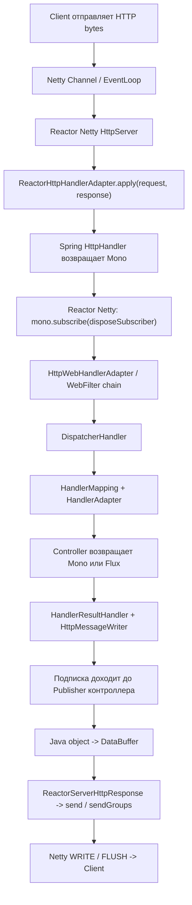
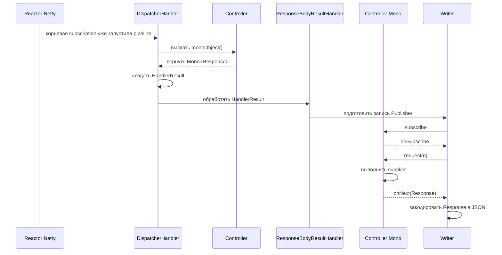

# Лекция 4. Runtime-практика WebFlux Request Path

Всем привет, ребята!

Сегодня четвертая лекция цикла по реактивному программированию. Первые три лекции поэтапно построили одну большую модель.

В первой лекции мы разобрали фундамент: чем blocking отличается от non-blocking, почему ожидание I/O не ускоряется от реактивности, почему
поток является ресурсом и зачем нужен EventLoop.

Во второй лекции мы спустились в сетевой runtime Netty. Мы увидели `Channel`, `ChannelPipeline`, `EventLoop` и поняли роль Reactor Netty поверх
Netty.

В третьей лекции мы поднялись от Reactor Netty к Spring WebFlux. Теоретически разобрали `ReactorHttpHandlerAdapter`, `HttpHandler`,
`ServerWebExchange`, фильтры, `DispatcherHandler`, поиск controller-а, `HandlerResult` и запись ответа.

Сегодня мы не будем строить еще одну отдельную теорию. Сегодня мы проверим предыдущую схему в runtime на основе практических примеров и
разберем весь путь на основе двух запросов.

```text
Простая схема: просто "controller вызвался", а разобрать весь путь.

```text
HTTP request
  -> Reactor Netty принимает request
  -> Reactor Netty запускает общий Spring Mono<Void> через subscribe(...)
  -> подписка приводит в движение WebFlux pipeline
  -> Spring находит и вызывает controller
  -> controller возвращает Mono или Flux
  -> Spring встраивает этот Publisher в response-writing pipeline
  -> подписка доходит до Publisher контроллера
  -> значение кодируется в DataBuffer / ByteBuf
  -> Reactor Netty записывает bytes клиенту
```

Главными вопросами лекции будут:

```text
Кто запускает WebFlux pipeline через subscribe,
как эта подписка приводит в выполнение controller,
и как Publisher контроллера превращается в HTTP response пользователя?
```

И я буду рад, если после лекции мы не просто будем повторять фразу, якобы «Spring подписывается на Mono»,
а могли объяснить ее технически корректно, что, собственно, и разбираем сегодня.

## 1. Техническая база, на которой проверен сценарий

Сценарий проверен на текущих зависимостях проекта:

```text
Spring Boot       4.0.6
Spring Framework  7.0.7
Reactor Core      3.8.5
Reactor Netty     1.3.5
Netty             4.2.12.Final
Java              21
```

Основной endpoint:

```bash
curl "http://localhost:8080/api/lesson-04/mono-object?name=Omar"
```

---

Общая карта:

 - Показать направление сверху вниз до controller-а и обратную колонку response write.

Короткая карта:

```text
Client
  -> Netty / Reactor Netty - HTTP runtime система, построенная поверх Netty и Reactor   
  -> ReactorHttpHandlerAdapter - адаптер между Reactor Netty и Spring HttpHandler
  -> DispatcherHandler - центральный диспетчер WebFlux, похожий по роли на DispatcherServlet  
  -> Controller - наш учебный код, который возвращает Mono или Flux 
  -> HandlerResult / HttpMessageWriter - коробка Spring-а с результатом вызова handler-а(HandlerResult) и дальнейшее кодирование Java-объекта ответа в JSON/SSE/bytes    
  -> ServerHttpResponse - reactive-запись responseBody в http-response   
  -> Reactor Netty send - доставка ответа клиенту
  -> Client - получает данные
```

Начнем! Смотрим в Java код!

> Проследим один request: Reactor Netty → Spring WebFlux → controller → Publisher → HTTP response.
> Controller возвращает описание будущей выдачи данных: `Mono` для 0..1 и `Flux` для 0..N.

### 3.2. Контроллер - показать

В контроллере создан метод, возвращающий Mono<SomeObject>. Нам не нужно двадцать примеров WebFlux.
Нам нужен один обычный(Mono) ответ, чтобы внимательно проследить жизненный цикл обработки.

## 4. Главная архитектурная модель: где на самом деле происходит subscribe

Сейчас важно остановиться и аккуратно развести два уровня описания.

Часто говорят:

```text
Spring подписался на Mono контроллера.
```

Для прикладного объяснения эта фраза допустима, но она скрывает важную деталь.

Точнее происходит так:

1. Reactor Netty получает от Spring общий `Mono<Void>`, представляющий весь HTTP exchange.
2. Reactor Netty выполняет терминальный `subscribe(...)` на этом `Mono<Void>`.
3. Эта подписка приводит в движение pipeline Spring WebFlux.
4. Spring находит controller и получает его `Mono` или `Flux`.
5. Response-writing слой Spring встраивает Publisher контроллера в pipeline кодирования и записи ответа.
6. Уже запущенная подписка распространяется через Reactor-операторы до Publisher контроллера.
7. `doOnSubscribe` нашего controller Publisher показывает момент, когда подписка действительно дошла до него.

Spring здесь отвечает за композицию HTTP pipeline: routing, вызов controller-а, выбор writer-а, encoding и `ServerHttpResponse`.

Reactor Core отвечает за исполнение Publisher/Subscriber-цепочки и распространение сигналов.

Reactor Netty находится на терминальной границе сервера: он запускает общий pipeline и связывает его завершение с сетевой операцией.



```text
Терминальная граница:
HttpServer.HttpServerHandle#onStateChange
  -> mono.subscribe(ops.disposeSubscriber()) - кто запускает общий `Mono<Void>`

Граница Publisher контроллера:
RuntimeRequestPathController
  -> doOnSubscribe(...) - эта подписка дошла до `Mono` или `Flux`, который вернул controller
```

Между ними Spring WebFlux собирает маршрут и response-writing pipeline.

```text
Одна терминальная подписка запускает общий HTTP pipeline.
Spring встраивает Publisher контроллера внутрь этого pipeline.
Reactor распространяет subscription и signals через всю цепочку.
```

## 5. Запуск Mono->Controller

Показываю концептуально важный фрагмент текущей версии Reactor Netty:

```text
if (newState == HttpServerState.REQUEST_RECEIVED) {
    HttpServerOperations ops = (HttpServerOperations) connection;
    Publisher<Void> publisher = handler.apply(ops, ops);
    Mono<Void> mono = Mono.deferContextual(ctx -> Mono.fromDirect(publisher));
    // ...
    mono.subscribe(ops.disposeSubscriber());
}
```

Обратите внимание: один и тот же `HttpServerOperations` реализует нужные Reactor Netty request/response-контракты и передается в
`handler.apply(ops, ops)` как request и response.

### 6.2. `ReactorHttpHandlerAdapter`: мост из Reactor Netty в Spring

Сейчас Reactor Netty вызывает handler, зарегистрированный Spring Boot. Этим handler-ом является `ReactorHttpHandlerAdapter`.

Адаптер решает конкретную задачу: переводит Reactor Netty request/response в Spring-абстракции и вызывает Spring `HttpHandler`.

Внутри `apply(...)` создаются:

```text
ReactorServerHttpRequest
ReactorServerHttpResponse
```

Затем вызывается:

```text
this.httpHandler.handle(request, response)
```

И возвращается `Mono<Void>`.

Обратите внимание: `ReactorHttpHandlerAdapter#apply` не вызывает `subscribe()` на Publisher контроллера. Он вообще еще не видел наш
controller Publisher. Он получает общий `Mono<Void>` обработки HTTP exchange и возвращает его к Reactor Netty.

А значит, `ReactorHttpHandlerAdapter` — мост, а не место бизнес-логики и не терминальная подписка.

### 6.3. Терминальный `subscribe(...)` на общем `Mono<Void>`

`handler.apply(...)` уже вернул Publisher обработки. Reactor Netty обернул его в `Mono<Void>` и дошел до важнейшей строки всей лекции:

```text
mono.subscribe(ops.disposeSubscriber());
```

Именно здесь находится терминальная подписка серверного runtime на общий pipeline обработки request.

`ops.disposeSubscriber()` — внутренний subscriber Reactor Netty, связанный с жизненным циклом текущей сетевой операции. Он наблюдает
завершение или ошибку общего `Mono<Void>`.

`Void` означает, что наружу не передается Java-объект ответа. Значимым результатом этого `Mono` является завершение всей обработки и записи
HTTP response.

Важная оговорка:

```text
Это terminal subscribe общего HTTP pipeline.
Это еще не отдельная ручная подписка непосредственно на Mono<Lesson04ProfileResponse>.
```

После выполнения этой строки подписка начнет распространяться через Reactor-операторы и приведет в движение Spring WebFlux pipeline.

После запуска подписки Spring исполнит входящий pipeline. Первой прикладной строкой станет вызов controller method:

```text
[MONO] controller: метод вызван, name=Omar | thread=reactor-http-nio-*
```

А значит->

```text
Reactor Netty не получает готовый response object.
Он получает Mono<Void> всей обработки и терминально подписывается на него.
```

### 6.4. `HttpWebHandlerAdapter`: `ServerWebExchange`

После терминального `subscribe` исполнение вошло в Spring WebFlux. `HttpWebHandlerAdapter` создает `ServerWebExchange`, содержащий request,
response и attributes текущего HTTP exchange.

А значит ->

Терминальная подписка Reactor Netty уже запустила Spring pipeline.
После terminal subscribe Spring создает `ServerWebExchange` и проводит request через framework chain к `DispatcherHandler`.

### 6.5. `DispatcherHandler`: найти и вызвать handler

Теперь запрос дошел до центрального диспетчера Spring WebFlux — `DispatcherHandler`.

Его задача делится на три шага:

```text
HandlerMapping       -> найти подходящий handler
HandlerAdapter       -> вызвать найденный handler
HandlerResultHandler -> обработать результат и записать response
```

В нашем случае mapping должен найти:

```text
GET /api/lesson-04/mono-object
  -> RuntimeRequestPathController#monoObject
```

Для вызова метода `@RestController` будет использован `RequestMappingHandlerAdapter`.

А значит ->

`DispatcherHandler`: mapping находит controller method, adapter вызывает его, result handler готовит response.

Reactor Netty запускает общий pipeline, а маршрутизацией и вызовом controller-а занимается Spring WebFlux.

### 6.6. Controller method: assembly еще не execution

Сейчас controller method физически вызван. Он выполняет обычный Java-код и начинает собирать `Mono`(план будущей обработки в рамках request(n)).

Строка:

```text
Mono.fromSupplier(() -> { ... })
```

- не выполняет supplier немедленно. Она создает Publisher с правилом: выполнить supplier, когда до него дойдут subscription и demand.

Вызывается метод контроллера. Точные сообщения текущего кода:

```text
[MONO] controller: метод вызван, name=Omar | thread=reactor-http-nio-*
[MONO] return: возвращаем Mono без subscribe() | thread=reactor-http-nio-*
```

А значит ->

```text
Controller method был вызван.
Publisher был собран и возвращен.
Отложенная работа Publisher-а еще не обязана выполниться.
```

### 6.7. `HandlerResult` и response-writing стратегия Spring

Controller вернул `Mono<Lesson04ProfileResponse>`, но Spring еще не получил JSON или bytes.

`RequestMappingHandlerAdapter` упаковывает результат вызова controller-а в `HandlerResult`.

Далее `DispatcherHandler` выбирает `HandlerResultHandler`. Для `@RestController` с body нас интересует `ResponseBodyResultHandler`.

Наиболее полезная практическая точка находится ниже, в:

```text
AbstractMessageWriterResultHandler#writeBody
```

Здесь Spring:

1. анализирует объявленный возвращаемый для ответа ТИП;
2. через `ReactiveAdapterRegistry` распознает `Mono`;
3. получает Publisher;
4. определяет element type;
5. выбирает media type;
6. выбирает подходящий `HttpMessageWriter`;
7. передает Publisher writer-у.

И снова важная точность: здесь Spring организует response pipeline, но в этом методе нет отдельного прикладного вызова
`controllerMono.subscribe(...)`.

Останавливаюсь в `AbstractMessageWriterResultHandler#writeBody`.

Следом инфраструктура подготовит encoding pipeline, а затем subscription дойдет до controller Mono.

### 6.8. `EncoderHttpMessageWriter`: Java Publisher превращается в Publisher буферов

Spring выбрал `EncoderHttpMessageWriter`. Его задача — связать Publisher Java-объектов с encoder-ом и реактивной записью response.

Внутри writer вызывает encoder и получает:

```text
Flux<DataBuffer>
```

Для нашего Mono-контроллера writer использует ветку 0..1. Он ожидает максимум один закодированный buffer и затем передает его в
`message.writeWith(...)`.

Объект еще не превращается в строку заранее в controller-е. Кодирование является частью reactive pipeline.

Обратите внимание на методы

```text
Mono input       -> 0..1 buffer -> writeWith(...)
streaming Flux   -> группы buffers -> writeAndFlushWith(...)
```

Важно: вызов `encode(...)` строит pipeline кодирования. Фактическое значение controller Mono появится, когда подписка пойдет в этот pipeline.

И в логах появится:

Сразу после подписки на возвращенный writer-ом pipeline дойдем до `doOnSubscribe` в controller-е.

А значит ->

```text
HttpMessageWriter не получает готовые bytes от controller-а.
Он получает Publisher<T> и строит Publisher<DataBuffer>.
```

### 6.9. Subscription дошла до `Mono` контроллера

Вот второй ключевой наблюдаемый момент лекции.

Ранее Reactor Netty терминально подписался на общий `Mono<Void>`. Spring дошел до controller-а, получил его `Mono`, выбрал response writer
и включил этот `Mono` в pipeline кодирования.

Теперь подписка дошла до Publisher, который вернул controller, поэтому срабатывает:

```text
.doOnSubscribe(...)
```

`doOnSubscribe` не является еще одной нашей терминальной командой. Это оператор-наблюдатель. Он сообщает, что на него подписались.

Затем приходит `request(n)`: — сколько элементов потребитель готов принять.

В проверенном Mono-запуске значение равно:

```text
9223372036854775807 == Long.MAX_VALUE
```

Но смысл лекции не в конкретном числе. Mono все равно может выдать максимум одно значение.

После subscription и request(n) выполняется supplier и создается `Lesson04ProfileResponse`.

А значит ->

```text
Terminal subscribe был в Reactor Netty.
Spring встроил controller Mono в response pipeline.
Теперь subscription дошла до controller Mono, появился demand,
и только после этого supplier создал значение.
```

`doOnSubscribe` доказывает, что subscription дошла до Publisher контроллера; supplier выполняется после demand.

### 6.10. `ReactorServerHttpResponse`: возврат из Spring к Reactor Netty

Controller Mono выдал Java object. Encoder превратил его в `DataBuffer`. Теперь Spring должен передать buffer серверному runtime.

`AbstractServerHttpResponse#writeWith` управляет commit response и реактивной записью body. Конкретная реализация для Reactor Netty —
`ReactorServerHttpResponse`.

В текущей версии ее ключевой метод выглядит концептуально так:

```java
protected Mono<Void> writeWithInternal(Publisher<? extends DataBuffer> publisher) {
    return this.response.send(toByteBufs(publisher)).then();
}
```

Здесь виден обратный мост:

```text
Spring DataBuffer
  -> native Netty ByteBuf
  -> Reactor Netty HttpServerResponse.send(...)
  -> Netty outbound pipeline
  -> WRITE / FLUSH
  -> socket / client
```

Вызов `send(...)` тоже не означает «синхронно скопировать все bytes в сетевую карту прямо на этой строке». Он является частью Reactor
Netty outbound pipeline. Фактическая запись зависит от подписки, EventLoop, buffers и готовности socket.

А значит ->

Spring закончил свою часть не на Java object, а передал реактивный Publisher буферов обратно Reactor Netty, который выполняет network
outbound path.

### 6.11. Фактический порядок Mono-логов

В проверенном запуске текущего кода порядок выглядит так:

```text
1. [MONO] controller: метод вызван, name=Omar | thread=reactor-http-nio-*
2. [MONO] return: возвращаем Mono без subscribe() | thread=reactor-http-nio-*
3. [MONO] doOnSubscribe: subscription дошла до Mono | thread=reactor-http-nio-*
4. [MONO] doOnRequest: request(n)=9223372036854775807 | thread=reactor-http-nio-*
5. [MONO] supplier: создаём Lesson04ProfileResponse после subscription и demand | thread=reactor-http-nio-*
6. [MONO] doOnNext: response=Lesson04ProfileResponse[...] | thread=reactor-http-nio-*
7. [MONO] doFinally: signal=onComplete | thread=reactor-http-nio-*
```

Этот порядок привязан к текущему расположению операторов. Главная устойчивая граница: supplier выполняется только после
`doOnSubscribe` и `doOnRequest`.

### 6.12. Итог Mono-прохода

```text
Мы только что прошли один запрос от Reactor Netty до controller-а и обратно.

Reactor Netty получил request и вызвал Spring adapter.
Spring вернул общий Mono<Void> обработки HTTP exchange.
Reactor Netty выполнил terminal subscribe на этом Mono<Void>.

Подписка запустила Spring WebFlux framework chain и DispatcherHandler.
Spring нашел и вызвал controller method.
Controller собрал Mono<Lesson04ProfileResponse> и вернул его, не вызывая subscribe.

ResponseBodyResultHandler и HttpMessageWriter встроили этот Mono в pipeline записи ответа.
Subscription дошла до controller Mono.
Появился request(n), supplier создал Java object, encoder превратил его в DataBuffer.

ReactorServerHttpResponse передал buffers в Reactor Netty через send(...),
а Netty записал HTTP bytes клиенту.

То есть controller не является ни началом request path, ни местом terminal subscribe,
ни компонентом, который лично пишет bytes в socket.
```



Спасибо за просмотр!
В следующей лекции мы будем подробно изучать Reactive Streams и его различные операторы!
Потрогаем руками Flux, Mono и поработаем с ними на практике.