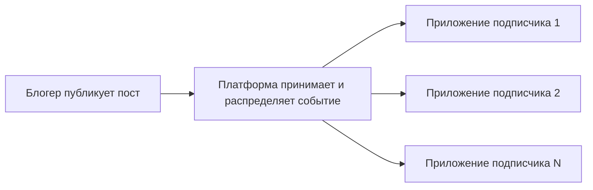
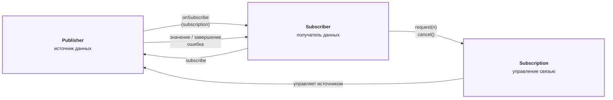
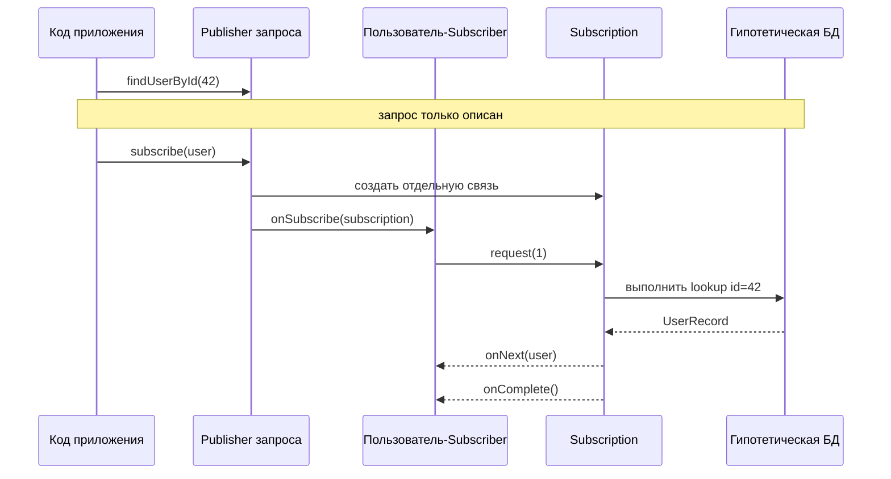
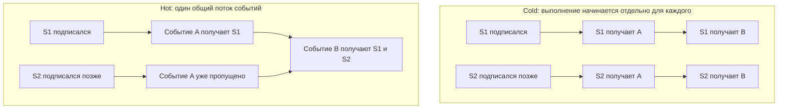
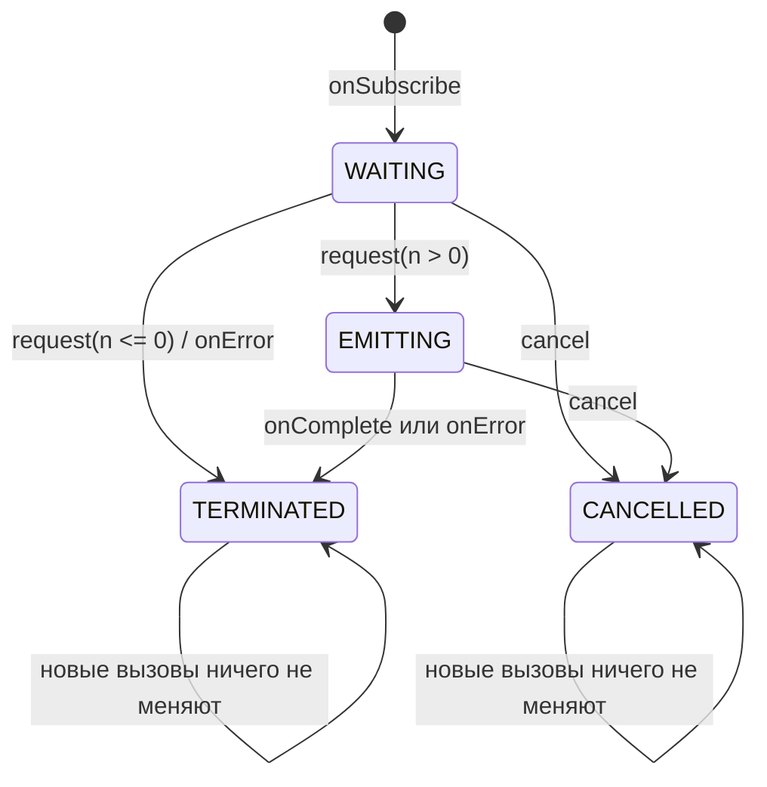

# Лекция 5. Reactive Streams

## 1. Что такое поток данных

Начнём вообще без Java, `Mono`, `Flux` и Spring.

Представим обычный список(аналогия соцсети):

```text
[пост-1, пост-2, пост-3]
```

Все три элемента уже существуют и лежат перед нами. Мы можем взять список и пройти по нему от начала до конца.

Теперь представим события, которые появляются со временем:

```text
10:00 — опубликован пост
10:03 — пришёл комментарий
10:05 — пришёл ещё один комментарий
10:20 — поставили лайк
завтра — появятся новые события
```

Мы заранее не знаем:

- когда появится следующее событие;
- сколько всего будет событий;
- когда поток закончится;
- закончится ли он вообще;
- успевает ли получатель обрабатывать события.

Вот такую последовательность значений, появляющихся со временем, мы и называем **потоком данных**.

Примеры потоков:

- посты и комментарии в социальной сети;
- биржевые котировки;
- сообщения Kafka;
- уведомления;
- строки большого файла;
- элементы ответа от базы данных;
- части streaming HTTP response.

Теперь простое определение Reactive Streams:

```text
Reactive Streams — это стандарт правил,
по которым источник передаёт поток данных получателю.
```

Эти правила отвечают на понятные вопросы:

```text
Как начать получать данные?
Как источник передаст очередное значение?
Как сообщить, что данных больше не будет?
Как сообщить об ошибке?
Как получателю остановить передачу?
Как не завалить медленного получателя слишком большим количеством данных?
```

Пока этого определения достаточно.

Важно не приписывать Reactive Streams лишнюю магию:

```text
Reactive Streams — не отдельный поток ОС.
Reactive Streams — не автоматическая параллельность.
Reactive Streams — не Mono и не Flux.
Reactive Streams — не набор map/flatMap.

Это протокол общения вокруг потока данных.
```

## 2. Жизненный пример: условный Instagram

Представим условного блогера со 100 миллионами подписчиков.

Блогер публикует новый пост. Миллионы людей хотят узнать об этом и увидеть пост в своей ленте.

Наивная картина могла бы выглядеть так:

```text
Блогер создал пост
 -> лично отправил пост подписчику №1
 -> лично отправил пост подписчику №2
 -> ...
 -> лично отправил пост подписчику №100 000 000
```

Очевидно, в реальности между автором и приложениями пользователей находится платформа, которая принимает, хранит и распределяет события.



Это только учебная аналогия. Мы не утверждаем, что внутренняя архитектура Instagram реализована именно так или использует Java Reactive
Streams.

Нас интересует общая модель:

```text
есть источник событий;
есть получатели;
между ними устанавливается связь;
по этой связи со временем приходят новые значения;
получатель может прекратить получать значения.
```

### 2.1. Почему приложение не загружает всё сразу

Пользователь открыл ленту. У платформы может быть огромная история публикаций, но телефон не должен немедленно получить всё:

```text
не 5 000 000 постов сразу,
а, например, первые 20 постов.
```

Пользователь прокрутил экран — приложение готово принять следующую порцию:

```text
дай следующие 20 постов
```

Пользователь закрыл приложение — продолжать передачу сейчас незачем.

Уже видны две разные идеи:

```text
1. На кого или на какой поток мы подписались?
2. Сколько данных приложение готово принять прямо сейчас?
```

Это не одно и то же.

### 2.2. Все подписчики работают с разной скоростью

У одного человека быстрый интернет и мощный телефон.

У другого медленный интернет.

Третий вообще свернул приложение.

Если платформа будет без ограничений отправлять всем данные с максимальной скоростью, медленные получатели начнут отставать. Где-то придётся
накапливать необработанные данные:

```text
быстрый источник
 -> всё больше необработанных элементов
 -> растущая очередь
 -> растущее потребление памяти
 -> задержки
 -> в худшем случае OutOfMemory или разрыв соединения
```

Значит, одного правила «источник просто толкает данные всем подписчикам» недостаточно.

## 3. Зачем понадобился отдельный протокол

### 3.1. Проблема №1: данные появляются не одновременно

Обычная функция удобна, когда результат можно вернуть прямо сейчас:

```java
User findUserById(long id);
```

Но новое сообщение, ответ внешнего сервиса или следующий сетевой пакет могут появиться позже.

Нам нужен способ сказать:

```text
«Когда значение появится — передай его получателю».
```

### 3.2. Проблема №2: количество элементов неизвестно

У запроса пользователя может быть один результат.

У ленты может быть тысяча результатов.

У потока уведомлений вообще может не быть заранее известного конца.

Поэтому модель должна поддерживать:

```text
ноль элементов;
один элемент;
много элементов;
потенциально бесконечный поток.
```

### 3.3. Проблема №3: источник и получатель имеют разную скорость

Представим:

```text
источник создаёт 100 000 событий в секунду;
получатель обрабатывает 1 000 событий в секунду.
```

Получатель не станет быстрее только потому, что источник отправит ещё больше данных.

Нужен механизм, позволяющий получателю сообщить:

```text
«Я сейчас готов принять вот столько элементов».
```

Так мы естественно приходим к **обратному давлению**, или **backpressure**.

```text
Backpressure — это управление скоростью передачи со стороны получателя.
```

Backpressure не ускоряет медленного получателя. Он помогает контролировать количество данных между сторонами и не создавать бесконечные
очереди.

### 3.4. Почему нужны общие правила

Можно написать собственные callbacks для каждой библиотеки. Но тогда у каждой системы будут разные методы, разные правила ошибок, отмены и
управления скоростью.

Обычный Observer уже решает часть задачи: получатель может реагировать на новые события.

```java
// 1. Интерфейс Наблюдателя
interface Observer {
    void update(String news);
}

// 2. Интерфейс Издателя
interface Subject {
    void registerObserver(Observer o);

    void removeObserver(Observer o);

    void notifyObservers();
}

// 3. Конкретный Издатель (Новостной Канал)
class NewsAgency implements Subject {
    private final List<Observer> observers = new ArrayList<>();
    private String latestNews;

    public void setNews(String news) {
        this.latestNews = news;
        notifyObservers(); // Автоматически уведомляем при изменении
    }

    @Override
    public void registerObserver(Observer o) {
        observers.add(o);
    }

    @Override
    public void removeObserver(Observer o) {
        observers.remove(o);
    }

    @Override
    public void notifyObservers() {
        for (Observer observer : observers) {
            observer.update(latestNews);
        }
    }

    // 4. Конкретные Наблюдатели (Подписчики)
    class NewsSubscriber implements Observer {
        private final String channelName;

        public NewsSubscriber(String channelName) {
            this.channelName = channelName;
        }

        @Override
        public void update(String news) {
            System.out.println("[" + channelName + "] Получена новость: " + news);
        }
    }

    // Демонстрация работы
    public class Main {
        public static void main(String[] args) {
            NewsAgency agency = new NewsAgency();

            NewsSubscriber bbc = new NewsSubscriber("BBC");
            NewsSubscriber cnn = new NewsSubscriber("CNN");

            agency.registerObserver(bbc);
            agency.registerObserver(cnn);

            // Публикация новости автоматически обновит все каналы
            agency.setNews("Паттерн Observer работает отлично!");
        }
    }
}
```

Хотя классический Observer отлично подходит для простых событий, у него есть критический недостаток: издатель
отправляет данные (метод update()) в push-модели без оглядки на то, успевает ли наблюдатель их обрабатывать.
Если NewsAgency начнет генерировать миллион новостей в секунду, у NewsSubscriber переполнится стек или память.

Reactive Streams добавляет к этой идее строгий жизненный цикл, запрос допустимого количества элементов и отмену.

Reactive Streams стандартизирует этот разговор:

```text
как подключиться;
как запросить данные;
как передать значение;
как завершиться;
как сообщить об ошибке;
как отменить передачу.
```

Благодаря общему протоколу совместимые компоненты могут соединяться в один поток обработки.

## 4. Основные участники Reactive Streams

Теперь, когда понятна задача, можно дать сторонам технические названия.

### 4.1. Publisher — источник

`Publisher` — объект, который может передавать значения подписавшемуся получателю.

```text
В Instagram-аналогии: сервис ленты, из которого приходят посты.
```

Publisher — это не обязательно готовые данные. Это может быть описание работы, которая начнётся позже.

### 4.2. Subscriber — получатель(подписчик)

`Subscriber` — объект, который принимает значения и уведомления от Publisher.

```text
В Instagram-аналогии: приложение пользователя, получающее элементы ленты.
```

Subscriber умеет реагировать:

- на установление связи;
- на очередное значение;
- на успешное завершение;
- на ошибку.

### 4.3. Subscription — объект самой подписки(связь Publisher <-> Subscription <-> Subscriber)

`Subscription` — объект связи между конкретным Publisher и конкретным Subscriber.

Через него получатель может:

```text
попросить ещё данные;
отменить передачу.
```

Для двух разных подписчиков создаются две разные Subscription, потому что у каждого собственная скорость и собственное решение об отмене.

### 4.4. Все три роли на одной схеме



Короткая формула:

```text
Publisher знает, как получить или создать данные.
Subscriber хочет их получать.
Subscription управляет разговором между ними.
```

### 4.5. Как эти роли выглядят в Java

Теперь интерфейсы уже не должны казаться случайным набором методов.

```java
public interface Publisher<T> {
    void subscribe(Subscriber<? super T> subscriber);
}
```

```java
public interface Subscriber<T> {
    void onSubscribe(Subscription subscription);

    void onNext(T value);

    void onError(Throwable error);

    void onComplete();
}
```

```java
public interface Subscription {
    void request(long n);

    void cancel();
}
```

Есть ещё четвёртый интерфейс:

```java
public interface Processor<T, R> extends Subscriber<T>, Publisher<R> {
}
```

`Processor` одновременно принимает значения сверху и публикует преобразованные значения дальше. Пока достаточно этой общей идеи. В Reactor
промежуточные стадии обычно создаются готовыми операторами, а не ручной реализацией `Processor`.

### 4.6. Сигналы как разговор

Представим диалог обычными словами:

```text
Subscriber: «Я хочу получать данные».
Publisher:  «Вот объект, через который ты можешь управлять нашей связью».
Subscriber: «Я готов принять один элемент».
Publisher:  «Вот значение».
Publisher:  «Данных больше не будет».
```

В терминах протокола:

```text
subscribe(subscriber)
 -> onSubscribe(subscription)
 -> request(1)
 -> onNext(value)
 -> onComplete()
```

Если работа завершилась неуспешно:

```text
subscribe(subscriber)
 -> onSubscribe(subscription)
 -> request(1)
 -> onError(error)
```

Если данные больше не нужны:

```text
subscribe(subscriber)
 -> onSubscribe(subscription)
 -> cancel()
```

Что означает каждый сигнал:

| Сигнал                      | Простое значение                     |
|-----------------------------|--------------------------------------|
| `onSubscribe(subscription)` | связь установлена, вот управление ею |
| `request(n)`                | готов принять ещё `n` элементов      |
| `onNext(value)`             | пришло очередное значение            |
| `onComplete()`              | поток нормально закончился           |
| `onError(error)`            | поток закончился ошибкой             |
| `cancel()`                  | данные больше не нужны               |

Теперь можно перейти к коду и руками реализовать этот разговор.

## 5. Практика: пользователь запрашивает данные из гипотетической БД

В примере нет настоящей базы данных. Значения захардкожены, чтобы нас не отвлекали JDBC, R2DBC, сеть и драйверы.

Учебные данные:

```text
id=42  → UserRecord(42, "Omar", active=true)
id=404 → пользователь не найден
id=-1  → гипотетическая ошибка БД
```

Роли:

```text
FakeReactiveDatabase      → создаёт описание запроса
DatabaseQueryPublisher    → Publisher одного результата
ManualDemandSubscriber    → пользователь-получатель
DatabaseQuerySubscription → управление одной связью
```

### 5.1. Не смешиваем содержимое запроса и количество данных

Сначала приложение говорит, **что именно** нужно найти:

```java
Publisher<UserRecord> query = database.findUserById(42);
```

Число `42` — параметр запроса к нашей гипотетической БД.

Позже Subscriber говорит, **сколько элементов** он готов принять:

```java
subscription.request(1);
```

Число `1` — количество элементов, а не id пользователя.

```text
findUserById(42) = что найти
request(1)       = сколько результатов сейчас можно передать
```

### 5.2. Вся последовательность



На схеме важно увидеть две паузы:

```text
После findUserById lookup ещё не выполнен.
После subscribe lookup тоже ещё не выполнен.
В нашей учебной модели lookup запускает положительный request.
```

### 5.3. Модель результата

```java
public record UserRecord(long id, String name, boolean active) {
}
```

### 5.4. БД создаёт Publisher, но не выполняет lookup

```java
public Publisher<UserRecord> findUserById(long userId) {
    System.out.println("[ASSEMBLY] database.findUserById(" + userId
            + ") создаёт Publisher; lookup ещё не выполнен");

    return new DatabaseQueryPublisher(userId, this);
}
```

Здесь впервые вводим термин **assembly**:

```text
Assembly — этап, на котором мы собираем описание будущей работы.
```

Мы сохранили:

- `userId`;
- ссылку на учебную БД, которая позже выполнит lookup.

Но данные ещё не читались.

### 5.5. Publisher принимает Subscriber

```java

@Override
public void subscribe(Subscriber<? super UserRecord> subscriber) {
    Objects.requireNonNull(subscriber, "subscriber");

    System.out.println("[SUBSCRIBE] Publisher получил нового Subscriber для userId=" + userId);
    subscriber.onSubscribe(new DatabaseQuerySubscription(userId, subscriber, database));
}
```

`DatabaseQueryPublisher` создаёт новую `DatabaseQuerySubscription` для каждого Subscriber.

Пока достаточно простого объяснения:

```text
каждый пользователь получает собственный пульт управления своей подпиской.
```

### 5.6. Subscriber получает связь

```java

@Override
public void onSubscribe(Subscription newSubscription) {
    this.subscription = newSubscription;
    System.out.println("[ON_SUBSCRIBE] связь получена, но данные пока не запрошены");
}
```

Наш учебный Subscriber намеренно не вызывает `request` автоматически. Благодаря этому можно остановиться и проверить:

```text
Publisher создан;
Subscriber подписан;
Subscription передана;
lookupCount всё ещё равен 0;
onNext ещё не было.
```

### 5.7. Subscriber сообщает готовность

```java
public void request(long n) {
    subscription.request(n);
}
```

После вызова:

```java
user.request(1);
```

наша Subscription выполняет lookup и передаёт результат:

```text
Optional<UserRecord> result = database.executeLookup(userId);

if (result.isPresent()) {
    subscriber.onNext(result.get());
}

subscriber.onComplete();
```

Реальная реализация в проекте дополнительно учитывает состояние, cancellation, ошибку lookup и недопустимый запрос количества.

### 5.8. Ожидаемые логи счастливого пути

Запускаем `ReactiveStreamsDatabaseDemo.main()` из IDE.

```text
[ASSEMBLY] database.findUserById(42) создаёт Publisher; lookup ещё не выполнен
[SUBSCRIBE] Publisher получил нового Subscriber для userId=42
[ON_SUBSCRIBE] user-subscriber получил Subscription, но пока не запросил данные
[CHECK] lookupCount после subscribe = 0
[DEMAND] user-subscriber вызывает request(1)
[DEMAND] Subscription получила request(1) для userId=42
[QUERY] выполняется lookup #1 для userId=42
[ON_NEXT] Publisher передаёт UserRecord[id=42, name=Omar, active=true]
[ON_NEXT] user-subscriber получил значение: UserRecord[id=42, name=Omar, active=true]
[COMPLETE] Publisher больше не имеет значений и вызывает onComplete()
[COMPLETE] user-subscriber получил onComplete()
```

Теперь термины можно связать с конкретными строками:

```text
assembly      → объект запроса создан;
subscription  → связь установлена;
demand        → Subscriber готов принять значение;
execution     → lookup действительно запущен;
onNext        → значение передано;
onComplete    → работа нормально закончилась.
```

### 5.9. Что здесь означает lazy execution

`Lazy` означает, что работа отложена до момента, когда она действительно понадобится.

В нашем примере:

```text
findUserById(42) → описали работу;
subscribe(user)  → создали связь;
request(1)       → запустили lookup.
```

Но нельзя говорить, что любой код рядом с `Mono` или Publisher автоматически ленивый. Позже сравним разные способы создания `Mono`.

### 5.10. Остальные исходы

Пользователь не найден:

```text
request(1)
 -> lookup возвращает пустой результат
 -> onNext отсутствует
 -> onComplete()
```

Ошибка БД:

```text
request(1)
 -> lookup завершается ошибкой
 -> onError(error)
```

Отмена до запроса:

```text
onSubscribe
 -> cancel()
 -> последующий request ничего не запускает
 -> lookupCount остаётся 0
```

## 6. Где здесь Mono, Flux и Reactor

До этого момента мы обсуждали Reactive Streams как протокол.

Теперь можно расположить технологии по уровням:

```text
Reactive Streams
    задаёт интерфейсы и правила разговора

Project Reactor
    реализует эти правила
    предоставляет Mono, Flux и операторы

Spring WebFlux
    использует Reactor для HTTP request/response flow
```

### 6.1. Mono — Publisher на 0..1 значение

`Mono<T>` может закончиться тремя способами:

```text
значение: onNext(value) → onComplete()
пусто:    onComplete() без onNext
ошибка:   onError(error)
```

Запрос `findUserById` естественно представлять как `Mono<UserRecord>`, потому что пользователь либо найден, либо отсутствует, либо запрос
закончился ошибкой.

### 6.2. Flux — Publisher на 0..N значений

`Flux<T>` подходит для последовательности:

```text
список пользователей;
элементы streaming response;
сообщения;
события;
длинный или бесконечный поток.
```

Короткий пример:

```text
Flux<Integer> numbers = Flux.range(1, 5);

numbers.subscribe(subscriber);

subscriber.request(1); // приходит 1
subscriber.request(1); // приходит 2
subscriber.request(1); // приходит 3
```

На `Flux` смысл управления количеством виден лучше: потенциально элементов много, но Subscriber разрешает выдавать их порциями.

### 6.3. Что такое оператор

Оператор — это готовая стадия обработки потока.

Например:

```java
Mono<UserRecord> source = Mono.from(database.findUserById(42));
Mono<String> name = source.map(UserRecord::name);
```

`map` не изменяет объект `source`. Он возвращает новый Publisher, который подпишется на предыдущую стадию, преобразует значение и передаст
его дальше.

Только теперь вводим направления:

```text
request/cancel идут к источнику — upstream;
onNext/onError/onComplete идут к получателю — downstream.
```

### 6.4. Пять основных групп для этой лекции

| Оператор        | Когда нужен                                | Простая форма                  |
|-----------------|--------------------------------------------|--------------------------------|
| `map`           | синхронно преобразовать значение           | `T → R`                        |
| `flatMap`       | следующий шаг возвращает `Publisher`       | `T → Publisher<R>`             |
| `filter`        | пропустить только подходящее значение      | значение либо empty            |
| `switchIfEmpty` | заменить пустой результат другим Publisher | empty → fallback               |
| `doOn...`       | увидеть сигнал в логах или метриках        | наблюдение без замены значения |

Полный pipeline лекции:

```java
Mono<String> greeting = Mono.from(database.findUserById(42))
        .filter(UserRecord::active)
        .map(UserRecord::name)
        .flatMap(database::loadGreeting)
        .switchIfEmpty(Mono.defer(database::anonymousGreeting))
        .doOnNext(value -> System.out.println("observe: " + value));
```

#### `map`

```java
.map(UserRecord::name)
```

Обычное синхронное преобразование:

```text
UserRecord → String
```

#### `flatMap`

```java
.flatMap(database::loadGreeting)
```

Нужен, потому что `loadGreeting` уже возвращает `Mono<String>`. Если использовать `map`, получится вложенность `Mono<Mono<String>>`.

#### `filter`

```java
.filter(UserRecord::active)
```

Если условие ложно, значение не проходит дальше. Для `Mono` downstream увидит пустое успешное завершение.

#### `switchIfEmpty`

```java
.switchIfEmpty(Mono.defer(database::anonymousGreeting))
```

Если значение не пришло, Reactor подпишется на fallback. `Mono.defer` откладывает создание fallback до момента, когда он действительно
понадобится.

#### `doOn...`

```java
.doOnSubscribe(...)
.

doOnRequest(...)
.

doOnNext(...)
.

doOnError(...)
.

doFinally(...)
```

Эти операторы помогают наблюдать поток. Не стоит прятать в них основную бизнес-логику.

### 6.5. Почему WebFlux controller не вызывает subscribe сам

В чистом Java-примере terminal subscribe инициируем мы, потому что другого runtime нет.

В WebFlux:

```text
controller возвращает Mono/Flux;
WebFlux встраивает его в HTTP response flow;
инфраструктура выполняет terminal subscribe;
сигналы превращаются в HTTP body, completion или error response.
```

Эта формулировка теперь является мостом к предыдущей лекции, а не сложным вступлением в новую тему.

## 7. Lazy/eager и cold/hot

### 7.1. Lazy и eager отвечают на вопрос «когда?»

Eager-вариант:

```java
Mono<UserRecord> eager = Mono.just(loadUser());
```

Java сначала выполнит `loadUser()`, чтобы получить аргумент для `Mono.just`. Работа произойдёт во время сборки выражения.

Lazy-вариант:

```java
Mono<UserRecord> lazy = Mono.fromSupplier(this::loadUser);
```

Здесь Reactor получает описание работы и вызовет его после подписки и запроса данных.

```text
lazy/eager = когда выполняется работа
```

### 7.2. Cold и hot отвечают на вопрос «чьё выполнение?»

Cold Publisher создаёт отдельный сценарий для каждого Subscriber.

```text
Запрос БД:
subscriber-1 → собственный lookup
subscriber-2 → новый собственный lookup
```

Hot Publisher связан с общим уже идущим потоком.

```text
Live-feed:
событие произошло один раз;
подписанные сейчас получили его;
поздний подписчик мог пропустить прошлое событие.
```



Нельзя смешивать оси:

| Вопрос                               | Понятия      |
|--------------------------------------|--------------|
| Когда начинается вычисление?         | lazy / eager |
| Отдельное выполнение или общий эфир? | cold / hot   |

## 8. Строгие правила протокола

Теперь, когда общий разговор понятен, можно зафиксировать технические инварианты.

### 8.1. Допустимая форма сигналов

```text
onSubscribe
    onNext*
    (onComplete | onError)?
```

Это означает:

- `onSubscribe` должен быть первым;
- `onNext` может прийти ноль, один или много раз;
- `onComplete` и `onError` — взаимоисключающие финальные сигналы;
- после финального сигнала новых сигналов быть не должно;
- `cancel()` прекращает интерес Subscriber-а, но не является `onComplete()`.

### 8.2. Количество onNext ограничено запросом

В любой момент:

```text
количество переданных onNext
<=
суммарное количество запрошенных элементов
```

Если Subscriber вызвал `request(5)`, Publisher может передать от нуля до пяти значений и завершиться. Он не обязан обязательно найти пять
элементов.

### 8.3. request(n <= 0)

```text
subscription.request(0);
subscription.request(-10);
```

Оба значения недопустимы.

Ошибка должна прийти Subscriber-у через:

```text
onError(IllegalArgumentException)
```

`request` не должен выбрасывать эту ошибку наружу обычным `throw`.

### 8.4. Состояния нашей Subscription



Зачем хранить состояние:

- не выполнить lookup дважды;
- не передать значение после завершения;
- не вызвать одновременно `onError` и `onComplete`;
- не продолжить работу после отмены;
- сделать повторный `cancel()` безопасным.

### 8.5. Граница учебной реализации

Наш Publisher показывает форму протокола, но не заменяет полноценный reactive runtime.

Особенно нельзя сделать так:

```java
public void request(long n) {
    jdbcTemplate.query(...); // блокирующий JDBC не стал reactive
}
```

Обёртка в Publisher не превращает блокирующий I/O в неблокирующий. Для настоящей реактивной базы нужен неблокирующий драйвер вроде R2DBC
либо отдельная осознанная изоляция blocking boundary.

## 9. Типичные ошибки

### Ошибка 1. «Reactive Streams — это Mono и Flux»

Нет. Reactive Streams — протокол. `Mono` и `Flux` — реализации Publisher из Reactor.

### Ошибка 2. «subscribe означает немедленно отправить все данные»

Нет. Сначала устанавливается связь. Количество элементов контролируется через `request(n)`.

### Ошибка 3. «request(42) означает найти id=42»

Нет. Содержимое запроса задаётся отдельно. `request(42)` означает готовность принять до 42 элементов.

### Ошибка 4. «Reactive Streams автоматически создаёт другой поток»

Нет. Учебный Publisher может выполнить lookup и callbacks синхронно на потоке, вызвавшем `request`.

### Ошибка 5. «empty — это null или error»

Нет:

```text
empty → onComplete без onNext
error → onError
```

### Ошибка 6. «backpressure ускоряет Consumer»

Нет. Он регулирует количество данных между сторонами.

### Ошибка 7. «cold означает lazy»

Нет. Lazy описывает время выполнения, cold — отношение выполнения к подписчикам.

### Ошибка 8. «в controller можно вызвать subscribe руками»

Так работа отрывается от HTTP lifecycle, cancellation и обработки ошибок WebFlux. Controller должен вернуть Publisher инфраструктуре.

## 10. Краткий итог

Главная концепция:

```text
Reactive Streams задаёт правила управляемой передачи потока данных от источника к получателю.
```

Главные роли:

```text
Publisher    → предоставляет данные
Subscriber   → получает сигналы
Subscription → управляет количеством и отменой
```

Наш сценарий:

```text
database.findUserById(42) → описали запрос
subscribe(user)           → установили связь
request(1)                → разрешили передать один результат
onNext(user)              → получили значение
onComplete()              → поток завершился
```

Связь с Reactor:

```text
Mono/Flux реализуют Publisher.
Операторы создают новые стадии Publisher.
WebFlux подписывается на итоговый Publisher и превращает сигналы в HTTP response.
```

Следующая лекция:

- Flux в контексте бесконечного и конечного потока с настройкой backpressure
- Threads, Schedulers(parallel, boundedElastic), publishOn, subscribeOn...
