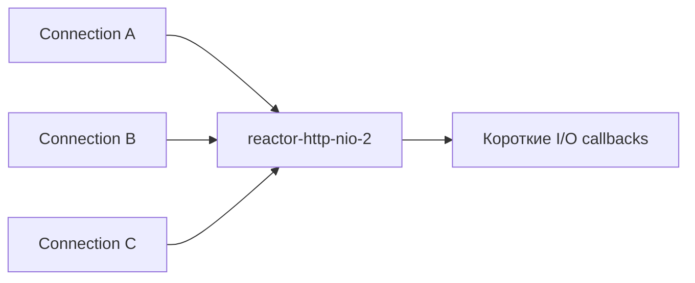
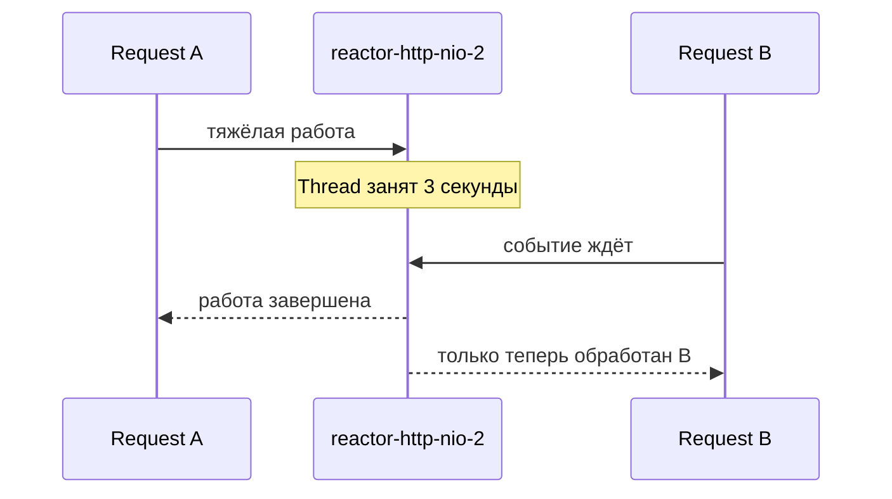
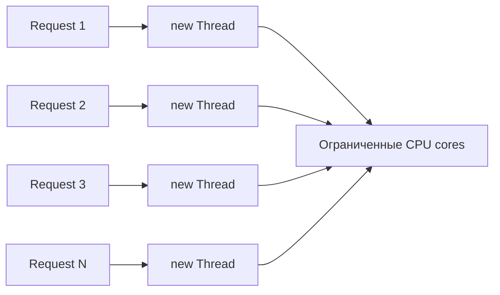
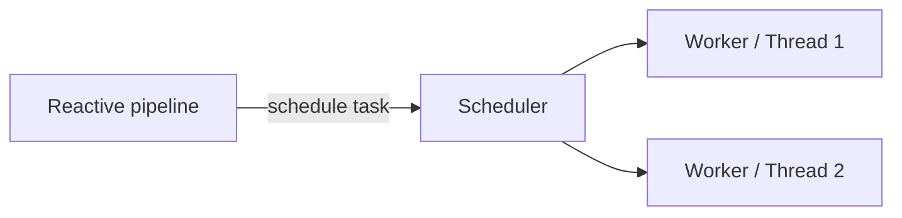

# Лекция 6. Threads и Schedulers в Reactor

В WebFlux один event-loop Thread обслуживает события многих соединений.

Поэтому пользовательский код внутри reactive pipeline должен отвечать на вопрос:

```text
Можно ли выполнить эту работу на event loop,
или её нужно перенести на другой Scheduler(условный пул потоков)?
```

В этой лекции рассматриваем два основных Scheduler-а Reactor:

```text
Schedulers.parallel()       → CPU-bound работа;
Schedulers.boundedElastic() → неизбежный blocking I/O.
```

## 1. Что должно быть понятно после лекции

После занятия слушатель сможет:

- объяснить, почему event loop нельзя занимать долгой работой;
- отличить CPU-bound вычисление от blocking I/O;
- выбрать между `parallel()` и `boundedElastic()`;
- объяснить разницу `publishOn` и `subscribeOn`;
- правильно вынести тяжёлую работу с event loop;

Главная мысль:

```text
Scheduler не ускоряет работу.

Он определяет execution resource, на котором эта работа будет выполняться.
```

### 2.1. Event loop обслуживает несколько соединений

Упрощённая модель Reactor Netty:



Event loop по очереди:

```text
читает bytes;
выполняет короткую работу по обслуживанию запроса и освобождается;
возвращается к сетевым событиям;
обслуживает следующий Channel.
```

Модель эффективна, пока callback быстро возвращает управление.

### 2.3. Что произойдёт при трёхсекундной работе



Проблема не только в медленном request A. Пока event-loop Thread занят, он не обслуживает другие назначенные ему Channel-ы.

Получаем первую проблему:

```text
WebFlux экономит Threads благодаря event-loop модели,
но долгий синхронный callback может занять один из этих редких Threads
и задержать сразу несколько соединений.
```

## 3. Почему одной стратегии для любой долгой работы недостаточно

### 3.1. CPU-bound

CPU-bound работа действительно занимает процессор вычислениями:

- криптография;
- хеширование;
- сжатие;
- обработка изображения;
- сложные расчёты.

```text
Thread: RUNNABLE
CPU core: выполняет инструкции
```

Если перенести криптографию с `reactor-http-nio-2` на `parallel-1`, вычисление не исчезнет:

```text
parallel-1 продолжит занимать CPU,
но reactor-http-nio-2 сможет вернуться к сети.
```

То есть мы освобождаем event loop, а не уменьшаем CPU cost.

### 3.2. Blocking I/O

Blocking I/O удерживает Thread ожиданием:

- JDBC;
- старый синхронный HTTP client;
- blocking file API;
- SDK, предоставляющий только синхронный метод.

```text
Thread: ждёт внешний ресурс
CPU core: простаивает
```

### 3.3. Настоящий non-blocking I/O

Есть и третий случай: `WebClient`, Reactor Netty или R2DBC начинает I/O и возвращает Thread в event loop.

```text
1. Runtime начал операцию.
2. Зарегистрировал интерес к будущему I/O event.
3. Thread вернулся к другим Channel-ам.
4. После готовности ресурса runtime продолжил pipeline.
```

Такой вызов может завершиться через три секунды, но event-loop Thread не был заблокирован на эти три секунды.

### 3.4. Сравнение

| Тип работы       | Что происходит с Thread           | Ограничение                 | Scheduler                     |
|------------------|-----------------------------------|-----------------------------|-------------------------------|
| CPU-bound        | активно выполняет инструкции      | CPU cores                   | `Schedulers.parallel()`       |
| Blocking I/O     | удерживается ожиданием ресурса    | Threads                     | `Schedulers.boundedElastic()` |
| Non-blocking I/O | не удерживается ожиданием         | event loop и внешний ресурс | не переключать без причины    |
| Короткий код     | быстро выполняется и возвращается | event loop                  | переключение не требуется     |

## 4. Почему нельзя просто создавать новый Thread на каждый request

Наивное исправление выглядит так:

```text
new Thread(() ->

calculateHash()).start();
```

Event loop действительно освободится. Но мы вернём проблемы модели thread-per-request:

- каждый platform Thread требует память под stack;
- большое число Threads усиливает context switching;
- CPU-bound Threads конкурируют за конечное число cores;
- отсутствует общий предел параллелизма;
- нет управляемой очереди задач;
- нужно самостоятельно решать shutdown, ошибки и повторное использование ресурсов.



Нам нужен не случайный новый Thread, а управляемый механизм:

```text
переиспользовать execution resources;
ограничить их количество;
поставить лишние tasks в очередь;
выбрать модель под конкретный тип работы;
интегрировать всё это с lifecycle Reactor pipeline.
```

Так мы приходим к Scheduler.

## 5. Как из этих проблем появляется Scheduler

Упрощённо:

```text
Task      → работа, которую нужно выполнить;
Thread    → исполняет инструкции task;
Scheduler → планирует Reactor tasks на своих execution resources.
```



Scheduler не равен одному Thread. Например, `Schedulers.parallel()` управляет фиксированным набором workers.

Главное архитектурное требование:

```text
CPU-bound и blocking I/O нельзя бездумно отправить в один одинаковый пул.
```

CPU-bound tasks нужны немногочисленные workers, связанные с числом cores. Blocking tasks могут иметь больше workers, потому что большую часть
времени ждут, но их количество и очередь всё равно должны быть ограничены.

Поэтому Reactor предоставляет Scheduler-ы с разной моделью ресурсов.

Переключение имеет цену:

- task ставится в очередь;
- Scheduler выбирает worker;
- появляется дополнительная latency;

Поэтому Scheduler не нужно добавлять перед каждым оператором.

## 6. Schedulers.parallel()

`Schedulers.parallel()` — общий Reactor Scheduler для CPU-bound работы.

Его основные свойства:

- фиксированное количество workers;
- размер по умолчанию связан с числом доступных процессоров;
- подходит для вычислений без blocking ожидания;

Пример:

```text
Mono.just(payload)
.publishOn(Schedulers.parallel())
.map(cryptoService::calculate);
```

Важно: `parallel()` тоже не защищает приложение от перегрузки. Если одновременно запустить много трёхсекундных вычислений, workers будут
заняты, а новые tasks начнут ждать.

На `parallel()` нельзя выполнять JDBC, `Thread.sleep` и другой blocking I/O.

## 7. Schedulers.boundedElastic()

`Schedulers.boundedElastic()` предназначен для неизбежного blocking I/O.

Правильный blocking adapter:

```text
Mono.fromCallable(() -> legacyClient.loadProfile(userId))
.subscribeOn(Schedulers.boundedElastic());
```

Что произошло:

```text
blocking-вызов остался blocking;
внешняя система не стала быстрее;
но event loop больше не ждёт этот вызов.
```

`boundedElastic()` не бесконечный. При насыщении tasks ждут в очереди, latency растёт, а после достижения предела scheduling может быть
отклонён.

Для настоящего non-blocking API, например `WebClient` или R2DBC, `boundedElastic()` обычно не нужен: такое I/O уже не удерживает Thread
ожиданием.

## 8. publishOn и subscribeOn

### 8.1. Направления pipeline


Data signals идут от source к subscriber. Subscription строится в обратную сторону.

### 8.2. publishOn

`publishOn` переносит downstream-стадии, стоящие после него:

```text
Mono.just(payload)                                 // reactor-http-nio-2
.doOnNext(value ->log.info("before: {}",thread())) // reactor-http-nio-2
.publishOn(Schedulers.parallel())
.map(cryptoService::calculate)                     // parallel-1
.doOnNext(value ->log.info("after: {}",thread()))  // parallel-1
.map(this::createResponse);                        // parallel-1
```

```text
до publishOn    → reactor-http-nio-*;
после publishOn → parallel-*.
```

```text
Ожидаемые логи:

before: reactor-http-nio-2
calculate: parallel-1
after: parallel-1
createResponse: parallel-1
```

Если тяжёлый `map` поставить до `publishOn`, то он выполнится на event loop.

### 8.3. subscribeOn

`subscribeOn` переносит процесс subscription к source:

```text
Mono.fromCallable(() -> legacyClient.loadProfile(userId))
.subscribeOn(Schedulers.boundedElastic());
```

`subscribeOn` не вызывает `subscribe()` самостоятельно. Terminal subscription по-прежнему выполняет WebFlux runtime.

Короткая формула:

```text
Тяжёлая downstream-стадия → publishOn перед ней.

Blocking source → fromCallable + subscribeOn.
```

## 9. Практика через WebFlux controller

Код находится в пакете:

```text
V6_threads_schedulers_practice.lesson06
```

`controllerThread` показывает, где Spring вызвал controller method. 
`workThread` показывает, где реально выполнялась долгая работа.

### 9.1. Базовый endpoint

```bash
curl "http://localhost:8080/api/lesson-06/current-thread"
```

Без Schedulerов ожидаем:

```text
controllerThread = reactor-http-nio-2
workThread       = reactor-http-nio-2
```

Для короткой работы это правильно.

### 9.2. CPU-bound на event loop — неправильно

```bash
curl "http://localhost:8080/api/lesson-06/cpu-on-event-loop?payload=hello&durationMs=3000"
```

```text
return Mono.just(payload)
.map(value ->executeCpuWork(value, durationMs));
```

Учебный `executeCpuWork` повторяет SHA-256 и занимает CPU.

Ожидаемые Threads:

```text
controllerThread = reactor-http-nio-2
workThread       = reactor-http-nio-2
```

Endpoint намеренно неправильный.

### 9.3. CPU-bound на parallel — правильно

```bash
curl "http://localhost:8080/api/lesson-06/cpu-on-parallel?payload=hello&durationMs=3000"
```

```text
return Mono.just(payload)
.publishOn(Schedulers.parallel())
.map(value ->executeCpuWork(value, durationMs));
```

Ожидаем:

```text
controllerThread = reactor-http-nio-2
workThread       = parallel-1
```

Event loop освободился, но CPU-вычисление по-прежнему длится около трёх секунд.

### 9.4. Blocking-вызов на event loop — неправильно

```bash
curl "http://localhost:8080/api/lesson-06/blocking-on-event-loop?userId=42&durationMs=3000"
```

```text
return Mono.fromCallable(() ->legacyClient.loadProfile(userId));
```

`fromCallable` сделал вызов lazy, но не перенёс его:

```text
controllerThread = reactor-http-nio-2
workThread       = reactor-http-nio-2
```

Endpoint намеренно неправильный.

### 9.5. Blocking-вызов на boundedElastic — правильно

```bash
curl "http://localhost:8080/api/lesson-06/blocking-on-bounded-elastic?userId=42&durationMs=3000"
```

```text
return Mono.fromCallable(() -> legacyClient.loadProfile(userId))
.subscribeOn(Schedulers.boundedElastic());
```

Ожидаем:

```text
controllerThread = reactor-http-nio-2
workThread       = boundedElastic-1
```

## 10. Типичные ошибки

### «Scheduler ускоряет работу»

Нет. Он переносит execution. CPU и внешний сервис не становятся быстрее.

### «Любую долгую работу отправляем на boundedElastic»

Нет. CPU-bound работа идёт на `parallel`, blocking wait — на `boundedElastic`.

### «fromCallable уже перенёс blocking-вызов»

Нет. Он только сделал source lazy. Для переноса нужен `subscribeOn`.

### «Можно написать Mono.just(blockingCall())»

Нет. Java выполнит `blockingCall()` ещё до создания `Mono`. Нужен `fromCallable`.

### «publishOn можно поставить после тяжёлого map»

Нет. Выполненная до boundary работа уже заняла исходный Thread.

### «WebClient нужно перенести на boundedElastic»

Нет. Настоящее non-blocking I/O не удерживает Thread ожиданием.

## 11. Итог

```text
Короткая работа: остаться на event loop.

CPU-bound работа: publishOn(Schedulers.parallel()).

Blocking source:
Mono.fromCallable(...)
    .subscribeOn(Schedulers.boundedElastic()).
```

Финальная мысль:

```text
В хорошем pipeline мало Scheduler boundaries, но каждая из них имеет конкретную причину.
```

## 13. Источники

- [Project Reactor: Threading and Schedulers](https://projectreactor.io/docs/core/release/reference/coreFeatures/schedulers.html)
- [Project Reactor FAQ: wrapping a synchronous blocking call](https://projectreactor.io/docs/core/release/reference/faq.html#faq.wrap-blocking)
- [Reactor Schedulers API](https://projectreactor.io/docs/core/release/api/reactor/core/scheduler/Schedulers.html)

Всем спасибо за просмотр!