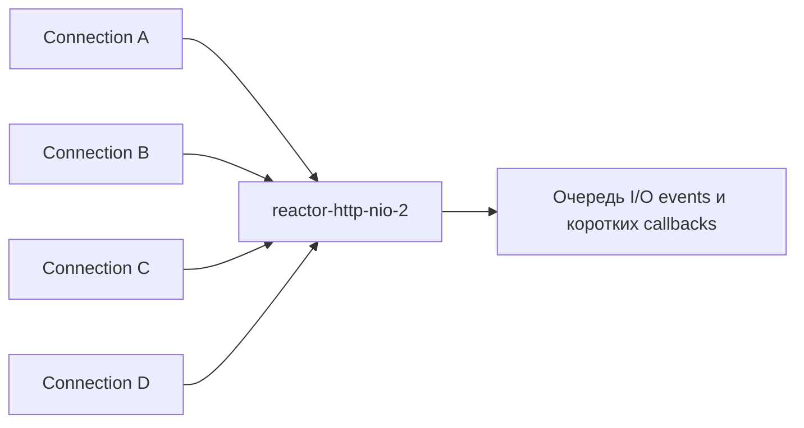
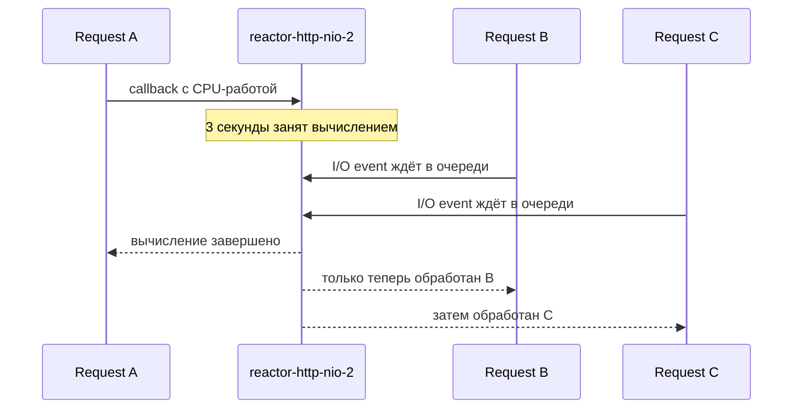
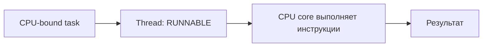
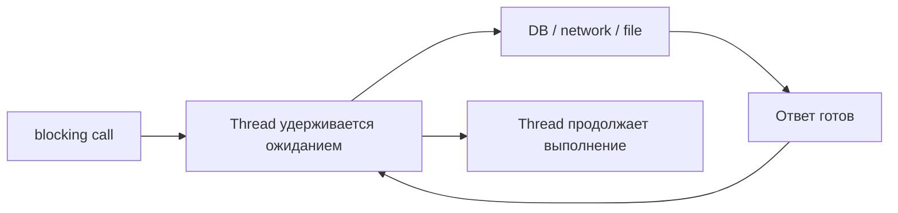
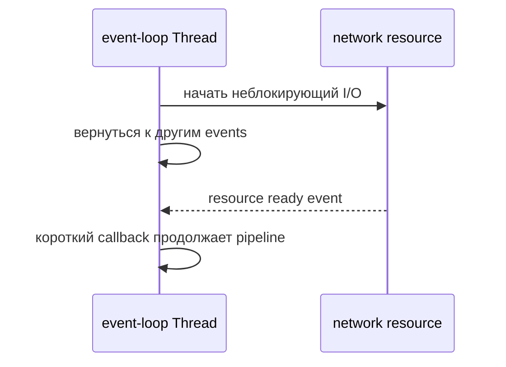
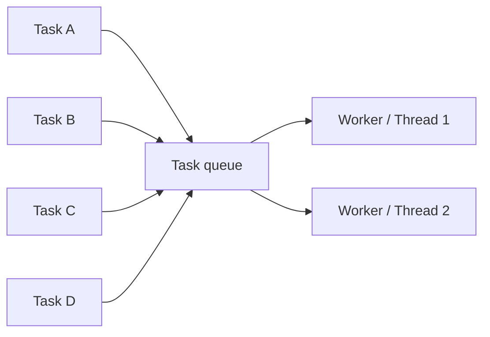
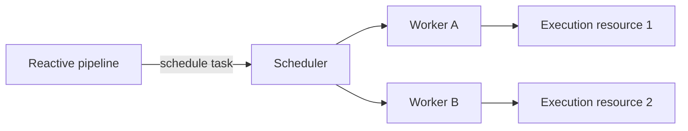
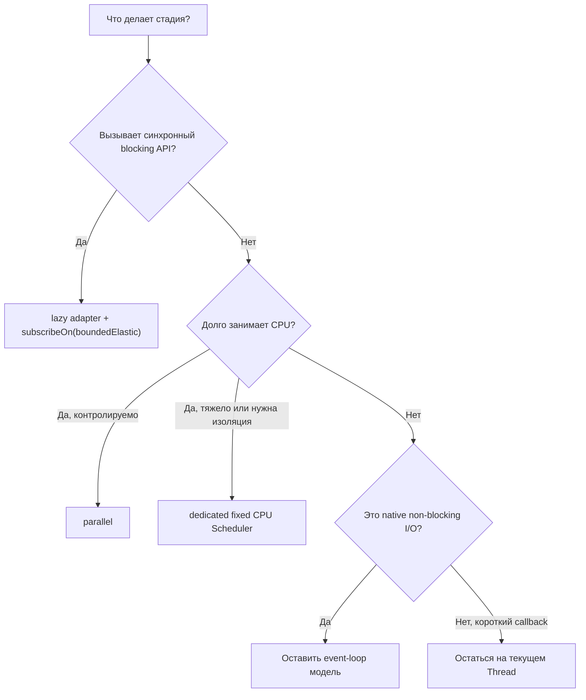
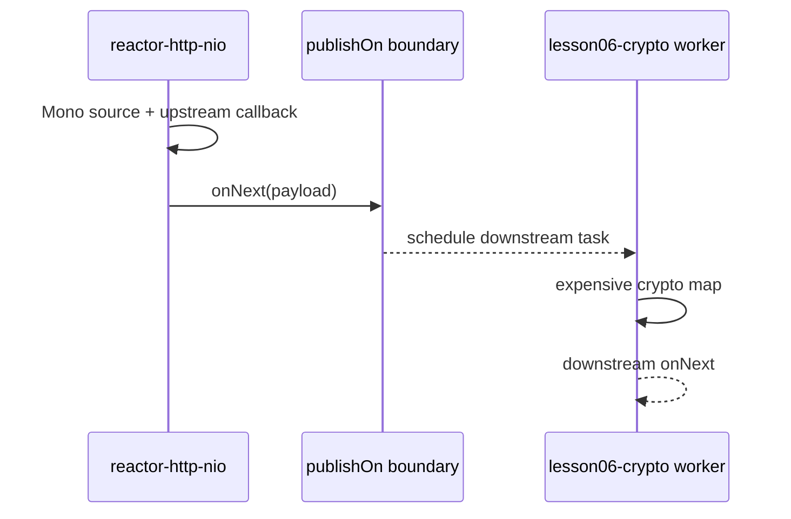
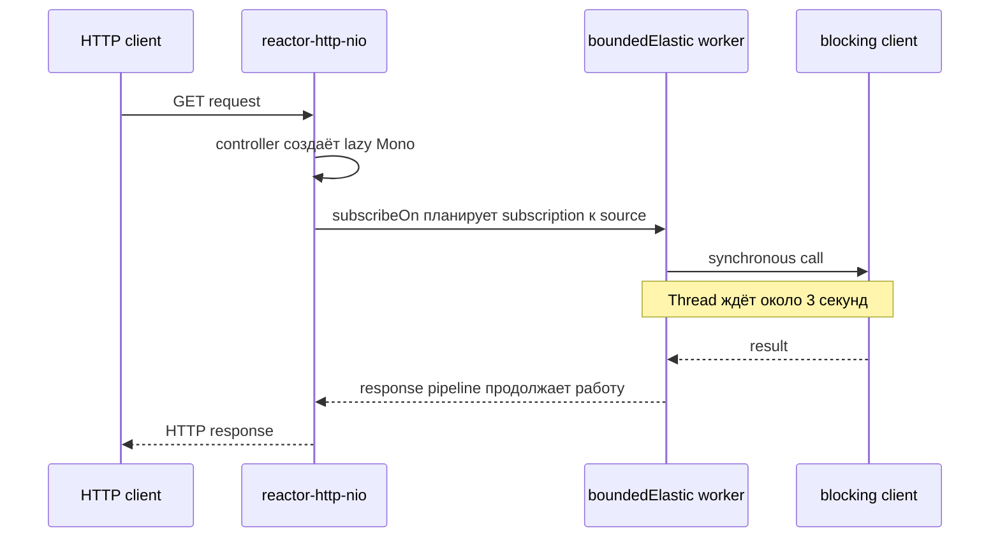

# Лекция 6. Threads, Schedulers и границы выполнения в Reactor

В предыдущих лекциях мы увидели две важные части WebFlux:

```text
Reactor Netty принимает HTTP request небольшим количеством event-loop Threads.

Controller возвращает Publisher(Mono, Flux), а WebFlux "подписывается" на него и превращает сигналы в HTTP response.
```

Теперь возникает практический вопрос:

```text
Что произойдёт, если пользовательский код внутри pipeline работает три секунды?
```

Ответ зависит не только от длительности, но и от причины:

```text
Thread три секунды вычисляет и занимает CPU?

или

Thread три секунды ничего не вычисляет, но заблокирован ожиданием JDBC/старого HTTP-клиента? 
То есть, возможен вызов синхронного блокирующего кода
```

Именно для осознанного управления такими границами Reactor предоставляет `Scheduler`, `subscribeOn` и `publishOn`.

## 1. Что будет понятно после лекции

После занятия слушатель сможет:

- объяснить, почему event loop должен выполнять короткие callbacks;
- отличить CPU-bound работу от blocking I/O и настоящего non-blocking I/O;
- объяснить разницу между `Thread`, задачей, пулом, `Scheduler` и `Scheduler.Worker`;
- выбрать между текущим event loop, `Schedulers.parallel()`, отдельным CPU Scheduler и `Schedulers.boundedElastic()`;
- объяснить `subscribeOn` и `publishOn` через направление subscription и data signals;
- правильно изолировать тяжёлое вычисление и синхронный blocking-вызов;
- прочитать логи учебных HTTP endpoint-ов и предсказать имена Threads;
- объяснить цену каждого переключения и ограничения каждого пула.

Главная мысль:

```text
Scheduler не ускоряет вычисление и не делает blocking API неблокирующим.

Scheduler позволяет выбрать execution resource, на котором конкретная работа не разрушит остальную runtime-модель.
```

## 2. Сначала проблема: почему понадобились Scheduler-ы

### 2.1. Reactor не создаёт отдельный поток(os-thread) на каждый Publisher

Создание reactive pipeline само по себе не означает:

```text
создай новый Thread;
перенеси работу с event loop;
```

Большинство синхронных операторов продолжают выполнение в Thread, из которого получили сигнал.

Если WebFlux runtime начал обработку на:

```text
reactor-http-nio-2
```

то пользовательский `map`, `filter` или supplier тоже выполнится на `reactor-http-nio-2`,
если не указать компилятору границу выполнения вручную, создав задачи на отдельные пулы потоков

И event-loop прекрасно справляется в рамках короткой работы:

```text
прочитать поле;
проверить простое условие;
создать маленький response object;
```

Переключение Thread для каждой такой операции стоило бы дороже самой операции. (1 лекция и Scheduler операционной системы; context switch)

Проблема начинается, когда короткая работа внезапно превращается в долгую работу.

### 2.2. Один event loop обслуживает много соединений

Упрощённая модель Reactor Netty:



Это не модель «один Thread на один request».

Один event-loop Thread со временем обслуживает события многих Channel-ов:

```text
прочитал bytes соединения A;
вызвал callback;
вернулся в event loop;
обработал готовность соединения C к записи;
вернулся;
прочитал новые bytes соединения B;
```

Такая модель эффективна, пока каждый callback быстро возвращает управление.

### 2.3. Что будет при трёхсекундной долгой работе

Представим, что request A запустил криптографическое вычисление прямо на event loop:



Задержка затронула не только request A.

На этом event loop могли ждать события других соединений. Поэтому правило звучит так:

```text
Event loop не должен надолго терять возможность обслуживать свои Channel-ы.
```

### 2.4. Важная поправка про «разгрузить CPU»

Если перенести криптографию с `reactor-http-nio-2` на `lesson06-crypto-1`, вычисление не исчезнет.

```text
Было:
event-loop Thread занимает CPU три секунды.

Стало:
crypto Thread занимает CPU три секунды,
а event-loop Thread может вернуться к сетевым событиям.
```

Мы освободили event loop, но не уменьшили CPU cost.

Если одновременно запустить слишком много таких вычислений, процессор всё равно будет нагружаться. Однако, eventLoop будет свободен.

## 3. Не вся долгая работа одинакова

Перед выбором Scheduler нужно классифицировать работу.

### 3.1. CPU-bound: Thread реально вычисляет

Примеры:

- хеширование большого объёма данных;
- шифрование или проверка цифровой подписи;
- сжатие;
- обработка изображения;
- большой JSON transformation;
- сложная математическая модель.

Во время такой работы Thread в основном исполняем:

```text
Thread state: RUNNABLE
CPU core: занят инструкциями
```



Для CPU-bound работы увеличение числа Threads далеко сверх числа CPU cores обычно не ускоряет систему:

```text
много runnable Threads
 -> конкурируют за конечные cores
 -> чаще переключается контекст
 -> растёт latency
 -> throughput перестаёт расти или падает
```

Поэтому CPU pool обычно фиксированный и связан с числом доступных процессоров.

### 3.2. Blocking I/O: Thread удерживается ожиданием

Примеры:

- JDBC driver ждёт ответ базы;
- старый синхронный HTTP client ждёт сеть;
- `InputStream.read()` ждёт данные;
- синхронная работа с файлом;
- SDK предоставляет только blocking API;
- `Thread.sleep(...)` учебно имитирует такое ожидание.

Здесь большую часть времени Thread не вычисляет полезный результат:

```text
Thread: ждёт
CPU core: может выполнять другой Thread
resource: соединение/файл/таймер ещё не готов
```



Для такого сценария Threads может быть больше, чем CPU cores, потому что многие из них одновременно ждут. Но число Threads и очередь всё
равно должны иметь предел.

### 3.3. Non-blocking I/O: Thread не ждёт готовность ресурса

Примеры в нашем стеке:

- Reactor Netty;
- `WebClient` поверх неблокирующего transport;
- R2DBC driver;
- reactive Kafka client с неблокирующей интеграцией.

Концептуально:

```text
1. Начали I/O operation.
2. Зарегистрировали интерес к будущему событию.
3. Вернули Thread в event loop.
4. Когда ресурс готов, runtime вызвал следующий callback.
```



```text
Неблокирующее ожидание уже не удерживает Thread.
```

### 3.4. Главное сравнение

| Тип работы        | Что делает Thread большую часть времени | Основное ограничение          | Базовый выбор                      |
|-------------------|-----------------------------------------|-------------------------------|------------------------------------|
| Короткий callback | немного вычисляет                       | latency event loop            | остаться на текущем Thread         |
| CPU-bound         | активно исполняет инструкции            | CPU cores                     | `parallel` или отдельный CPU pool  |
| Blocking I/O      | ждёт синхронный ресурс                  | Threads, очередь, connections | `boundedElastic`                   |
| Non-blocking I/O  | не удерживается ожиданием               | event loop и внешний ресурс   | не добавлять Scheduler без причины |

## 4. Архитектурная модель: Thread, task, pool, Scheduler, Worker

### 4.1. Thread — исполнитель инструкций

`Thread` — Java-представление потока выполнения.

Имя Thread помогает увидеть runtime:

```text
reactor-http-nio-2
parallel-1
lesson06-crypto-1
boundedElastic-1
```

Но имя потока — это некая диагностика логов, а не бизнес-контракт.

### 4.2. Task — конкретная работа

Упрощённо задача выглядит как `Runnable`:

```java
Runnable task = () -> calculateHash();
```

```text
Task   → что нужно выполнить.
Thread → кто сейчас выполняет инструкции task.
```

Один Thread последовательно выполняет множество задач.

### 4.3. Pool — ограниченный набор исполнителей

Если каждый HTTP request создаёт новый platform Thread, при нагрузке быстро растут:

- память под stack Threads;
- context switches;
- конкуренция за CPU;
- сложность shutdown и наблюдения;
- риск неконтролируемого создания ресурсов.

Пул потоков же переиспользует ограниченный набор Threads:



Но пул не решает перегрузку автоматически:

```text
Tasks приходят быстрее, чем завершаются
 -> очередь растёт
 -> время ожидания растёт
 -> после предела задачи отклоняются или система теряет память
```

### 4.4. Scheduler — Reactor abstraction над планированием

`Scheduler` решает, где и когда запустить Reactor task.

Он похож на `ExecutorService`, но дополнительно интегрирован с Reactor:

- создаёт `Worker` для планирования связанных задач;
- поддерживает немедленное и отложенное выполнение;
- позволяет Reactor обозначать Threads как допускающие или запрещающие blocking;
- предоставляет общие и пользовательские реализации с разными ограничениями.



Нельзя говорить:

```text
Scheduler — это один Thread.
```

Один Scheduler может управлять несколькими workers и Threads

### 4.5. Assembly и execution

Создание pipeline — assembly:

```java
Mono<String> work = Mono.fromCallable(this::loadData);
```

Вызов `loadData()` — execution, который произойдёт после subscription.

```text
Thread assembly не обязан быть Thread execution.
```

Но Java сначала вычисляет аргументы метода. Поэтому это уже eager execution:

```java
Mono.just(loadData());
```

Если `loadData()` блокирует, поставленный после `Mono.just(...)` Scheduler не сможет перенести работу, которая уже произошла.

## 5. Какой execution resource выбирать

### 5.1. Event loop — правильное место для короткой работы

Оставляем текущий execution context, если стадия:

- выполняется быстро и предсказуемо;
- не вызывает blocking API;
- не запускает тяжёлый CPU loop;
- только преобразует небольшое значение;
- продолжает native non-blocking I/O pipeline.

Не нужно переносить каждый `map` в другой пул. Scheduler boundary имеет цену.

### 5.2. Schedulers.parallel() — общий CPU-oriented pool

`Schedulers.parallel()` предоставляет общий фиксированный набор workers. Его размер по умолчанию связан с числом доступных процессоров.

Подходит для:

- контролируемой CPU-bound работы;
- коротких вычислительных стадий;
- случаев, где нет blocking ожидания.

```java
Mono.just(payload)
        .

publishOn(Schedulers.parallel())
        .

map(this::calculateHash);
```

Не подходит для JDBC, `Thread.sleep`, blocking HTTP client или чтения через blocking stream.

Reactor помечает default `parallel` Threads как non-blocking-only. Вызов Reactor `block()` на таком Thread приводит к
`IllegalStateException`

### 5.3. Почему трёхсекундной криптографии нужен отдельный CPU Scheduler

Общий `parallel()` используют разные части приложения и некоторые Reactor operators. Если занять все его workers трёхсекундными tasks,
другие CPU-задачи начнут ждать.

Для учебного сценария создаём долгоживущий отдельный bean:

```java

@Bean(name = "lesson06CryptoScheduler", destroyMethod = "dispose")
Scheduler lesson06CryptoScheduler() {
    int cpu = Runtime.getRuntime().availableProcessors();
    int parallelism = Math.max(1, cpu / 2);
    return Schedulers.newParallel("lesson06-crypto", parallelism);
}
```

Почему не создавать Scheduler внутри controller method:

```text
Scheduler владеет ресурсами.
Один request не должен создавать новый pool.
Application-scoped bean переиспользуется и корректно закрывается.
```

Почему `CPU / 2` — не универсальная production-формула:

- задачи имеют разную стоимость;
- приложение делит CPU с Netty, GC и другими компонентами;
- container может иметь CPU quota;
- workload и допустимая latency различаются;
- OS не резервирует физические cores только по имени пула.

В лекции это понятный ограниченный размер. В production parallelism выбирают измерениями. Также нужны admission control и ограничение
входной нагрузки: отдельный pool сам по себе не гарантирует безопасную очередь.

### 5.4. Schedulers.boundedElastic() — изоляция blocking ожидания

`Schedulers.boundedElastic()` предназначен для неизбежной синхронной или долгой blocking-работы.

Ключевые слова в названии:

```text
elastic → количество ресурсов может расти при нагрузке;
bounded → рост Threads и очередь имеют предел;
```

Базовый adapter:

```java
Mono.fromCallable(legacyRepository::loadUser)
        .

subscribeOn(Schedulers.boundedElastic());
```

Что изменилось:

```text
JDBC остался blocking.
Ожидание осталось долгим.
Но event loop больше не удерживается этим ожиданием.
```

В platform-thread реализации shared pool по умолчанию ограничен примерно `CPU × 10` backing Threads и ограниченной очередью. Эти значения
можно настраивать, но нельзя считать ресурс бесконечным.

При насыщении:

```text
все workers заняты
 -> task ждёт в очереди
 -> растёт latency
 -> очередь достигает предела
 -> scheduling может завершиться отказом
```

На Java 21+ Reactor может использовать virtual-thread реализацию shared `boundedElastic`, если явно включено соответствующее системное
свойство. Virtual threads удешевляют blocking wait, но не расширяют connection pool базы, rate limit внешнего сервиса и память процесса.

### 5.5. Почему нельзя поменять parallel и boundedElastic местами

CPU work на `boundedElastic`:

```text
слишком много runnable Threads
 -> конкуренция за CPU
 -> лишние context switches
 -> общий blocking pool занят не своим типом работы
```

Blocking I/O на `parallel`:

```text
маленький фиксированный CPU pool
 -> workers ждут I/O
 -> новые CPU tasks не могут выполняться
 -> таймеры и другие пользователи shared pool задерживаются
```

### 5.6. Дерево выбора



## 6. subscribeOn и publishOn: где поставить boundary

Теперь мы знаем, зачем нужен другой execution resource. Осталось понять, какую часть pipeline переносить.

### 6.1. Два направления reactive chain

Операторы создают цепочку Publisher-ов. После terminal subscription Reactor строит внутреннюю цепочку Subscriber-ов в сторону source.


Без async boundary синхронный signal обычно продолжает обычный Java call stack на текущем Thread.

### 6.2. subscribeOn переносит процесс подписки к source

```java
Mono.fromCallable(() ->legacyClient.

loadProfile(userId))
        .

subscribeOn(Schedulers.boundedElastic());
```

`subscribeOn` означает:

```text
Когда runtime подпишется на этот pipeline,
subscription к source нужно запланировать на выбранном Scheduler.
```

Он не является terminal operation и не вызывает `subscribe()` сам.

Почему это подходит blocking source:

```text
fromCallable лениво описал весь синхронный вызов;
subscribeOn перенёс запуск этого source;
blocking-вызов не успел выполниться во время assembly;
```

Рекомендуем ставить один `subscribeOn` сразу рядом с source, способ выполнения которого он определяет. Несколько `subscribeOn` не создают
понятные downstream-зоны и обычно добавляют только лишнее планирование.

### 6.3. publishOn переносит последующие data signals

```java
Mono.just(payload)
        .

doOnNext(value ->log.

info("before | {}",thread()))
        .

publishOn(cryptoScheduler)
        .

map(cryptoService::calculate)
        .

doOnNext(value ->log.

info("after | {}",thread()));
```

`publishOn` получает upstream signal и передаёт его downstream через Worker выбранного Scheduler.

```text
До publishOn  → текущий Thread source.
После publishOn → выбранный execution resource.
```

Положение `publishOn` критично. Если тяжёлый `map` стоит до него, этот `map` уже успеет занять event loop.



### 6.4. Практическая формула

```text
Работа является самим lazy source
 -> fromCallable + subscribeOn.

Тяжёлая работа является downstream-стадией после уже полученного значения
 -> publishOn перед этой стадией.
```

Это не абсолютный запрет на другие композиции. Это модель, которая делает границу видимой и уменьшает вероятность поставить Scheduler ниже
опасной работы.

### 6.5. Переключение не бесплатно

Execution boundary означает:

- создание или получение Worker;
- постановку task в очередь;
- планирование исполнения;
- возможное переключение Thread;
- дополнительную latency;
- необходимость контролировать насыщение целевого пула.

Поэтому pipeline не должен выглядеть так:

```text
publishOn A → один простой map → publishOn B → ещё один простой map → publishOn C
```

Каждая граница должна отвечать на конкретный архитектурный вопрос.

## 7. Практика: гипотетический HTTP client и controller

Только теперь переходим к runnable-коду.

Все endpoint-ы находятся в:

```text
V6_threads_schedulers_practice.lesson06
```

Общий response:

```java
public record Lesson06ExecutionResponse(
        String scenario,
        String controllerThread,
        String workThread,
        long requestedDurationMs,
        long actualDurationMs,
        String result
) {
}
```

Два Thread-поля отвечают на разные вопросы:

```text
controllerThread → где Spring вызвал controller method;
workThread       → где реально произошла долгая работа;
```

### 7.1. Базовый request без Scheduler boundary

Запрос:

```bash
curl "http://localhost:8080/api/lesson-06/current-thread"
```

Controller возвращает lazy `Mono` без Scheduler:

```java

@GetMapping("/current-thread")
public Mono<Lesson06ExecutionResponse> currentThread() {
    String controllerThread = currentThreadName();

    return Mono.fromSupplier(() -> {
        String workThread = currentThreadName();
        return new Lesson06ExecutionResponse(
                "current-thread",
                controllerThread,
                workThread,
                0,
                0,
                "no-scheduler-boundary"
        );
    });
}
```

При обычном запуске WebFlux ожидаем примерно:

```text
controllerThread = reactor-http-nio-2
workThread       = reactor-http-nio-2
```

Это не ошибка. Короткая работа именно там и должна остаться.

### 7.2. CPU-bound криптография: неправильный вариант

Запрос:

```bash
curl "http://localhost:8080/api/lesson-06/cpu-on-event-loop?payload=hello&durationMs=3000"
```

Pipeline:

```java
return Mono.just(payload)
        .

map(value ->

executeCpuWork(
                "cpu-on-event-loop",
                controllerThread,
                value,
                durationMs
                ));
```

Внутри `executeCpuWork` около трёх секунд повторяется SHA-256:

```java
do{
current =digest.

digest(current);

iterations++;
        }while(System.

nanoTime() <deadlineNanos);
```

Здесь нет `Thread.sleep`. Thread действительно вычисляет и занимает CPU.

Ожидаемые логи:

```text
[CPU-WRONG] controller method | thread=reactor-http-nio-2
[cpu-on-event-loop] CPU work START | thread=reactor-http-nio-2
... три секунды CPU work ...
[cpu-on-event-loop] CPU work END | thread=reactor-http-nio-2
```

Проблема:

```text
reactor-http-nio-2 не может вернуться к своим Channel events,
пока calculate не завершится.
```

Endpoint намеренно неправильный и существует только для обучения.

### 7.3. CPU-bound криптография: dedicated pool

Запрос:

```bash
curl "http://localhost:8080/api/lesson-06/cpu-on-dedicated-pool?payload=hello&durationMs=3000"
```

Pipeline:

```java
return Mono.just(payload)
        .

doOnNext(value ->log.

info(
                "значение ещё upstream от publishOn | thread={}",
                currentThreadName()
        ))
                .

publishOn(cryptoScheduler)
        .

map(value ->

executeCpuWork(
                "cpu-on-dedicated-pool",
                controllerThread,
                value,
                durationMs
                ));
```

Ожидаем:

```text
[CPU-CORRECT] controller method | thread=reactor-http-nio-2
[CPU-CORRECT] значение ещё upstream от publishOn | thread=reactor-http-nio-2
[cpu-on-dedicated-pool] CPU work START | thread=lesson06-crypto-1
... три секунды CPU work ...
[cpu-on-dedicated-pool] CPU work END | thread=lesson06-crypto-1
```

Что получили:

```text
event loop запланировал продолжение и вернулся к сети;
ограниченный crypto pool выполняет CPU work;
response не стал магически мгновенным;
процессор всё ещё тратит три секунды вычислительного времени.
```

### 7.4. Blocking I/O: неправильный вариант

Запрос:

```bash
curl "http://localhost:8080/api/lesson-06/blocking-on-event-loop?userId=42&durationMs=3000"
```

Вызов ленивый, но Scheduler не указан:

```java
return Mono.fromCallable(() ->

executeBlockingWork(
        "blocking-on-event-loop",
        controllerThread,
        userId,
        durationMs
        ));
```

`fromCallable` не делает вызов неблокирующим. Он только откладывает вызов до subscription.

Ожидаем:

```text
[BLOCKING-WRONG] controller method | thread=reactor-http-nio-2
[blocking-on-event-loop] blocking call START | thread=reactor-http-nio-2
... Thread три секунды ждёт ...
[blocking-on-event-loop] blocking call END | thread=reactor-http-nio-2
```

В отличие от crypto, CPU может быть почти свободен. Но event-loop Thread всё равно недоступен своим Channel-ам.

Endpoint тоже намеренно неправильный.

### 7.5. Blocking I/O: boundedElastic

Запрос:

```bash
curl "http://localhost:8080/api/lesson-06/blocking-on-bounded-elastic?userId=42&durationMs=3000"
```

Правильный adapter:

```java
return Mono.fromCallable(() ->

executeBlockingWork(
                "blocking-on-bounded-elastic",
                controllerThread,
                userId,
                durationMs
                ))
        .

subscribeOn(Schedulers.boundedElastic());
```

Ожидаемые логи:

```text
[BLOCKING-CORRECT] controller method | thread=reactor-http-nio-2
[blocking-on-bounded-elastic] blocking call START | thread=boundedElastic-1
... boundedElastic Thread три секунды ждёт ...
[blocking-on-bounded-elastic] blocking call END | thread=boundedElastic-1
```

Под капотом:



Framework сам обеспечивает корректную сетевую запись. Не нужно вручную пытаться вернуть pipeline на конкретный
`reactor-http-nio-*` Thread.

### 7.6. durationMs и безопасность демонстрации

По умолчанию примеры работают около трёх секунд:

```text
durationMs=3000
```

Допустимый учебный диапазон:

```text
1..5000 ms
```

Меньшие значения используются в тестах. Ограничение не является production rate limiter: оно только не позволяет случайно запросить
многочасовую учебную операцию.

### 7.7. Что сравнить в JSON response

Неправильный CPU-вариант:

```json
{
  "scenario": "cpu-on-event-loop",
  "controllerThread": "reactor-http-nio-2",
  "workThread": "reactor-http-nio-2",
  "requestedDurationMs": 3000,
  "actualDurationMs": 3001,
  "result": "sha256=..., iterations=..."
}
```

Правильный CPU-вариант:

```json
{
  "scenario": "cpu-on-dedicated-pool",
  "controllerThread": "reactor-http-nio-2",
  "workThread": "lesson06-crypto-1",
  "requestedDurationMs": 3000,
  "actualDurationMs": 3000,
  "result": "sha256=..., iterations=..."
}
```

Правильный blocking-вариант:

```json
{
  "scenario": "blocking-on-bounded-elastic",
  "controllerThread": "reactor-http-nio-2",
  "workThread": "boundedElastic-1",
  "requestedDurationMs": 3000,
  "actualDurationMs": 3000,
  "result": "legacy-profile-for-42"
}
```

## 8. Что нельзя исправить одним Scheduler-ом

### 8.1. Перегрузку CPU

Если приходят сто crypto requests, а dedicated pool имеет четыре workers:

```text
4 tasks вычисляют;
остальные ждут;
очередь и latency растут.
```

Нужны ограничение concurrency, очередь с осознанным пределом, timeout, admission control или перенос задачи в отдельную worker-систему.

### 8.2. Ограничение внешней базы

Сто `boundedElastic` Threads не создают сто свободных DB connections, если connection pool имеет размер двадцать.

Может получиться:

```text
Threads ждут connection pool
 -> очередь растёт уже внутри приложения
 -> база не стала быстрее
```

### 8.3. Неправильный eager-вызов

```java
Mono.just(legacyClient.loadProfile(userId))
        .

subscribeOn(Schedulers.boundedElastic());
```

Java вызовет `loadProfile` до создания `Mono`. Переносить уже выполненную работу поздно.

### 8.4. Ручной block внутри controller

```java
User user = webClient.get()
        .retrieve()
        .bodyToMono(User.class)
        .block();
```

Так настоящий non-blocking client превращается в синхронное ожидание. В request path нужно вернуть и продолжить `Mono`, а не извлекать из
него значение через `block()`.

## 9. Типичные ошибки

### Ошибка 1. «Reactive означает отдельный Thread»

Нет. Без execution boundary синхронный код продолжает работу в Thread входящего сигнала.

### Ошибка 2. «Перенос crypto разгрузил CPU»

Нет. Он освободил event loop, но вычисление продолжает занимать CPU core.

### Ошибка 3. «Чем больше CPU Threads, тем быстрее»

После насыщения cores дополнительные runnable Threads усиливают конкуренцию и context switching.

### Ошибка 4. «Любую долгую операцию отправляем на boundedElastic»

Нет. CPU-bound и blocking wait используют разные модели ресурсов.

### Ошибка 5. «boundedElastic сделал JDBC неблокирующим»

Нет. Он только изолировал blocking wait на предназначенных для этого ограниченных resources.

### Ошибка 6. «fromCallable уже переносит вызов»

Нет. Он делает source lazy. Execution context задаёт `subscribeOn` или внешний runtime.

### Ошибка 7. «subscribeOn сам выполняет subscribe»

Нет. Terminal subscription по-прежнему выполняет WebFlux runtime или пользователь.

### Ошибка 8. «publishOn можно поставить после тяжёлого map»

Тяжёлый `map` уже выполнится до boundary. `publishOn` должен стоять перед переносимой downstream-стадией.

### Ошибка 9. «Новый Scheduler можно создавать на каждый request»

Нет. Он владеет ресурсами. Нужен общий долгоживущий instance с управляемым lifecycle.

### Ошибка 10. «WebClient нужно обернуть в boundedElastic»

Нет. Native non-blocking I/O уже не удерживает Thread ожиданием.

## 10. Краткий итог

Начальная проблема:

```text
Event loop обслуживает много Channel-ов.
Долгая пользовательская работа не должна отнимать у него Thread.
```

Три вида работы:

```text
CPU-bound       → Thread вычисляет, ограничение — CPU cores.
Blocking I/O    → Thread ждёт, ограничение — Threads/queue/external resource.
Non-blocking I/O → Thread возвращается к другим events.
```

Выбор:

```text
короткая работа          → текущий Thread;
обычная CPU work         → parallel;
тяжёлая изолированная CPU work → dedicated fixed CPU Scheduler;
неизбежный blocking call → fromCallable + subscribeOn(boundedElastic);
native non-blocking I/O   → не добавлять Scheduler без причины;
```

Операторы:

```text
subscribeOn → переносит subscription к lazy source;
publishOn   → переносит последующие downstream stages;
```

Финальная мысль:

```text
Хороший reactive pipeline не содержит максимально много Scheduler-ов.

Он содержит минимальное количество явно обоснованных execution boundaries.
```

Следующий логичный шаг:

- `WebClient` и полный lifecycle исходящего HTTP-вызова;
- transport error против HTTP status error;
- `timeout`, cancellation и `retryWhen`;
- backoff, retry storm и fallback;
- тестирование через `StepVerifier` и `WebTestClient`.

## 11. Контрольные вопросы

1. Почему один трёхсекундный callback может задержать несколько соединений?
2. Что именно освобождается при переносе CPU work с event loop?
3. Почему перенос не уменьшает количество CPU instructions?
4. Чем состояние CPU-bound Thread отличается от Thread, ожидающего blocking I/O?
5. Почему CPU pool обычно связан с числом cores?
6. Почему blocking pool может иметь больше Threads, чем cores?
7. Когда работу нужно оставить на текущем event loop?
8. Для чего подходит `Schedulers.parallel()`?
9. Почему тяжёлые shared CPU tasks полезно изолировать в dedicated Scheduler?
10. Что делает и чего не делает `boundedElastic`?
11. Почему нужен `Mono.fromCallable`, а не `Mono.just(blockingCall())`?
12. В каком направлении действует `subscribeOn`?
13. На какие стадии влияет `publishOn`?
14. Почему нельзя создавать новый Scheduler на каждый request?
15. Почему `WebClient` обычно не нужно переносить на `boundedElastic`?

## 12. Источники для углубления

- [Project Reactor: Threading and Schedulers](https://projectreactor.io/docs/core/release/reference/coreFeatures/schedulers.html)
- [Project Reactor FAQ: wrapping a synchronous blocking call](https://projectreactor.io/docs/core/release/reference/faq.html#faq.wrap-blocking)
- [Reactor Schedulers API](https://projectreactor.io/docs/core/release/api/reactor/core/scheduler/Schedulers.html)
- [Reactive Streams specification](https://github.com/reactive-streams/reactive-streams-jvm)
