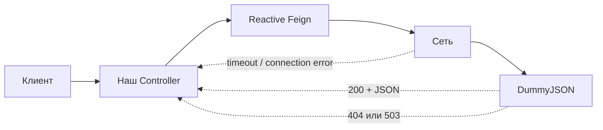
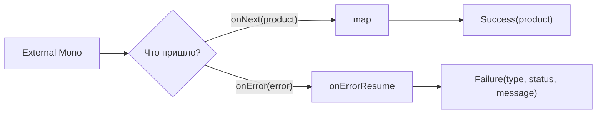
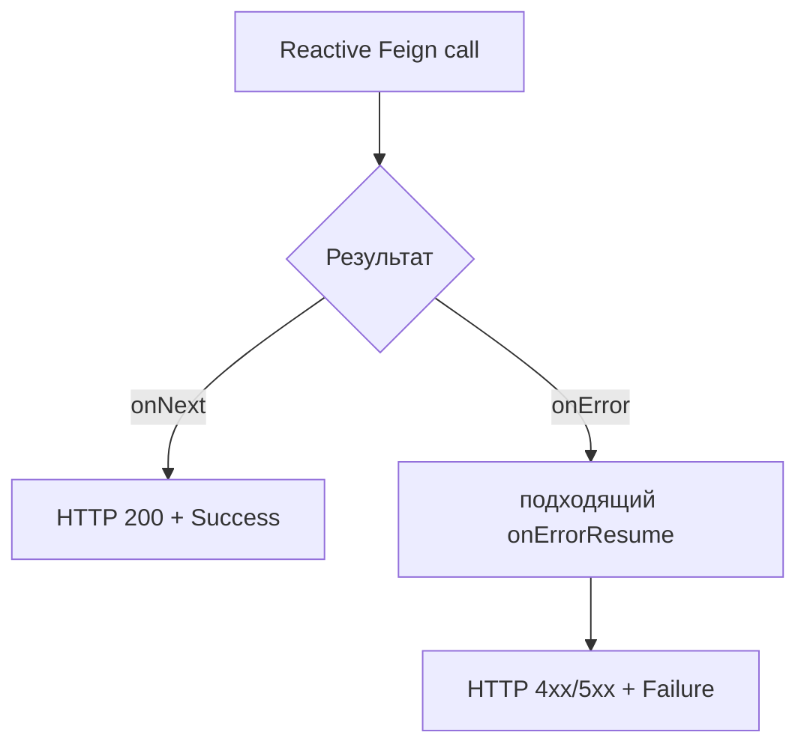

# Лекция 7. Reactive Feign: внешний вызов, ошибки, timeout и retry

В этой лекции наше WebFlux-приложение обращается в реальный внешний сервис:

```text
клиент → наше приложение → @ReactiveFeignClient → https://dummyjson.com
```

[DummyJSON](https://dummyjson.com) общедоступен, не требует регистрации и умеет
возвращать ответы, заданные HTTP-статусы и ответы с задержкой.

---

## 1. Сначала проблема

Когда мы вызываем чужой сервис, результат зависит не только от нашего кода:



Возможные результаты:

- получен продукт;
- продукт не найден — `404`;
- внешний сервис недоступен — `503`;
- внешний сервис отвечает слишком долго;
- HTTP response вообще не получен из-за DNS или соединения.

Поэтому нам нужны три решения:

1. описать внешний HTTP-контракт;
2. ограничить ожидание;
3. явно обработать успешную и ошибочную ветки.

Reactive Feign работает поверх неблокирующего WebClient/Reactor Netty. Здесь нет
синхронного блокирующего клиента, поэтому `boundedElastic` не нужен.

---

## 3. Reactive Feign client

```text
@ReactiveFeignClient(
        name = "lesson07-product-service",
        url = "${lesson07.product-service.url:https://dummyjson.com}"
)
public interface Lesson07ProductReactiveClient {

    @GetMapping("/products/{productId}")
    Mono<Lesson07Product> findProduct(
            @PathVariable("productId") long productId,
            @RequestParam("delay") long delayMs
    );

    // Этот URL всегда возвращает 503 и нужен только для retry-примера.
    @GetMapping("/http/503/lesson-07")
    Mono<Lesson07Product> respondWithServiceUnavailable();
}
```

Интерфейс описывает URL, HTTP method, параметры и ожидаемый успешный JSON.

```text
@JsonIgnoreProperties(ignoreUnknown = true)
public record Lesson07Product(
        long id,
        String title,
        BigDecimal price,
        String category,
        int stock
) {
}
```

Метод клиента возвращает lazy `Mono`. HTTP request начнётся, когда Spring WebFlux
подпишется на цепочку, возвращённую контроллером. Ручной `subscribe()` не нужен.

---

## 4. Что такое signals в минимально необходимом объёме

Signal — это событие, которое publisher отправляет подписчику.

Для `Mono` сейчас достаточно знать только два пути:

```text
успех:  onNext(product) → onComplete

ошибка: onError(exception)
```

Это не отдельный Thread и не HTTP response. Это способ Reactor сообщить downstream:
«вот значение» или «работа завершилась ошибкой».

После `onError` исходный publisher закончен. Следующий `map` уже не выполнится.

---

## 5. Railway-oriented результат



`onErrorResume` не возвращается в сломанный HTTP request. Он заменяет завершившийся
publisher новым:

```text
.onErrorResume(SomeException.class, error ->
        Mono.just(new Failure(...))
)
```

До оператора существовал `onError`. После оператора по цепочке идёт обычное значение
`Failure`. Это и есть переход на вторую рельсу.

---

## 6. Одна понятная цепочка обработки

Читаем сверху вниз:

```text
выполнить внешний вызов
        ↓
ждать максимум 3 секунды
        ↓
product              → HTTP 200 + Success
TimeoutException     → HTTP 504 + Failure(TIMEOUT)
FeignException       → HTTP 404/503 + Failure
ReactiveFeignException → HTTP 502 + Failure(TRANSPORT)
```

### Почему несколько `onErrorResume`

Каждый обработка реагирует только на свой тип ошибки:

```text
.onErrorResume(TimeoutException.class, ...)
.onErrorResume(FeignException.class, ...)
.onErrorResume(ReactiveFeignException.class, ...)
```

Если первый тип не совпал, Reactor проверяет следующий оператор. Как только ошибка
обработана и заменена значением, следующие `onErrorResume` её уже не увидят.

Порядок помогает читать обработку как обычные `catch` сверху вниз.

---

## 7. Самый простой retry

Для демонстрации есть endpoint DummyJSON, который всегда возвращает `503`:

```java

@GetMapping("/unavailable")
public Mono<ResponseEntity<Lesson07CallResult>> serviceUnavailable() {
    return handleExternalCall(
            productClient.respondWithServiceUnavailable()
                    .retry(2)
    );
}
```

`retry(2)` означает:

```text
HTTP request #1 → onError
        ↓ retry
HTTP request #2 → onError
        ↓ retry
HTTP request #3 → onError
        ↓
onErrorResume → Failure
```

Число `2` — количество **дополнительных** попыток. Всего запросов будет три.

`retry` не продолжает старый request. Он заново подписывается на cold Mono Reactive Feign,
что приводит к новому HTTP request.

### Ограничение простого варианта

`retry(2)` повторяет любую ошибку. Поэтому мы используем его только на специальном
endpoint-е, который гарантированно демонстрирует `503`.

Для production обычно нужен `retryWhen`: он позволяет повторять только выбранные ошибки,
добавить паузу и backoff. Но сначала важно понять базовый механизм повторной подписки;
сложную политику в эту лекцию не добавляем.

---

## 8. Ручная проверка

### Успешный внешний вызов

```bash
curl -i "http://localhost:8080/api/lesson-07/products/1"
```

```json
{
  "value": {
    "id": 1,
    "title": "Essence Mascara Lash Princess",
    "price": 9.99,
    "category": "beauty",
    "stock": 99
  }
}
```

### Внешний 404

```bash
curl -i "http://localhost:8080/api/lesson-07/products/999"
```

```json
{
  "type": "NOT_FOUND",
  "externalStatus": 404,
  "message": "DummyJSON не нашёл продукт"
}
```

### Timeout

DummyJSON позволяет намеренно задержать ответ:

```bash
curl -i "http://localhost:8080/api/lesson-07/products/1?delayMs=5000"
```

Наше приложение ждёт три секунды и отвечает `504`:

```json
{
  "type": "TIMEOUT",
  "externalStatus": null,
  "message": "DummyJSON не ответил за 3000 ms"
}
```

### Три запроса при 503

```bash
curl -i "http://localhost:8080/api/lesson-07/unavailable"
```

После первой попытки и двух retry получим:

```json
{
  "type": "UPSTREAM_UNAVAILABLE",
  "externalStatus": 503,
  "message": "DummyJSON вернул HTTP 503"
}
```

---

## 9. Главное не перепутать

### `onErrorResume` не исправляет внешний сервис

Он только выбирает, чем наше приложение заменит ошибочную ветку.

### Timeout не ускоряет запрос

Он ограничивает наше ожидание.

### Retry — новый HTTP request

Это особенно важно для POST: операция могла выполниться, даже если response потерялся.

### Reactive Feign не нужно переносить на `boundedElastic`

WebClient/Reactor Netty уже работают неблокирующим образом.

---

## 10. Итог



1. `@ReactiveFeignClient` описывает внешний HTTP-контракт.
2. `Mono` сообщает об успехе через `onNext`, об ошибке — через `onError`.
3. `timeout` ограничивает время ожидания.
4. `onErrorResume` превращает ожидаемую ошибку в понятный ответ.
5. `retry(2)` создаёт две дополнительные подписки и два новых HTTP request-а.
6. Success и Failure обрабатываются явно, без глобального handler-а.

## Материалы

- [Reactive Feign](https://github.com/PlaytikaOSS/feign-reactive)
- [DummyJSON products](https://dummyjson.com/docs/products)
- [DummyJSON delay](https://dummyjson.com/docs)
- [DummyJSON HTTP statuses](https://dummyjson.com/docs/http)
- [Project Reactor: error handling](https://projectreactor.io/docs/core/release/reference/coreFeatures/error-handling.html)

Всем спасибо!